# Eternal Return Lumia Island Level Design Study: Routes, Kiosks, Wickeline, Endgame Pressure
> Language / 语言：[中文](README.md) | English
>
> One-line pitch: use public sources, official images, and 48 DAK.GG Saved Plan route samples to explain how Lumia Island turns looting, rotation, Kiosks, Wickeline, and restricted zones into one spatial pressure system.
>
> For: MOBA / PvPvE level designers, combat designers, systems designers, map researchers, Eternal Return players, and content creators.
>
> Why star it: this is not a tier list or route guide; it is a source-grounded map-design study with 55 local figures, 16 characters x 3 real network-guide route samples, and Chinese / English editions.
>
> Want to share it: use the ready-to-copy posts in [SHARE.md](SHARE.md).

> Version scope: this report uses public material and localized assets available from 2026-06-12 to 2026-06-13; complete sources and evidence boundaries are collected at the end.
> Writing goal: This is a Chinese textbook-type report for level planning, battle planning, and system planning. It focuses on explaining level goals, player movement lines, space layout, interaction mechanisms, obstacle settings, difficulty curves, rhythm control, and reward feedback. Resources, materials, and character routes are only used as evidence for argumentation, not as a main list.

## 0. Report Description

### 0.1 How to read the evidence

The report presents the level-design argument first, then collects sources and evidence boundaries at the end. The main text does not interrupt every paragraph with external links or asset lists; when a figure number or source ID appears, use Chapters 10 and 11 to check the source, local image file, route sample, and evidence boundary. Details that are not supported by public sources or local data, such as grass coordinates, exact ordinary monster coordinates, footstep radius, cover dimensions, or real death heatmaps, are not written as facts.

### 0.2 How to read the figures

The images fall into two groups: local screenshots, maps, and avatars traceable to official or data-site sources; and explanatory redraws based on those sources. Read the figure number, title, arrows, and the surrounding paragraph first. Generated diagrams help explain routes, pressure, and spatial relationships; they are not official scale maps, live-scene replicas, or statistical heatmaps. Each figure's source, supporting claim, and boundary are collected in Sections 10.6 and 11.

### 0.3 Writing rules: three levels of explanation

Each key argument in this report is written in three layers: the first layer "what" explains the specific performance of the mechanism, terrain or route in the game; the second layer "why" explains the experience problems that the level design wants to solve; the third layer "how it affects the players" falls into the actual behavior in early stage search, mid-term target competition, and later research center/Wickeline/restricted zone closing. Resource names, character names, and routes are only used as supporting evidence, and the report is not written as a list of materials.

### 0.4 Game play consistency verification caliber

This report is written around the actual gameplay of "Eternal Return": Lumia Island is a PvPvE survival-competition / MOBA-style battle map, not a traditional extraction map with several fixed exits permanently open. The official Game Flow includes Escape / Rootkit rules, so the report discusses them in that official framing. When the text says "retreat and cash out", it means converting a fight, objective, or economic gain into the next tempo through retreat routes, teleport points, Kiosks, revives, item completion, Escape / Rootkit decisions, restricted-zone timers, and the next objective position. Claims about Kiosk, Wickeline, Alpha / Omega, Mutant Herds, restricted-zone closure, character routes, and regional materials are backed by source IDs at the end. DAK route samples only prove that the Plan and route sequence exist in the page payload; they are not official routes, tier rankings, or a single optimal route.

## 1. Overall level structure of Lumia Island

- **The core of Lumia Island is not to "cover the map with resources", but to use low pressure in the outer circle, high pressure in the center, and regularly disclosed targets to push players from a search mentality to a risk-cashing mentality. ** Players gain route freedom early on, and then their choices are gradually narrowed by Kiosk, Wickeline, normal zone restrictions/restarts, and endgame safe zone rules.
- **Each region is doing the same thing: putting rewards in locations that require a stay, exposure, or lane change. ** Piers, beaches, and factories are for safety; schools, fire stations, and ponds are for outer observation; the research center is more like the outward movement path and pressure core of high-value targets, rather than an ordinary material search area.
- **The same space serves both single row opportunism and squad division of labor collaboration. ** A single queue waits for the third-party window in the outer ring, while a multi-player team divides front-row entrance control, rear-row wiring, and control/support road closures into clear responsibilities. The map uses road networks and short-field windows to magnify this difference.

### 1.1 Overall level design principles

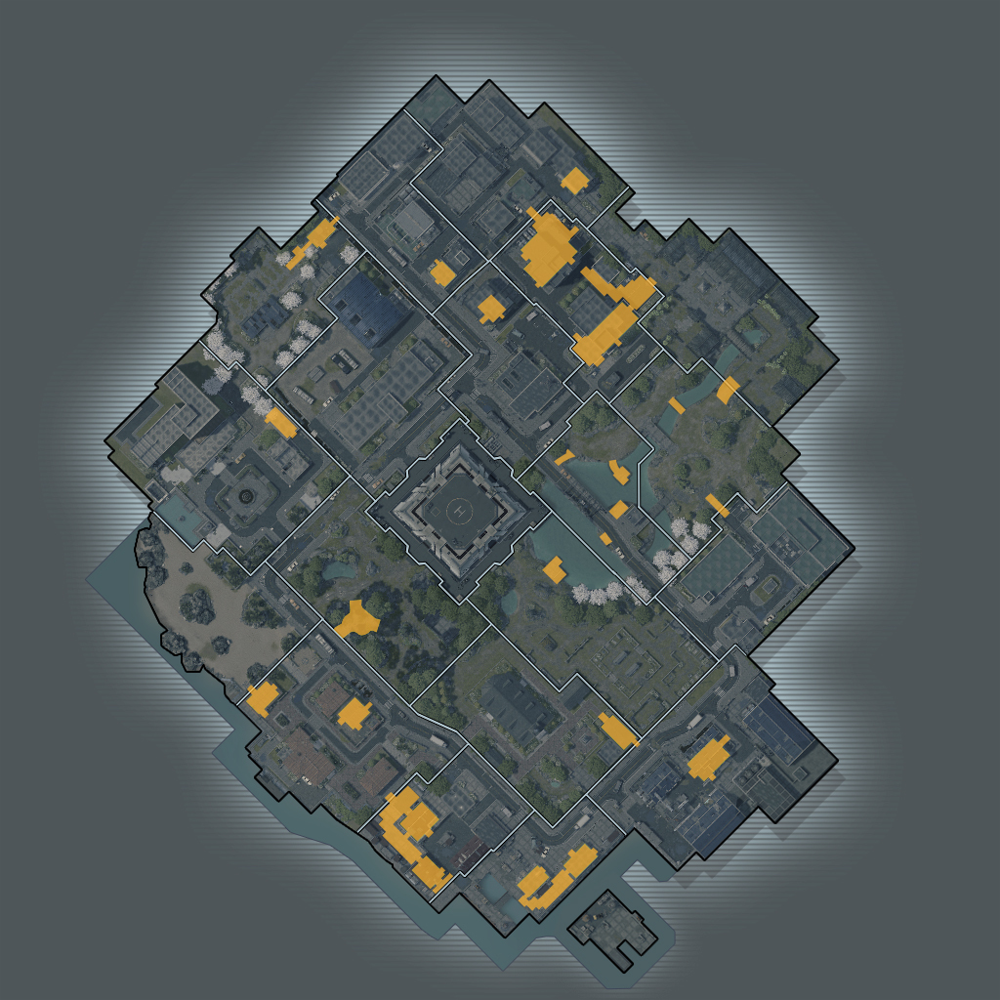

Figure F-01 First answer “Why does the island need to be expanded and why does it need to be demolished?” It shows that after 1.0, Lumia Island no longer only pursues pushing players to the center outer ring faster, but leaves a buffer for Day 1’s search and line changing to reduce early random collisions. [Document number: S-02]

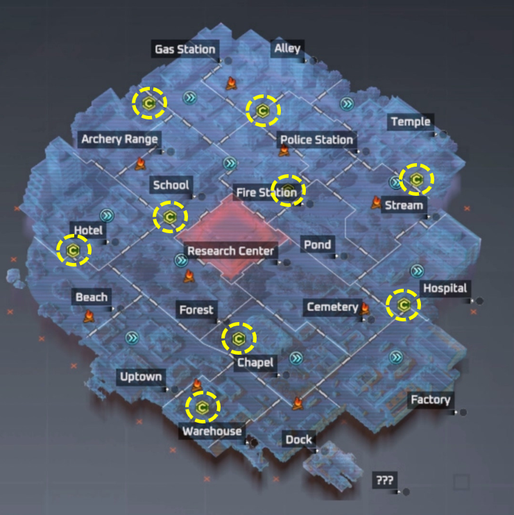

Figure F-02 Answer "Why did the player stop?" Kiosk is not just a store icon, it turns replenishment, resurrection and economic redemption into a short-lived action; as long as the player stops, it may be read by the passing team. The current Kiosk area is reviewed with the S-06 data station list, and the old location map is only used as a visual base map and mechanical reference. [Document number: S-03/S-06]

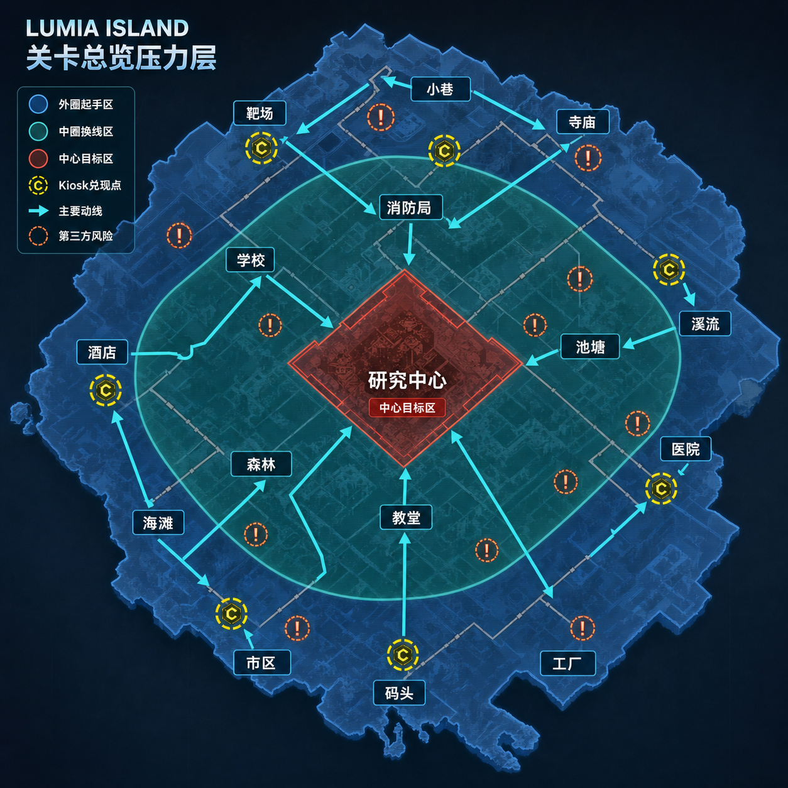

Figure F-03: Stack the expansion map, Kiosk, target prompts and mid-term resource attraction together: the outer circle gives freedom, and the center gives pressure. The real level design occurs on the player's path from freedom to pressure. The specific current area of ​​Kiosk is reviewed with S-06. [Document number: S-01/S-03/S-06/S-IMG2]

### 1.2 Core gameplay closed loop: from freedom of search to target compression

Lumia Island in "Eternal Return" uses a closed loop of "dispersed birth -> outer circle search -> middle circle line change -> target competition -> retreat and cash out -> final conclusion". The key to level design is not to let players fight in every area, but to make players gradually realize: continuing to search can improve equipment, but will miss the next round of goals; entering the game early can obtain information, but will accept third-party persuasion.

The map of Day 1 undertakes learning and shaping functions. Outer areas such as docks, beaches, factories, and high-end residential areas are given low-pressure starting points to allow different experimental bodies to complete the basic build. Starting from the mid-term, kiosks, mutant beast swarms, public target prompts, and normal area restrictions/reopenings will force players to leave their comfort zone. After Night 4, the combination of outer rings and core areas such as research centers, schools, fire stations, and ponds will push players into a team battle space with high information density.

### 1.3 Space Economics: Rewards must come with space costs

Spatial Economics is reflected in three costs in this picture:

1. **Stay Cost**: Kiosks, mutant beast swarms, and bosses all require players to stop what they are doing. The longer you stay, the easier it is to be caught by target prompts, intersection vision or passing teams.
2. **Cost of changing lines**: It is safe to start at corners such as piers, beaches, and factories, but it will take extra time to move to the outer ring of the research center, the school side, or the Wickeline outward movement path side. Security is not a free benefit, the price of security is slow target response.
3. **Cash-out Cost**: After players get Credits, materials or combat benefits, they still need to find the Kiosk, resurrection point, retreat route and next round position. The map separates "getting rewards" and "cashing rewards" through Kiosk locations, making retreat a part of the game.

### 1.4 Design of moving routes: main roads, side roads, retracement lines, kiosks and cross-district traffic

Macro moving lines are not simply connections, but three types of choices:

- **Main Road** is used to transport players from the outer circle to the middle circle, such as beach -> hotel -> school, factory -> hospital/cemetery -> pond, dock -> warehouse -> church.
- **Side paths** are used to create stealth angles and persuade third parties, such as the forest flank pressing against the outer ring of the research center, the alley cutting into the police station, and the stream pressing against the hospital.
- **Retracement line** is used to turn a failed battle into the next round of choices, such as retreating from the outer ring of the research center to the school kiosk, the pond to the hospital, and the forest to the church.

Kiosk is the most important "economic stopping point" in the moving line system. It is not an ordinary store icon, but a position that the team can actively expose in order to repair parts, revive, and buy materials. In multiplayer mode, Kiosk turns "if the battle is lost, will there be another round" into a level issue; in single row, Kiosk is the pause window most easily captured by opportunistic players.

Interregional traffic is another level of route cost adjuster. Lumia Island data station records that there is an Acceleration Influx Perimeter at the area boundary: players who cross the boundary for the first time will receive a 50% movement speed bonus for a short period of time, but this mechanism will be turned off at the beginning of Day 2. This design makes the search route on Day 1 smoother, allowing players to complete the basic build from the outer circle; when it is closed after Day 2, it makes each lane change more like a commitment, and players can no longer use the same low cost to repeatedly jump.

Hyperloop (Transmission Terminal) and VLS (Vertical Launch System) are responsible for cross-zone rearrangement in the mid- to late-game. The Hyperloop areas currently listed on the data site include Gas Station, Forest, School, Temple, Stream, Hospital, Factory, Chapel, Uptown, and Hotel; starting from Day 3, Hyperloop in the safe zone will be replaced by VLS, while Hyperloop will remain in the restricted zone. VLS supports teammates to glide synchronously, with a maximum movement range of about 130m; after descending to a certain height, peripheral vision will be obtained, a mark will be displayed at the landing point, and a short stun/stun window will be generated when landing. To put it into level language: the map is not only connected by roads, but also creates high-risk routes through "instant rearrangement" and "public landing points". Teams can use VLS to fill positions quickly, but it also exposes their landing direction and entry timing to the enemy.

### 1.5 Information Design: Fog of War, Short-term Horizons and Open Goals

Official data confirms the short-term vision mechanisms such as Bat, Camera, and CCTV; the Lumia Island data station also gives the impact of weather and ecological objects on the information layer (data number S-06): Clear days will reduce the grass on the island and increase the basic field of view from 8.5m to 10m; Rainy days will increase the grass, increase SP recovery by 100%, and reduce the audible range of character voices and noises. 15%; Sandstorm will reduce vision; Foggy in custom games will hide airdrop locations and noise markers. In other words, the hidden area is not something that can be explained by a fixed grass coordinate table, but a dynamic information layer jointly shaped by "weather + short-term vision + intersection adjacency + target prompts".

Therefore, this report still does not include undisclosed grass coordinates, footsteps radius or bunker size, but will break down the concealment pressure of each area into reviewable level questions: when players enter the outer ring of a hospital, school, forest, dock or research center, whether to use Camera / Bat / CCTV / Lantern Bloom type of vision means to confirm the entrance; whether rainy days are more likely to be amplified by grass and hearing attenuation to amplify the risk of sneak attacks; whether sunny days make it easier for remote characters to set up intersections in advance. Players can temporarily know that a certain direction is safe, but they cannot master all entrances for a long time.

Public boss/objective hints are another type of information design. It reduces the asymmetry of target information and lets the entire map know that high-value windows exist; but it does not tell players the arrival time of each team. As a result, the core pressure of the level changed from "can't find the target" to "when to enter, when to withdraw, and whether to wait for the third party." This is exactly why the research center/school outer ring is the endgame template.

### 1.6 Friction Design: PvE, Restricted Zones, and Third-Party Risks

PvE entities are not purely economic packages. Groups of mutated beasts, Wickeline, ordinary wild monsters, and bosses all create friction: players need to stop, consume blood, transfer skills, and expose their position. Restricted areas are another kind of friction: they don't necessarily block the path immediately, but turn the path into a "high-cost passage that consumes personal timers." Players can briefly cross the restricted area for pursuit, rescue, or detours, but this will sacrifice subsequent end-game fault tolerance.

Battle Zone needs to be treated separately: the official 1.0 Gameplay once listed it as a random battlefield mechanic in Night 2, but the Battle Zone page on the Eternal Return Wiki (Fandom site) describes it in a historical tone. Therefore, this report no longer regards it as a stable map rule in the current version, and only retains it as old mechanism information and boundaries to be reviewed at the end of the article. Writing this way is more in line with the bottom line of level research: do not regard historical mechanisms as facts of the game that are still happening now.

### 1.7 Rhythm curve: low-pressure learning, mid-term peak, final closure

- **Day 1**: Low-pressure learning and material molding. Levels allow players to get to know the area, complete equipment, and establish the first route.
- **Day 2 and later**: Resource suction begins to become stronger. Kiosks, swarms of mutated beasts, lost boxes, target prompts, and general area restrictions/reopening allow players to stay or change lanes.
- **Night 2 to Night 5**: Mid-term peak. General areas will be gradually restricted and may be reopened in subsequent phases; players must manage TTK, positioning, retracement lines and personal restricted area timers.
- **Night 4 and later**: Finale. The research center and its outer ring are no longer just the center of the map, but a pressure field where high-value targets, public information and third-party risks are combined.

The design value of this curve is to push players from low-pressure learning to goal commitment, and then enter the high-pressure endgame; the level does not suddenly become difficult, but gradually increases the probability of staying, being exposed, and third-party entry.

### 1.8 Restricted areas and reopening: The map uses "area switches" to create rhythm, rather than just relying on shrinking circles

The final pressure of "Eternal Return" cannot be simply understood as "the big circle shrinks smaller and smaller." A more accurate statement is: Lumia Island is composed of multiple areas, and the data station describes 20 of them as regularly accessible; these areas will enter the restricted area status according to time, marked in red on the map, and may also be reopened in subsequent stages. After entering the restricted area, the player will not die immediately, but will start to consume the personal Restricted Area Counter (restricted area timer). According to the current public rules, the timer in the restricted area is initially 20 seconds and can reach a maximum of 30 seconds. Killing other experimental subjects can increase the timer by 5 seconds; when the timer reaches zero, the experimental subjects will die/be eliminated immediately.

This rule has two effects on level writing. First, the red zone is not an "absolute wall", it is a high-cost space to traverse: players can exchange a small amount of timers for shortcuts, pursuits or rescues, but this must be counted as a consumption of resources. Second, general areas may reopen from restricted area status, so some routes are not permanently lost but are repriced by the time window. When an area is restricted, it will temporarily push players to adjacent intersections; if it is reopened, it may become a detour, escape, or a reverse passage for third-party entry.

The Research Center is the exception core: According to the current public rules, the Research Center will become a restricted area after Night 4 and will not be reopened; Dr. Wickeline will come out of the Research Center and move to the unrestricted area. The official 1.0 Item Spawn table does not list the research center as an ordinary material area; the public information does not provide a reviewable route for "entering the internal search for materials and continuing operations like an ordinary area." Therefore, the research center cannot be written as "enter the area to search -> stay in the area to fight" according to the ordinary POI. A more reasonable reading of the level is: after Night 4, players will make commitment judgments around the boundaries of the research center, the four-way outer ring, the Wickeline outward movement path and the restricted area timer. The go-ahead team isn't just fighting the boss, it's buying target processing windows with health, skills, vision, and zone time.

The current public schedule also gives several later nodes that will change the way the levels are written: starting from Day 6, players will restore part of the restricted area timer; Temporary Safe Zones will appear on Night 6, and interactions such as the security console, Hyperloop, VLS, Kiosk, Launch Pad, and White Lily will stop working, and wild animals will be cleared and stop regenerating. The temporary safe zone will be separated from the rest of the island when there are more than two teams, and will not reopen until there is only one team left inside. Day 7 / Night 7 will enter the Final Safe Zone (Final Safe Zone) decisive battle; if there are still multiple teams surviving when the final time runs out, the entire island will become a restricted area, and the winner will be determined based on the remaining time of the personal timer. This means that later level design is not just about "the central goal is getting hotter and hotter", but also "which interactions are shut down, which routes are reopened, and whether players still have enough time in the restricted area." At the stage when they can fly, buy, and watch CCTV, the team still has room for operation; after these systems are shut down, the map will change from an open operation problem to a front-on problem in a small space.

Therefore, when analyzing area by area in the following article, we will consider the writing method according to three rules. The ordinary area is written as a dynamic space that can be opened, restricted, and reopened, rather than a permanently safe or permanently closed room; entering the red zone is written as a high-cost passage that consumes a personal timer, rather than an impenetrable hard wall; the research center is written as Wickeline external movement and outer ring pressure core, rather than an ordinary material area or an indoor combat zone that can be stably operated.

| stage | duration | Add restricted area | reopening zone | remaining safe area | Level design reading method |
|---|---:|---:|---:|---:|---|
| Day 1 / Night 1 / Day 2 | 140s / 110s / 140s | 0 | 0 | 19 | The map remains open in a large area, allowing players to complete route learning, basic search, and first line change. |
| Night 2 | 130s | 5 | 0 | 15 | The first obvious compression: greedy searches in the outer circle will start to pay the cost of switching lines. |
| Day 3 / Night 3 | 130s / 120s | 4 / 3 | 2 / 0 | 12 / 12 | The rhythm of "reopening after restrictions" has appeared in ordinary areas, and routes have changed from intuitive route finding to time window management. |
| Day 4 / Night 4 | 110s / 110s | 3 / 3 | 2 / 0 | 9 / 8 | Night 4 The research center becomes a restricted area that will not be reopened, and the Wickeline relocation to the side and outer ring rights of way becomes the main pressure. |
| Day 5 / Night 5 | 100s / 90s | 2 / 2 | 2 / 0 | 4 / 3 | A large number of ordinary areas lose long-term operating value, and Kiosk redemption, resurrection, and retreat lines need to be planned earlier. |
| Day 6 / Night 6 | 50s / 90s | 1 / 2 | 0 / 0 | 2 / 0 | Entering the temporary safe zone logic, multiple map interactions stop working, and the level changes from an operational map to a closed decisive battle space. |
| Day 7 / Night 7 | 60s / 80s | 0 / 1 | 1 / 0 | 1 / 0 | The final safe zone decisive battle; if there are still multiple teams surviving, the remaining timer in the personal restricted zone will become the final victory or defeat condition. |

### 1.9 Solo / Duo / Squad compatible

Solo queue emphasizes opportunism: players more often observe the endgame from the outer ring such as forests, schools, and ponds, looking for windows with remaining health, Kiosk pauses, or after boss battles. The double platoon emphasizes the temporary division of labor: one person searches or hits the target, and the other watches the entrance. Squad splits the space responsibilities into front row entrance control, rear row output wiring, control/support road closure and resurrection fulfillment. The value of Lumia Island is that the same path can accommodate all three types of play, without the need to create completely different maps for different modes.

## 2. Overview of character samples and avatars

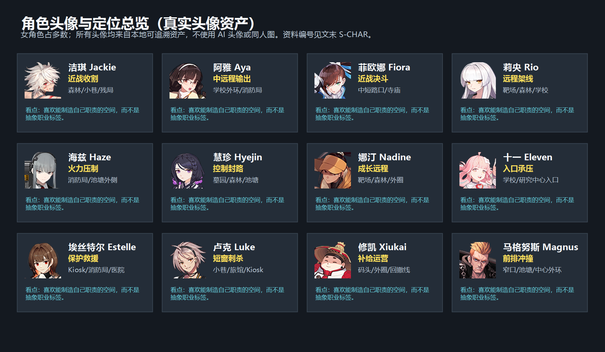

**How ​​to read Figure F-08**: The 12 avatars in the picture are all from local traceable character assets, and do not use AI avatars or fan art. The samples cover close combat harvesting, short window assassination, remote wiring, controlled road closure, entrance pressure, protection rescue, supply operation and front row collision. The "positioning" here is not the career system, but the way to use the level: Jackie and Luke need short circuits and pause windows, Rio and Haze need outer ring rays, Eleven and Estelle need entrance pressure points, Xiukai needs outer ring operations and retracement lines, and Magnus needs choke points to convert collision value into group starts. [Document number: S-CHAR/S-05]

This report selects these characters to allow the level design analysis to return to real experimental subjects rather than abstract occupational labels. The 12 key samples include 9 female characters, and include four hard samples: Jackie, Luke, Xiukai, and Magnus.

The boundaries of evidence must be clearly stated here: the avatar can only prove that "the analyzed object is a real experimental subject", and the DAK page and local route records can only prove that "these characters have corresponding weapon branches and Saved Plans entrances." Before taking screenshots of the Saved Plan step by step, the route sequence is still a sample behavior to be checked. What the report really wants to study is not "the current version of a certain character must go this way", but "when a melee harvesting, long-range wiring, front-row pressure or supply operation character appears on this map, which areas will amplify his decision-making, and which areas will punish his misjudgments."

| sample | Topographic issues of concern in this report | Typical game behavior |
|---|---|---|
| Jackie / Luke | Narrow Road, Kiosk Stop, Forest/School Outer Endgame | Wait for others to hit the target or retreat before cutting in. It is not suitable for charging head-on without information. |
| Aya / Rio / Haze / Nadine | Shooting range, pond, fire station, school outer ring long line | Front row or vision protection is required, and outer ring rays are used to suppress the outer ring/outward path side of the research center and adjacent intersections. |
| Eleven / Estelle / Magnus | Research center outer ring/outside path, fire station, school, pond choke point | The multi-player team is responsible for entrance pressure, team initiating, rescue and formation breakup. |
| Xiukai / Johann | Piers, hospitals, churches, Kiosk retracement lines | Turn outer circle operations, supplies, and resurrection into second-round entry capabilities. |

## 3. Preliminary search route and macro tactical flow

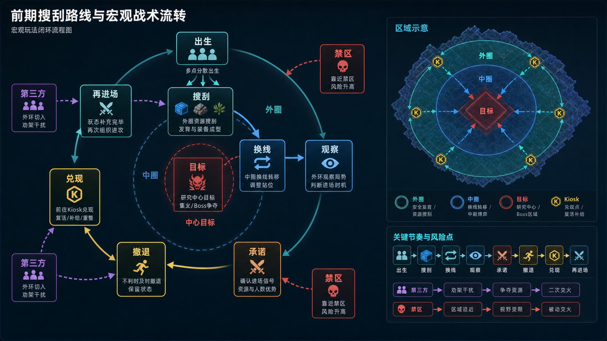

The key point of this flow chart is that the map is not a one-way advancement from A to D, but a cycle of "target -> retreat -> re-enter". The level design uses the Kiosk and the outer ring network so that the winning side must also deal with the risk of cashing out; the losing side may also re-enter the battle as long as it can retreat to the Kiosk or the outer ring. [Document number: S-01/S-03/S-IMG2]

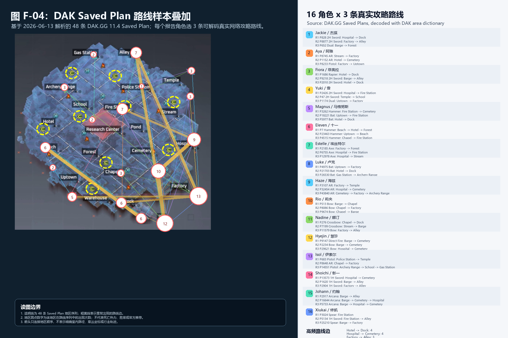

**How ​​to read Figure F-04**: This picture has been redrawn according to the DAK.GG Saved Plan real network strategy sample verified and parsed on 2026-06-13. The sample selects 3 decodable routes from each of the 16 reported characters, for a total of 48 routes; the selection rule is to give priority to the new version, and then look at the likes and win rate fields displayed on the DAK page, and try to avoid duplication of the same weapon and the same route. The figure uses the official Kiosk location map as the base map. The transparent line represents the region sequence of the 48 Saved Plans, the thick yellow line represents the recurring route edges, and the dot numbers represent the number of times the region appears in the route sequence. The arrows only connect the order of areas and do not represent precise indoor paths, grass coordinates, footsteps radius, or optimal intensity rankings. The density of basic materials is not marked separately because the public samples are not enough to support a stable conclusion of "which area has a significantly higher density of basic materials"; this section only uses Kiosk, route edges, start and end points, and regional heat as evidence layers. [Data number: S-03/S-05/S-DAK-ROUTE/S-IMG2]

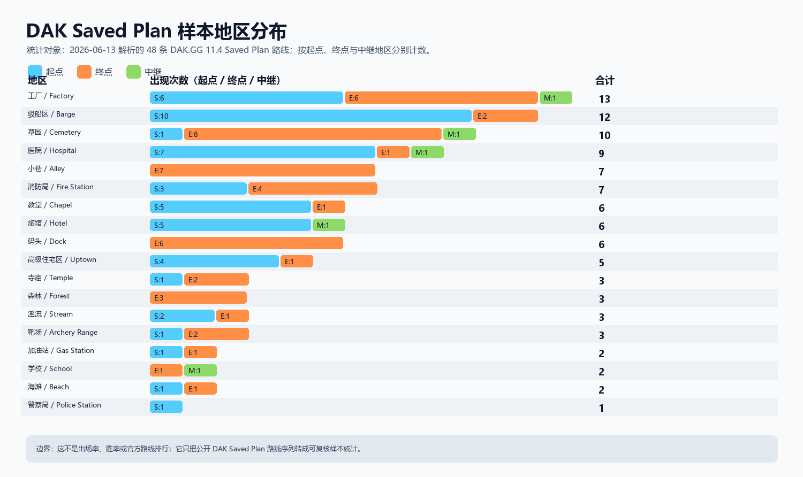

**How ​​to read Figure F-04a**: This statistical chart breaks the same group of 48 routes into starting points, ending points and number of relays. It fixes two problems with earlier sample distribution plots: first, the sample size has been increased from "1 bar per character" to "3 bars per character"; second, the text and bars no longer overlap. The high-frequency areas in the figure are not official heat, death heat maps or win rate rankings, but simply illustrate which areas these public Saved Plans pass more frequently in the area sequence.

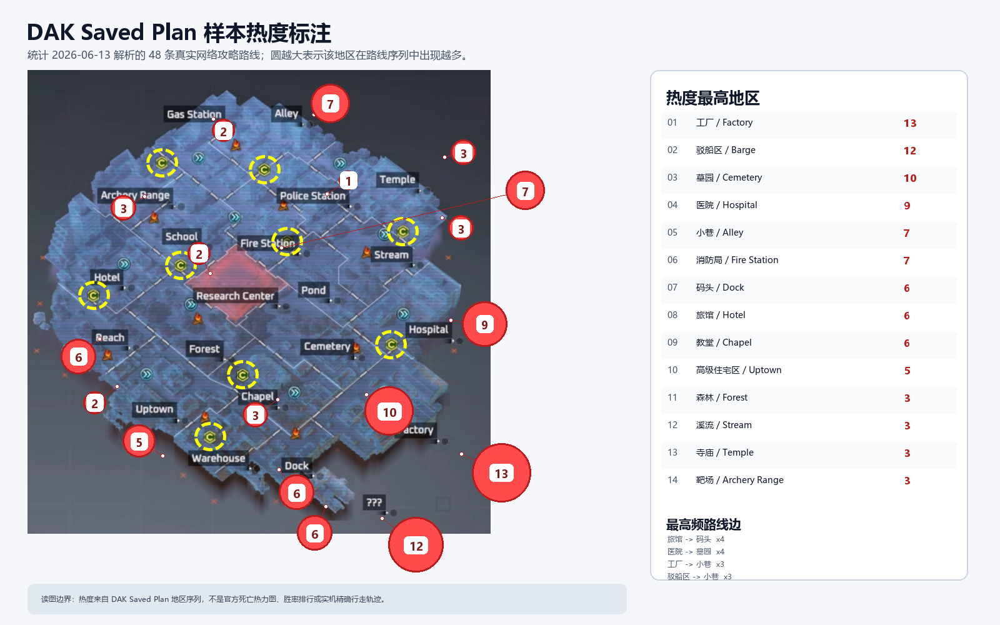

**Figure F-04b reading**: This picture writes the sample statistics back to the map. The larger the circle, the more the area appears in the 48 route sequence. The higher counts of Factory, Barge, Cemetery, and Hospital indicate that these areas are more often used as the starting point, end point, or path node in the sample route; but it is still not "player death heat" or "intensity heat" and cannot be used to directly determine where the most danger must be.

The table below lists the 48 DAK.GG Saved Plan routes that entered the statistics. Plan IDs, weapons, and region sequences come from the public structured data of the DAK.GG character route page and are decoded with the DAK region dictionary; they are real network strategy samples, not official routes, nor the only optimal route.

| Role | R1 | R2 | R3 |
|---|---|---|---|
| Jackie / Jackie | P828 / Two-handed Sword / Hospital -> Dock | P8877 / Two-handed Sword / Factory -> Alley | P652 / Dual Swords / Barge -> Forest |
| Aya / AYA | P8745 / Assault Rifle / Stream -> Factory | P1152 / Assault Rifle / Hotel -> Cemetery | P8233 / Pistol / Factory -> Uptown |
| Fiora / Fiora | P1686 / Rapier / Hotel -> Dock | P9218 / Two-handed Sword / Barge -> Alley | P2010 / Two-handed Sword / Hotel -> Dock |
| Yuki / snow | P2426 / Two-handed Sword / Hospital -> Fire Station | P47 / Two-handed Sword / Temple -> School | P1174 / Dual Swords / Uptown -> Factory |
| Magnus / Magnus | P3262 / Hammer / Fire Station -> Cemetery | P5977 / Bat / Hotel -> Dock | P32383 / Hammer / Barge -> Fire Station |
| Eleven / eleven | P7 / Hammer / Beach -> Hotel -> Forest | P23463 / Hammer / Uptown -> Beach | P4515 / Hammer / Chapel -> Fire Station |
| Estelle / Estelle | P2185 / Axe / Factory -> Forest | P6755 / Axe / Hospital -> Fire Station | P12978 / Axe / Hospital -> Stream |
| Luke / Luke | P4975 / Bat / Uptown -> Factory | P21703 / Bat / Hotel -> Dock | P26530 / Bat / Gas Station -> Archery Range |
| Haze/Haize | P3107 / Assault Rifle / Factory -> Temple | P32454 / Assault Rifle / Hospital -> Cemetery | P43840 / Assault Rifle / Cemetery -> Factory -> Archery Range |
| Rio / Li Yang | P513 / Bow / Barge -> Chapel | P8086 / Bow / Chapel -> Factory | P9674 / Bow / Chapel -> Barge |
| Nadine / Nadine | P276 / CrossBow / Chapel -> Dock | P7199 / CrossBow / Stream -> Barge | P11579 / Bow / Factory -> Alley |
| Hyejin / Huizhen | P9147 / Direct Fire / Barge -> Cemetery | P2234 / Bow / Barge -> Cemetery | P29621 / Bow / Hospital -> Cemetery |
| Isol / Isol | P683 / Pistol / Police Station -> Temple | P8648 / Assault Rifle / Chapel -> Factory | P14551 / Pistol / Archery Range -> School -> Gas Station |
| Shoichi / Shoichi | P13573 / One-handed Sword / Hospital -> Cemetery | P1620 / One-handed Sword / Barge -> Alley | P2904 / One-handed Sword / Factory -> Alley |
| Johann / John | P2917 / Arcana / Barge -> Alley | P5733 / Arcana / Barge -> Hospital -> Cemetery | P7476 / Arcana / Stream -> Hospital -> Cemetery |
| Xiukai / Xiukai | P3024 / Spear / Fire Station | P5134 / One-handed Sword / Fire Station -> Alley | P25210 / Spear / Barge -> Factory |

### 3.1 What is it: The early route is build shaping and risk budgeting

The main task of Day 1 is not to seize the center immediately, but to allow the experimental subjects to complete the basic equipment, become familiar with the direction of leaving the area, and decide whether to approach the Kiosk or the mid-term target in advance. Outer areas such as piers, beaches, factories, and gas stations provide players with a lower flanking surface; central entrances such as schools, alleys, and fire stations are exposed to multi-directional movement lines earlier.

### 3.2 Why: Let novices understand the map first, and let experts plan mid-term goals in advance

If all players are pushed to the outer ring of the research center in the first minute, the route planning will be swallowed up by random first movers; if the outer ring is always safe, the game will become a map-making process for each player. Lumia Island's approach is to allow freedom in the early route, but place mid-term goals where the player must leave their comfort zone. In this way, the early stage is not a boring pavement, but a preparation for the subsequent competition for Meteorite, Tree of Life, Kiosk, mutant beasts, and the outer ring/external path side of the research center.

### 3.3 How it affects players: Single queue depends on safety, double queue depends on division of labor, and squad depends on gathering time.

Solo players will pay more attention to "can I leave this area safely", so corner areas such as docks, beaches, and factories are attractive. A division of labor began to appear between the two teams: one person continued to collect materials, and the other person checked the intersection into the school, hospital or church in advance. Squad pays more attention to the gathering time. If all three people are greedy for the outer ring, they will often lose the center and outer ring after Day 2; but if they get to the outer ring of the research center too early, the equipment may not be ready and be used by a third party.

## 4. Mid-term transition point and resource competition

The function of Figure F-03 in the mid-term chapter is to translate "resource refresh" into "player stay". Players do not necessarily fight just because there is an icon on the map, but because dealing with targets, buying kiosks, and playing PvE all create readable actions of a few to ten seconds. [Document number: S-01/S-03/S-IMG2]

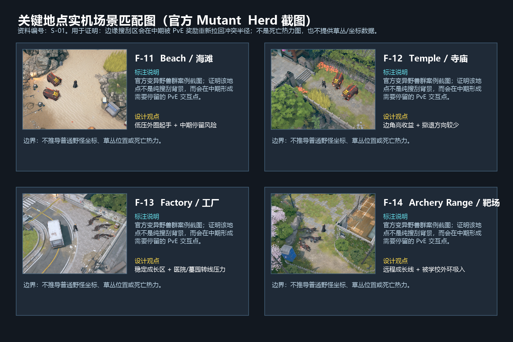

**How ​​to read Figure F-16**: This puzzle picture only uses localized official real-life screenshots, and puts the four Mutant Herd examples of Beach, Temple, Factory, and Archery Range in the same picture. What it proves is not that "these points must be the coordinates of all wild monsters in the current version", but the fact at the level design level: the outer circle or corner areas are not always safe search backgrounds. Mid-term PvE rewards will force players to stay, and the stay will be read by the switching team. [Document number: S-01]

### 4.1 What it is: Mid-term resources push players from "what materials are missing" to "dare to stay"

The key in the mid-term is not to simply give more resources, but to turn Tree of Life, Meteorite, Mutant Herd, Kiosk, target prompts and restricted zone time windows into stay actions. This report does not write about unconfirmed coordinates, but only discusses how these mechanisms change the movement lines. When a player sees a PvE or objective payoff on a beach, factory, shooting range, or temple, what the player really has to judge is: how long will it take me to deal with it, where are the surrounding teams coming from, and can I retreat to a kiosk or a safe route when I'm done.

Mid-term pressure mainly comes from three types of stops: Kiosk stops, PvE stops, and public target stops. The three together push the player from "continue on the road" to the judgment of "whether to commit to stopping". The restricted area/reopening rules are responsible for re-pricing these stops: the same intersection is a transfer gate during the safe period, and a risky channel that consumes the timer during the restricted period.

### 4.2 Why: Reward must bring the safe route back to the conflict radius

If there is no mid-term suction in the outer ring, players will develop with low pressure all the way to the later stage, and the "search, fight, and withdrawal" of PvPvE will be broken into pure search. The role of Mutant Herd and Kiosk is to turn the original marginal safety zone into a contestable point in the mid-term: the beach and factory are like safe starting points in the early stage, but in the mid-stage they will attract others to pass by because of PvE rewards and transfer routes. The higher the reward, the more it needs to stay; the longer it stays, the easier it is to be read by a third party.

### 4.3 How to influence players: The goal is not to win if you get it, but to withdraw and cash in is the complete benefit.

Characters like Jackie, Shoichi, and Luke will observe the skill gaps after others have defeated monsters or targets; Rio, Haze, and Aya will look for rays in the outer ring to force the team that is dealing with the target to turn around; Estelle and Eleven will stop at the entrance in advance to allow teammates time to hit targets or buy kiosks. The psychological pressure at the mid-term transition point comes from "I know there is a profit here, but I don't know how many seconds the next team will arrive." This is how maps turn resources into the engine of combat.

It is most likely to be mistakenly written here as "go wherever there are more resources." A more accurate reading is: resources are only responsible for calling people, and what really determines the quality of the engagement is the staying posture and retreat route. Factory's Wolf Herd allows players in the industrial zone to park in the southeast outer circle; Archery Range's Wolf Herd will expose the long-range growth line in the school/forest transition line of sight; Beach and Temple's Bear Herd pull the southwest outer circle and northeastern outer circle respectively from the safe search section back to the competition radius of Night 2. After players get materials or Credits, they must also determine the direction of the nearest kiosk, teleportation point, and restricted area, otherwise "win a wave" will turn into "die on the retracement line with gains."

## 5. Dismantle the terrain of key areas: 20 areas will be dismantled one by one

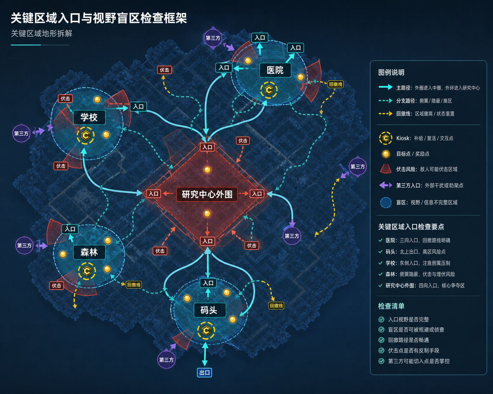

**How ​​to read Figure F-06**: This picture does not falsify the coordinates of the grass, nor does it draw unverified walls. It only answers one level design question: if you later get actual screenshots or interactive maps of hospitals, docks, and schools, which entrances, blind spots, and ambush windows should be reviewed first. The hospital should check the three-way entrance of the stream/cemetery/factory; the dock should check the departure route; the school should check the multi-directional information superposition of the research center, forest, and shooting range. [Document number: S-01/S-03/S-IMG2]

Before entering the 20 areas, think of Lumia Island as a set of level machines: the outer circle is responsible for keeping players alive, the middle circle is responsible for forcing players to meet, and the central outer circle is responsible for making players commit to high-value goals. Each region below is read according to "what/why/how it affects players", not to memorize material points, but to understand what kind of pressure it bears in a game.

| Regional functions | Corresponding area | What it is: specific performance on the map | Why: The problem level design solves | How it affects players: behavioral changes during the game |
|---|---|---|---|---|
| Low pressure starting container | Piers, beaches, factories, high-end residential areas, gas stations | Most of them are located in the outer ring or edge, with fewer early flanking surfaces, allowing the experimental body to complete the basic build first. | If Day 1 pushes all players to the middle circle too early, the start will become a random collision; starting in the outer circle allows players to gain route planning space first. | Solo teams will be more willing to start slowly from these areas; multi-player teams will need to send people to check the direction of leaving the zone in advance, otherwise "starting safely" will turn into "going slow and missing the Day 2 goal". |
| economic redemption point | Kiosk areas currently available for review: warehouse, hotel, hospital, church, school, police station, shooting range, temple | Kiosk places repairs, purchases, and resurrections in locations that can be read by passing teams. | The search-defeat gameplay cannot only reward "wins", but also exposes players for a short period of time when cashing out their gains. | Teams usually don’t have three people buying things together: one person interacts, one person watches the entrance, and one person retains control or movement; a single queue will treat the Kiosk as a short-term stopping point and leave immediately after buying. |
| Transition gates and choke points | Alleys, police stations, streams, cemeteries, churches | Multiple area connections press short lines, making it difficult for players to completely bypass when entering the middle circle from the outer circle. | Turn route selection into readable information: Where you come from and where you plan to go will be partially exposed by the terrain. | Short-window characters such as Jackie, Luke, and Shoichi will wait for someone to change lanes at the door; Aya, Rio, and Haze need teammates or vision to confirm the entrance first, otherwise the long-term advantage will be wiped out. |
| Information fog zone and third-party entrance | Forest, pond, school outer ring, hospital edge | What can be confirmed is multi-directional adjacency and fog-of-war pressure; specific grass, wall, and footstep-radius coordinates are excluded from factual claims unless verified by live screenshots. | It prevents the player from looking in all directions at the same time, thus creating the pressure of "I know the goal is here, but I don't know where the next team will come from." | When fighting jungle monsters, buying kiosks, or chasing residual health in the mid-term, players will actively use Bat, Camera, CCTV, or teammate positions to eliminate short-term threats; if they do not line up their field of view, they will easily be dissuaded by third parties. |
| Final goal outer ring | Research center, school, forest, pond, fire station | The research center is not an ordinary material area; after Night 4, a high-pressure target field is formed around the Wickeline outward movement path, the restricted area timer, and the outer ring station. | Design "fighting the boss" as a decision that is jointly constrained by public information, third-party entry, and withdrawal, rather than simply standing and outputting. | The team that goes first needs to decide whether to fight the people or the boss first, and the team that goes behind needs to judge the skill windows; after getting the benefits, they also need to consider retreating to kiosks such as schools, hospitals, churches, etc. |

This function table also explains why the report does not put the resource list in the center of the text: resources are just bait, and the real level design occurs in the four questions of "where does the player stop for resources, where does he leave, who can see him, and whether he can still cash in the benefits."

### 5.1 Dock

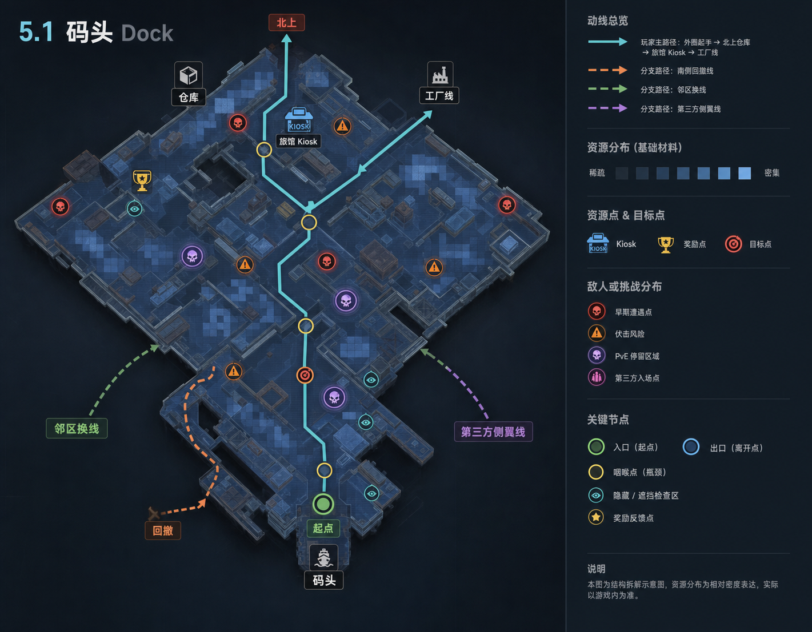

**Level Objective**
The dock is a typical outer ring starting area: it allows players to complete low-disruption looting on Day 1 before deciding to switch lines to warehouses, hotels, or factories. Its design goal is not to create a high-intensity team battle in the first minute, but to give characters who rely on melee combat, cooking, and crafts an edge entrance that can be formed first.

**Player movements**
The main line goes from the dock to the north to the warehouse, to the northwest to the hotel, and to the northeast to the factory. The meanings of the three roads are different: the warehouse line is most like a stable patch, the hotel line connects to the Kiosk for redemption, and the factory line sends players to the southeastern outer ring, which is suitable for solo queues that do not want to commit to the central outer ring goal prematurely.

**Space Layout**
On the map, the dock is located on the edge of a small island at the southern end, which naturally reduces attacks from one side, but also increases the cost of leaving. In terms of level design, this is a "safe but slow" entrance. Players get low information pressure at the expense of requiring earlier decisions when the target is refreshed.

**Interaction Mechanism**
The pier itself has no official kiosk labelling, and the interaction pressure comes from exit zone choices: whether to go to the warehouse first to replenish parts, whether to go through the hotel kiosk, whether to drag the rhythm along the outer circle. In other words, docks shift the interaction from in-zone combat to out-of-zone routing.

**obstacles and concealment**
Publicly available information does not include the coordinates of the pier's brush, the radius of footsteps, or the size of the bunker; this report only analyzes it as an edge zone in the fog of war. The risk of the dock is not "there must be some mysterious ambush point in the area", but the information will suddenly become less when leaving the area: from the southern edge to the warehouse, hotel or factory, the player must first determine which road has someone stopping in advance. For a single row, the most dangerous thing is not the search itself, but when leaving the dock with half-formed equipment, the route is read first by the team closer to the middle circle.

**Difficulty pace**
Day 1 is low pressure, Day 2 starts to be affected by the center target and restricted area closing. If the player stays at the pier for too long, he or she will pay an extra time cost for inter-zone time if he subsequently moves to the outer ring of the research center or the target on the school side.

**Bonus Feedback**
Reward feedback is "steady formation rather than instantaneous bursts." In the data, the dock supplies support cooking, short weapons and basic crafting chains, and are designed to give players a controllable start, rather than high-value bait.

**Adaptation role and mode differences**
Xiukai and Jackie, who need to convert early-stage materials into continuous combat effectiveness, are suitable here; single queues pay more attention to safe departure from the area, while multi-player teams need to designate one person to check the warehouse or hotel line in advance to prevent the three of them from leaving slowly at the same time. The key point of the teaching here is that "low-pressure starting does not mean low-risk whole game": the dock gives players the first period of safety and does not guarantee the safety of the second period of transfer.

### 5.2 Warehouse

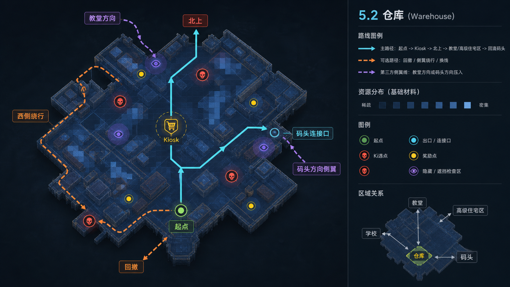

**Level Objective**
The warehouse is the economic redemption point on the south side, and its goal is to guide the looters from the outer circle to the middle circle. It is not simply safe like a dock, but a pressure door that "must pass through after completing the build".

**Player movements**
The warehouse can be connected to the dock to the south, the high-end residential area to the west, and the church to the north. After players start from the dock or high-end residential area, they often use the warehouse as a point to replenish materials and rearrange routes; in a multiplayer team, there will be a rhythm here where one person opens the box, one person watches the road, and one person prepares to change routes.

**Space Layout**
The current data station confirms that the Warehouse is a Kiosk area, which changes the warehouse from a resource point to an economic redemption point. In terms of spatial layout, it is close to the bottom of the map, but not far from the church and the forest, so it is the threshold for the southern outer circle to approach the central outer circle.

**Interaction Mechanism**
Kiosk is the most important level interaction in the warehouse: replenishing equipment, resurrecting teammates, and purchasing tactical materials all require staying. The design risk is that the stop will expose the queue to the queue coming from the church/senior housing area.

**obstacles and concealment**
Public information does not provide quotable high-definition pictures of the internal structure of the warehouse building, so this report does not describe the specific box height. The design analysis is based only on official regional relations: the warehouse is a multi-directional intersection, and the visual pressure comes from the intersection of the road network rather than a single bunker.

**Difficulty pace**
The pressure on the warehouse increases in the latter part of Day 1 and the earlier part of Day 2, because players in the outer circle will cash in their loot results here. If a nearby area enters a restricted state, the options for players in the warehouse will change from "slow search" to "leave as soon as possible, replenish parts and then change routes, or use adjacent areas that have not yet been restricted/reopened to detour."

**Bonus Feedback**
The level significance of warehouse rewards is to allow players to spend time in exchange for more stable mid-term equipment. Rather than serving a large one-time gain, it serves to push the southern route into the next phase of the battle.

**Adaptation role and mode differences**
Eleven (Eleven) or Estelle (Estelle) is suitable for warehouse exit protection in a multi-player team, Aya (Aya) or Haze (Haze) is responsible for the outside stringing; single-row Luke (Luke) is more like passing through the warehouse to find third-party opportunities.

### 5.3 Pond

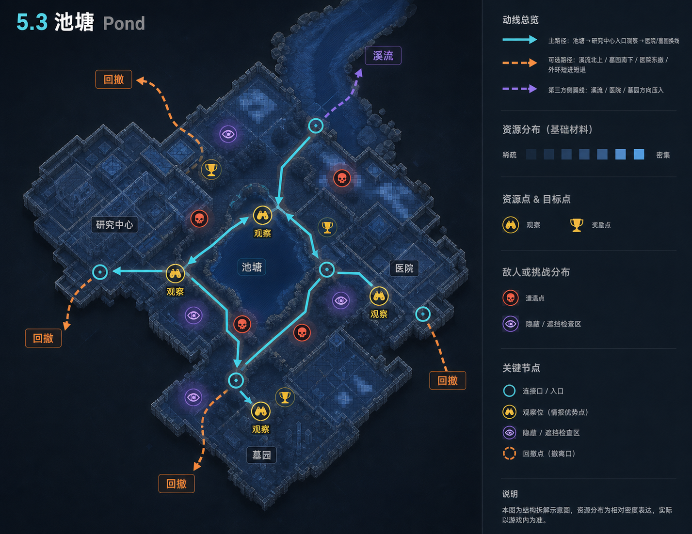

**Level Objective**
The pond is the central buffer zone, responsible for softly connecting the pressure of the research center, hospital, cemetery and fire station. Its goal is not to be a fixed end goal, but to allow passing, retreating, and counter-flanking to happen here.

**Player movements**
The pond connects the east side of the research center, the west side of the hospital, the north side of the cemetery, and the south side of the fire station. The value of the route lies in that it is not a single entrance, but an exchange surface that presses together multiple middle circle directions.

**Space Layout**
The pond is close to the center but not within the research center red zone, so it is often used as a "goal first, not commitment first" location. In terms of spatial economics, it gives players a short window to observe central events and also provides a low-commitment entrance for third parties to resolve conflicts.

**Interaction Mechanism**
The interaction here is mainly information interaction: target prompts, Boss notifications, the footsteps of the passing team and the fog of war border jointly decide whether to enter the site. Public information can confirm the short-term vision props and CCTV mechanism, but cannot confirm the specific grass coordinates.

**obstacles and concealment**
Since the pond borders multiple zones, barrier design focused on corners and line-of-sight cutoffs rather than long-term garrisoning. If players only look in the direction of the research center here, they will easily be flanked by the direction of the hospital or cemetery.

**Difficulty pace**
The pond starts to heat up after Day 2, as players decide whether to grab the central objective, whether to detour to the hospital kiosk, or whether to retreat from the cemetery. It is the buffer valve for mid-tempo.

**Bonus Feedback**
Reward feedback is information advantage and route choice. The supply of the pond itself should not be considered the protagonist, its real reward is allowing the player to switch targets with a shorter movement cost.

**Adaptation role and mode differences**
Control/information-based experimental bodies such as Hyejin and Isol are of high value in the pond; multi-person teams can station in the outer ring of the research center/move out to the path side/pond mouth in the front row, and station on the edge of the pond remotely. Single rows are more suitable to use the pond as a reconnaissance and retreat node.

### 5.4 Stream

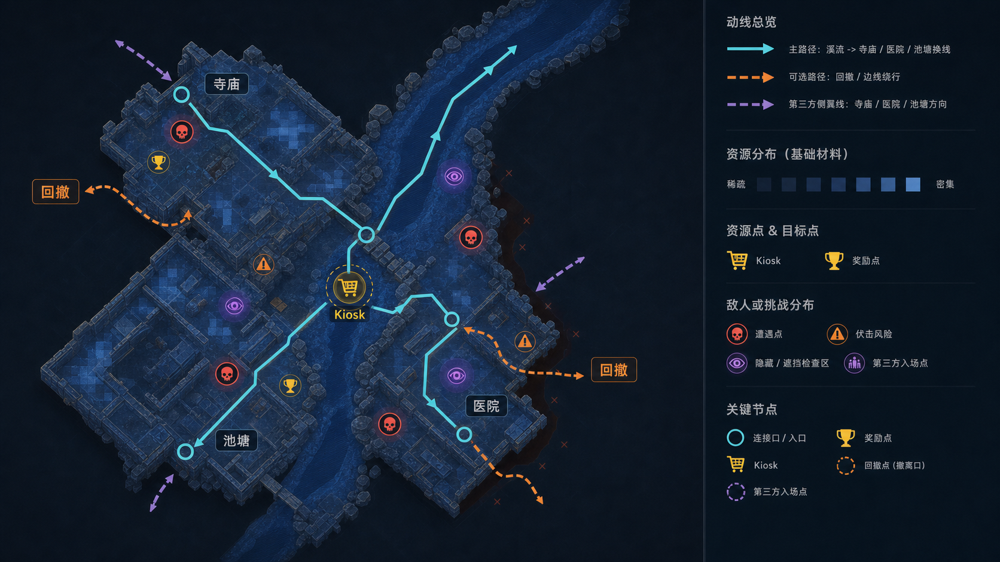

**Level Objective**
The stream is the resource suction and transfer gate on the northeast side. It forms a risky triangle between temples, alleys, and hospitals, where players must decide whether to continue developing the corners or join the mid-game battle toward the hospital/pond.

**Player movements**
The main route is from the temple to the stream, the stream turns west to the hospital, and the stream returns to the pond to see the center. Northeastern teams usually have to go through this set of road networks if they want to achieve their Kiosk or mid-term goals.

**Space Layout**
The stream is located between the outer circle in the northeast and the middle circle in the east. It is closer to the central target than the dock in terms of map relationship, but it is also easier to read by the teams on both sides of the hospital and temple.

**Interaction Mechanism**
The current data station does not list the stream as a Kiosk area. Kiosk pressure mainly comes from the adjacent Temple, Hospital, School and other redeemable points. In other words, the stream itself is more like "the water channel before going to the redemption point": it does not reward you for standing still for a long time, but forces you to judge whether you should continue to press towards the temple/hospital, or go back to the pond to see the outer ring of the center.

**obstacles and concealment**
There are no verifiable coordinates of stream grass in the public data, so the covert analysis is only written as "Northeast Road Network War Fog Short Window". Don't write the stream as a fixed ambush grass spot.

**Difficulty pace**
Day 1 can be used as an extension of the temple or hospital route, and Day 2 onwards heats up due to the proximity of adjacent Kiosk areas to the central objective. Normal area restrictions/reopening in the mid-to-late period will further increase the decision-making pressure: the stream may be a shortcut to transfer routes, or it may become a channel that cannot be pursued due to the cost of the red zone timer.

**Bonus Feedback**
The bonus feedback is that "the revenue from the northeast corner can be converted into the right to participate in the center." If the player obtains the materials but cannot exit safely from the stream, the reward will be eaten up by the cost of the route.

**Adaptation role and mode differences**
Rio and Nadine are suitable for using the medium and long-distance path from the stream to the hospital/temple; Jackie and Shoichi are more concerned about the short-term cutting opportunities brought by the corners of the stream.

### 5.5 Beach

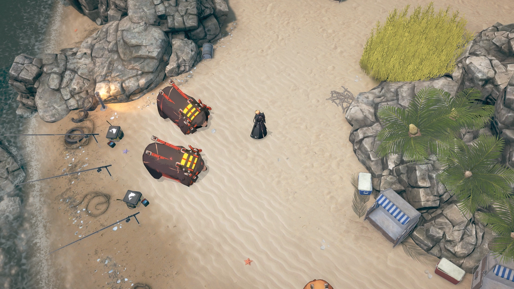

> This image is used to replace pure map cropping, indicating that the beach is not only the outer circle search area, but also responsible for mid-term PvE friction and loop exposure.

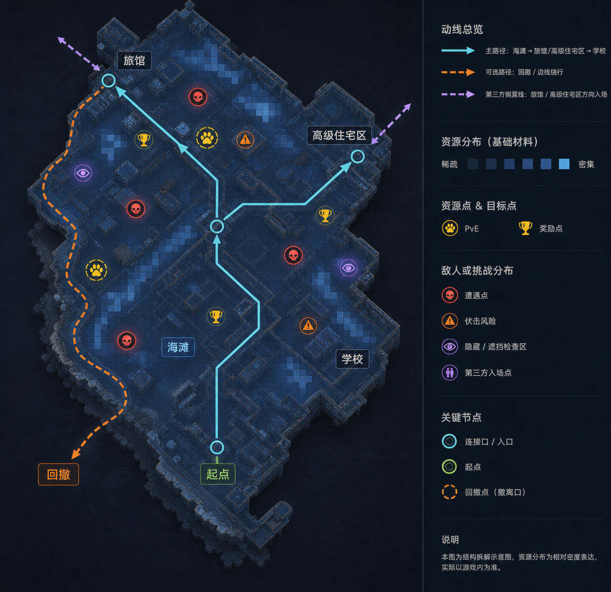

**Level Objective**
The beach is the starting area of ​​the southwest outer circle and one of the official mutant beast group sample areas. Its level goal is to accommodate novice looting with a low-pressure start, while using PvE rewards in the mid-term to bring players back from the edge to the conflict radius.

**Player movements**
The beach connects to hotels to the north, high-end residential areas to the southeast, and continues to the outer ring of the school to the northeast. If players in the outer circle want to participate in central events, they usually have to choose between the hotel kiosk or the outer circle on the school side.

**Space Layout**
The beach is located on the southwestern edge of the map. The single-sided boundary reduces the early attack angle, but also allows players to bear the pressure of long-distance lane changes earlier when the restricted area is closed.

**Interaction Mechanism**
The official 1.0 Gameplay gives a real-life example of a group of mutant beasts appearing on the beach. It upgrades the pure loot area to a mid-term PvE interactive area where "staying can get rewards and staying is also exposed".

**obstacles and concealment**
The real-life images confirm the existence of a visual hierarchy of open space and partial occlusion, but do not provide quantifiable cover dimensions. The design should be understood as a wide space in the outer ring, which is not suitable for fabricating precise cabinet parameters.

**Difficulty pace**
Day 1 is low pressure, Day 2 is hot due to the mutant beast swarm switching lines with the hotel/school. Multiplayer teams that hang around the beach for too long will miss out on the first round of research center and Wickeline-related objectives.

**Bonus Feedback**
The reward feedback is divided into two levels: basic materials are guaranteed to start, and the mutant beast group provides additional benefits in the mid-term. In terms of spatial economics, this is a hook that draws side players back into the main front.

**Adaptation role and mode differences**
Nadine can use the safety of the outer circle to complete her growth, and Xiukai can grow stably through cooking/supply routes; single-row players often use the beach as a low-risk starting point, while multi-player teams must arrange to explore the road to hotels or schools in advance.

### 5.6 High-end residential area (Uptown)

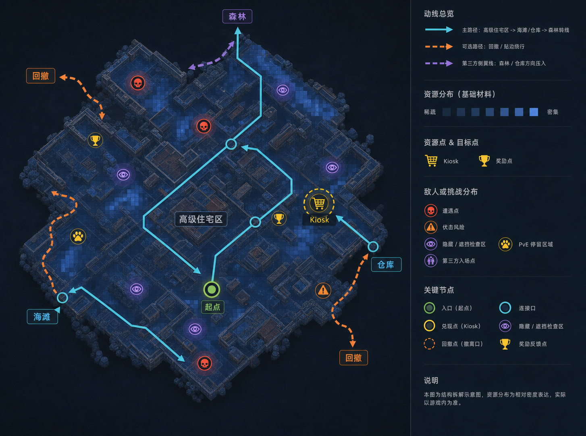

**Level Objective**
The high-end residential area is the supply and transfer area on the south and west side. The goal of the level is to combine the routes between the beach, warehouse, and forest. It's not the highest value point, but a fork that lets players in the outer circle choose "continue sideline" or "enter forest/church".

**Player movements**
High-end residential areas are connected to beaches, warehouses and forests. If the southwest team takes a conservative route, they will convert the beach revenue here into warehouse replacement parts; if they want to grab the mid-term goal earlier, they will cut into the forest.

**Space Layout**
The location of the map makes the high-end residential area affected by both beach low pressure and forest medium pressure. Its design logic is to transition from the outer ring to the center outer ring, rather than allowing players to stay for a long time.

**Interaction Mechanism**
The interaction mechanism is mainly route selection. Official data does not label this area kiosk, so economic cash-in is often done in warehouses or hotels, which makes the high-end residential area more like a transition zone.

**obstacles and concealment**
No real scene/grass coordinates of the high-end residential area were found in the public information. The report only discusses it as the outer transition space of the residential theme and does not describe the specific inner circle points of the building.

**Difficulty pace**
The early stage is relatively comfortable, but the mid-term pressure comes from the restricted area, the forest direction team and the warehouse kiosk competition. Its difficulty curve gradually shifts from resource searching to route judgment.

**Bonus Feedback**
Bonus feedback is stabilizing material and route resilience. What players do gain is the ability to plug the Southwest opening into multiple mid-term lanes.

**Adaptation role and mode differences**
Melee combatants such as Fiora and Yuki (Snow) who require a more stable equipment stage are suitable for entering the forest from here; a multi-person team can allow the remote to see the forest first, and the front row to protect the direction of the warehouse.

### 5.7 Alley

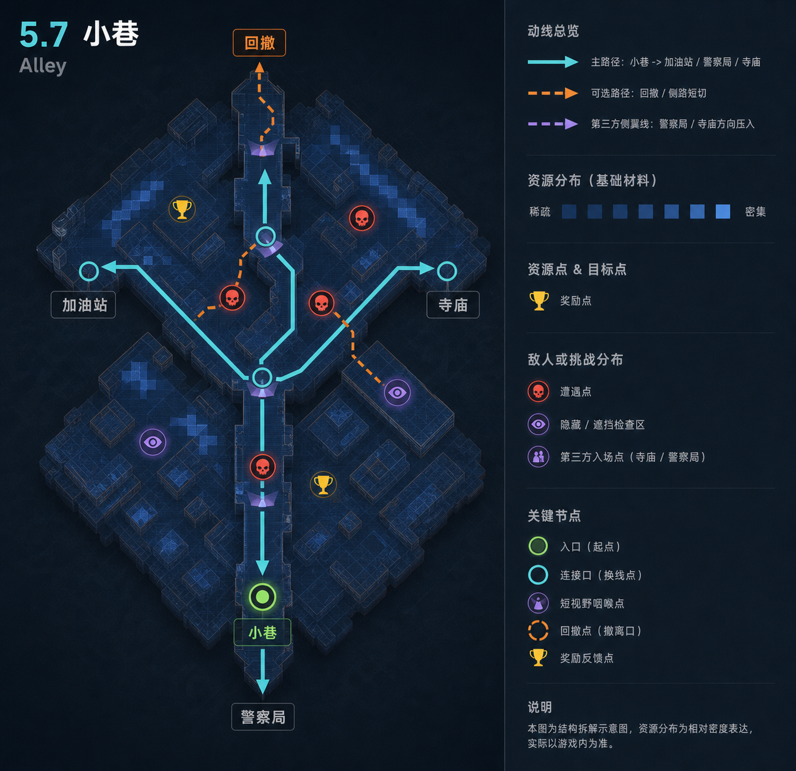

**Level Objective**
The alley is the lane change area of ​​the narrow road on the north side. The goal is to create short-range encounters, flank countdowns and retreat pressure. It connects gas stations, police stations, and temples, and is an early space for the northern line teams to test each other.

**Player movements**
If you push the gas station toward the alley, you can transfer to the police station; the temple will also pass near the alley if you go west. The route here is more linear and there is less room for detours, so it is easier for players to use sound, vision and target prompts to make predictions.

**Space Layout**
The alley's map location is close to the northern edge but close to the central police/fire station axis. It is not a pure corner, but a narrow door between the outer ring and the north center.

**Interaction Mechanism**
Alley interaction comes from short-term vision and intersection control. Official information confirms the field of view mechanisms such as Bat, Camera, and CCTV, but there is no specific camera coordinate table in this area, so the text only analyzes the mechanism and does not write the coordinates.

**obstacles and concealment**
Alley themes lend themselves naturally to occlusions and corners, but publicly available citations are not sufficient to quantify this. In terms of level design, it can be understood as a "short information window" training area: players must frequently confirm the next corner.

**Difficulty pace**
Encounters may occur on Day 1 because the starting points on the northern line are densely populated; after Day 2, the targets in the direction of the police station and fire station will turn this area into a flank passage.

**Bonus Feedback**
The reward feedback is not high-value supplies, but rights of way. The party occupying the alley can choose the direction of the temple, police station or gas station earlier.

**Adaptation role and mode differences**
Shoichi and Luke are suitable to use short intersections to take the lead; Aya and Haze need to maintain a retreat and are not suitable for close combat in the depths of the alley.

### 5.8 Gas Station

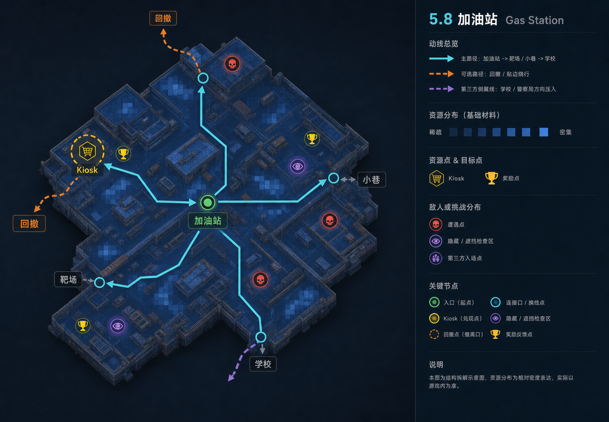

**Level Objective**
The gas station is the starting point from the Northwest Outer Circle into the North Central Circle. Its level goal is to give players a starting point for material molding, and at the same time, it uses three lines: shooting range, school, and alley to force players to choose the combat distance.

**Player movements**
It connects to the shooting range to the southwest, the alley to the east, and the school to the south. Ranged players can look for open lines toward the range/school, and melee players can create close calls through alleys.

**Space Layout**
The gas station is on the northwest edge of the map and is closer to schools and fire stations than the beach. Therefore, it is less safe than the extreme corner area, but the benefits of switching routes are higher.

**Interaction Mechanism**
The current information station does not list the gas station Kiosk, so its interactive meaning is not to "cash in place", but to send players on the northern route to the Archery Range, Police Station or School, which are redeemable/contestable directions. If players at the gas station want to make up for the damage, they usually need to complete the exit judgment first.

**obstacles and concealment**
There is no detailed data on the actual gas station in the public information. This report does not describe unverified bunkers such as oil tanks and vehicles. It only explains its advance and retreat options based on the road network relationship.

**Difficulty pace**
Day 1 is the start of the northern route, and Day 2 becomes the front station for the school/fire station outer circle competition. If players stay at the gas station for a long time, they will be dragged away by the goal in the direction of the school.

**Bonus Feedback**
Rewarding feedback is the Northern Line Rhythm Initiative. It allows players to choose between a remote combat zone or a narrow encounter zone in a shorter amount of time.

**Adaptation role and mode differences**
Rio and Nadine can move from the gas station to the shooting range to gain a range advantage; Magnus or Yuki are more suitable for entering from the alley/school.

### 5.9 Hotel

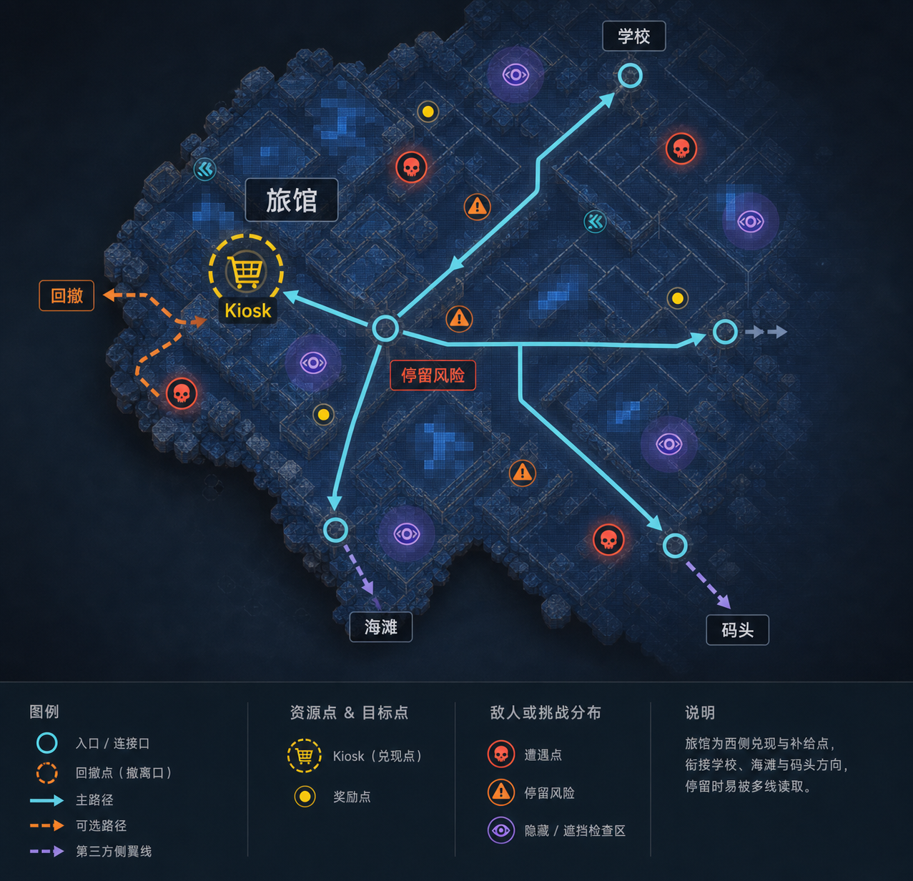

**Level Objective**
The hotel is the west side Kiosk redemption point and a relay between the beach, school, and marina. Its goal is to have players in the outer circle pay a "stay risk" before entering the middle circle.

**Player movements**
The beach to the north, the pier to the northwest, and the school to the southwest will all bring players near the hotel. The hotel route appears safe, but the Kiosk stop will hand over rights of way to nearby teams for observation.

**Space Layout**
The hotel is close to the western edge of the map, but closer to the center than the beach, forming a compromise between edge safety and central attraction. It is suitable as a supplement after retreat, but not suitable for long-term gathering of multiple teams.

**Interaction Mechanism**
A kiosk is the most important formal interaction in a hotel. When players purchase, resurrect or repair parts here, they must evaluate the people coming from both sides of the school and the beach.

**obstacles and concealment**
The public information does not provide screenshots of hotel interior tactics, so the room structure is not mentioned. In terms of design, the hotel is understood as "a place where the economy needs to stand", and the focus is on staying and being seen.

**Difficulty pace**
Day 1 can accept beach/pier starting players, and Day 2 starts to become a hot spot for patch items. If someone dies in multiplayer mode, the value of the hotel kiosk increases and the motivation to fight increases accordingly.

**Bonus Feedback**
Reward feedback is the ability to convert Credits into equipment/resurrection/sustainability. It serves the "search, fight, withdraw and cash out" in the core gameplay, so that the retreat is not the end, but preparation for the next entry.

**Adaptation role and mode differences**
Johann (John) and Estelle (Estelle) can protect the hotel Kiosk in the multi-player team; Jackie and Luke (Luke) in the single row will use this as an opportunity point to capture the remaining health repairers.

### 5.10 Factory

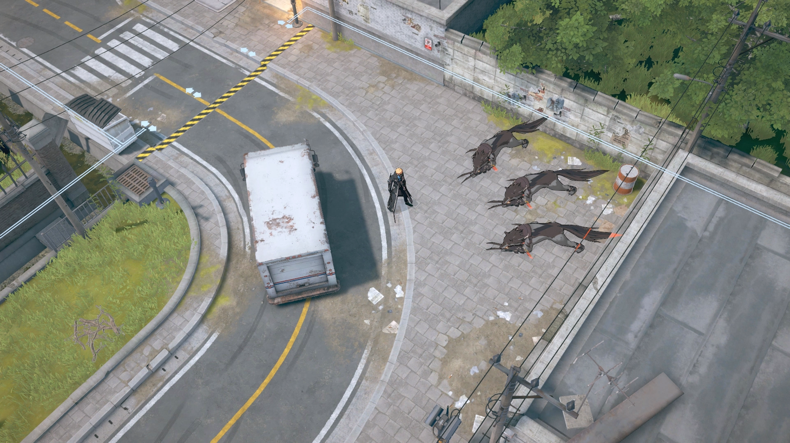

> This diagram serves to illustrate how the Southeast Industrial Outer Circle can turn low-pressure starts into mid-game scrambles through PvE rewards.

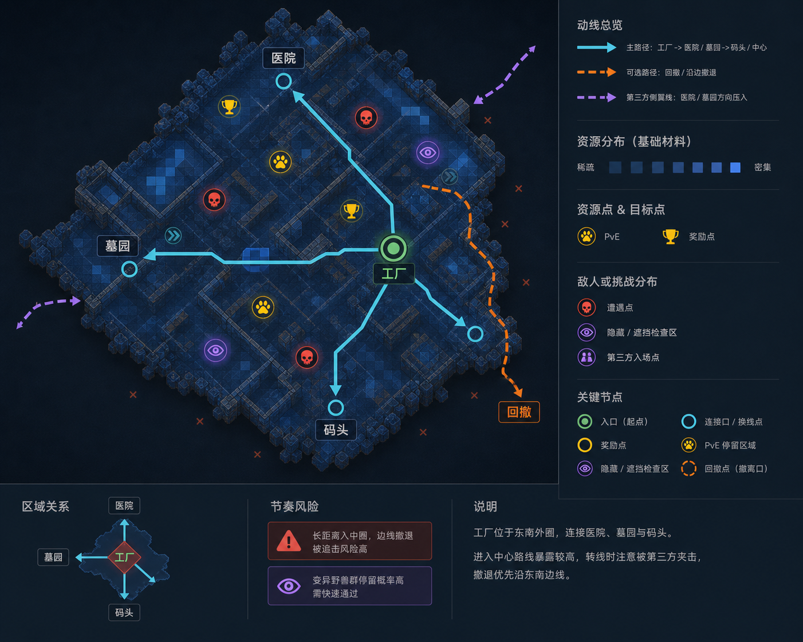

**Level Objective**
The factory is the southeastern industrial outer circle and is also the official mutant beast group sample area. Its goal is to provide a stable outer ring economy and compensate for slower routes closer to the central outer ring with mid-term PvE rewards.

**Player movements**
The factory can be connected to the cemetery to the northwest, the hospital to the north, and the dock to the southwest. When players leave the factory, they usually have to decide whether to take the hospital kiosk or the cemetery/church to the center outer ring.

**Space Layout**
The factory is in the southeast corner of the map, far from the center but close to the hospital/cemetery. This location allows it to have low early conflicts and high subsequent transfer costs, making it a typical "slow profit zone".

**Interaction Mechanism**
Official real-life photos prove that the factory is a case site for the mutant beast swarm. In terms of design, the mutant beast swarm turns the factory from a pure looting area into a mid-term contention point, forcing players to choose between stay rewards and transfer time.

**obstacles and concealment**
The real-life images present the industrial environment level, but there is no quantifiable bunker data. This report only discusses how it creates a sense of occlusion through the industrial theme and does not describe the unverified cabinet.

**Difficulty pace**
Day 1 was relatively low-pressure, but Day 2 began to rise due to the mutant beast swarm, hospital kiosk, and restricted area. Factory players can easily miss the central objective if they are too greedy for PvE.

**Bonus Feedback**
The reward feedback is stable development of the outer circle plus mid-term PvE compensation. It serves a gameplay that allows players to choose low-conflict growth, but not permanently avoid combat for free.

**Adaptation role and mode differences**
Xiukai can use the factory as a cooking and growth route, and Magnus is suitable for moving from the factory to the hospital/cemetery for frontal attack; the mid- and back-row of the squad should avoid being forced into close combat deep in the factory.

### 5.11 Cemetery

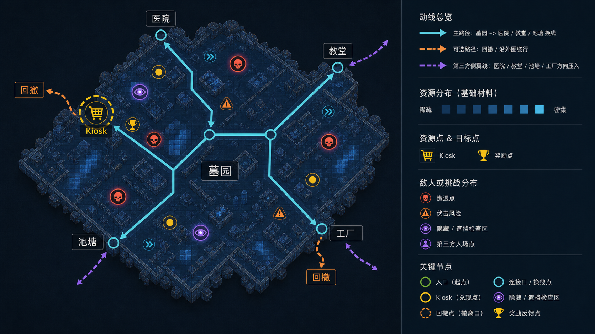

**Level Objective**
The cemetery is the southeast middle circle pressure valve, connecting the hospital, factory, church and pond. Its level goal is to undertake the last information judgment of the southeast outer ring players before approaching the central outer ring.

**Player movements**
You can enter the cemetery from the factory, you can cross the cemetery from the hospital, and you can attack from the church/pond in the opposite direction. The cemetery is therefore not a single path, but rather a location where the southeastern teams read each other's lines.

**Space Layout**
The cemetery is close to the Hospital Kiosk and Church Relay, in the middle circle but not the central red zone. Its spatial value is to compress the teams before the target is captured at adjacent intersections.

**Interaction Mechanism**
Interactions with the cemetery itself come more from adjacent objectives: Hospital Kiosk, Pond Observation, Church Redirect. No fixed boss or mutant group annotation was found in the official data, so it is not written as a high-value PvE point.

**obstacles and concealment**
The cemetery theme has a natural occlusion imagination, but it lacks referenceable real scenes and coordinates. This report is written only as "Line of Sight Segmentation and Fog of War Stress" and does not falsify tombstone bunker heights.

**Difficulty pace**
Day 1 can be used as the southeast crossing point, and after Day 2 it will become hotter with the hospital patch, research center objective and restricted area closing. The biggest risk for players in the cemetery is seeing one direction and being flanked by another.

**Bonus Feedback**
Bonus feedback is the route option to the southeast approaching the center outer ring. The cemetery gives players the flexibility to bypass the pond or head straight for the hospital, but each pause increases third-party risk.

**Adaptation role and mode differences**
Hyejin and Isol are suitable for area control in the cemetery; Haze and Aya can defend with mid-range vision, but need the front row to protect the flanks.

### 5.12 Hospital

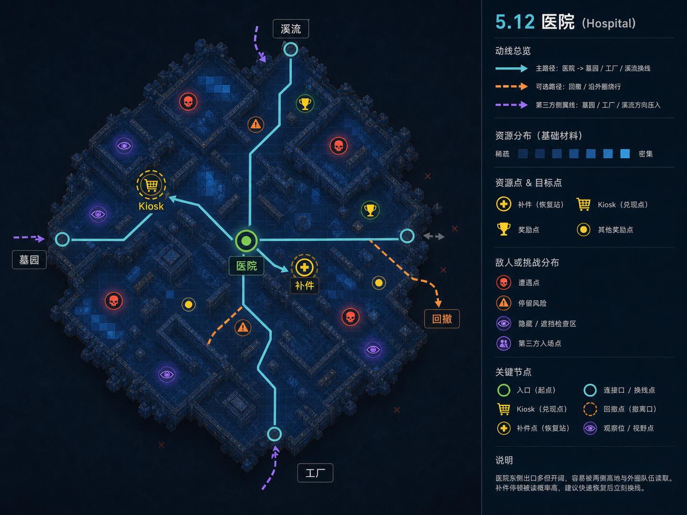

**Level Objective**
The hospital is the economic cash and reply theme area on the east side. The goal of the level is to allow players to obtain round endurance through Kiosk/supply meaning, while withstanding pressure from three directions: streams, cemeteries, and factories.

**Player movements**
The hospital is connected to a stream to the north, a cemetery/pond to the west, and a factory to the south. It is the largest relay station for players on the east line to enter the middle circle from the outer circle.

**Space Layout**
The hospital is close to the eastern border but has multi-directional exits, which makes it suitable for retreating parts and easily causing information noise from multiple teams on the same screen.

**Interaction Mechanism**
The current data station confirms that Hospital is a Kiosk area. In multiplayer mode, the value of resurrection and replacement parts will significantly increase the motivation of the hospital to fight; in solo queue, the hospital is more often used as a short-term stopover point.

**obstacles and concealment**
There are no publicly available verifiable hospital interior roadmaps, and this report does not describe specific rooms. But from the map relationship, the pressure on the hospital is clear enough: the three lines of stream, cemetery, and factory will bring the player to the edge of the hospital, and the Kiosk will make the player stop nearby. What players really need to do before entering the hospital is to "explore the door first, and then buy something." Otherwise, it is easy to end up in a situation where one person is opening the Kiosk, his teammates are still replenishing their status, and Luke or Shoichi are already approaching from the side.

**Difficulty pace**
Day 1 is medium pressure, then Day 2 heats up with the kiosk, the influx of southeastern teams, and objective prompts. If the hospital or adjacent areas enter a restricted state, the hospital will change from a "supply point" to a risk node where you must quickly decide whether to stay or go: continuing to buy items will consume the window, and leaving too late will hand over the retreat route to the opponent.

**Bonus Feedback**
Bonus feedback is sustainment and reorganization. Players convert combat losses into the next round of offensive capabilities in the hospital, but the longer they stay, the easier it is to be discovered by the east side road network.

**Adaptation role and mode differences**
Johann and Estelle can increase the team's fault tolerance around the hospital; Aya and Rio need to use the front row to stand at the exit, otherwise they will be easily cut by Luke or Shoichi. The correct rhythm for a Squad in the hospital is usually not to have three people clicking the Kiosk together, but one person to interact, one person to look at the stream or cemetery, and one person to retain the control skills; for a single queue, the hospital should be used as a "short-stop supply point" and not as a safe house.

### 5.13 Chapel

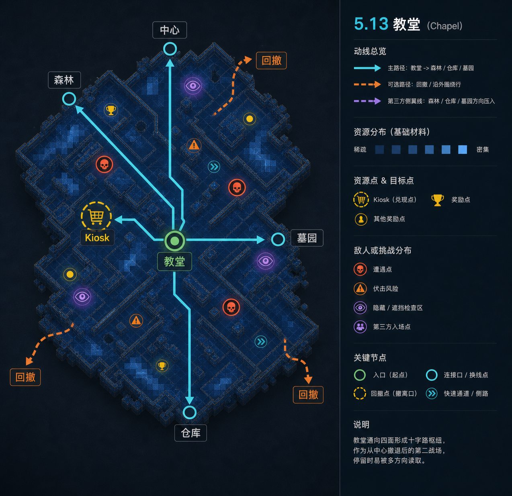

**Level Objective**
The church is the south central transfer gate, and it is also the area where the current version of the information mentions terrain changes. Its level goal is to compress the routes between warehouses, forests, cemeteries, and the outer ring of the research center into high-decision-density passages.

**Player movements**
The church is bordered by the warehouse to the south, the forest to the northwest, and the cemetery/pond to the northeast. It is a common passage for players on the south side to enter the middle circle and for players in the center to retreat south.

**Space Layout**
The church is near the lower center of the map and has a Kiosk marker nearby. It's not a starting point, but a converter for multiple routes, where players frequently move from a looting state to a combat-ready state.

**Interaction Mechanism**
Kiosks, routing, and terrain updates together make up the church interaction. The current version of the data shows that the church's terrain has been changed. This report only uses this as the boundary of "the current version needs to be reviewed" and does not deduce undisclosed details.

**obstacles and concealment**
There are no complete details of the new church in public information, so specific obstacles are not mentioned. The significance of level design is that terrain changes often adjust access, line of sight, and garrison value.

**Difficulty pace**
Teams from the south began to appear in the latter part of Day 1, and after Day 2 the pressure on the outer ring of the Kiosk and Research Center heated up. If the group retreats from the center, the church often becomes the site of a second exchange of fire.

**Bonus Feedback**
Bonus feedback is the ability to reorganize routes on the south side. Here players can patch up pieces, switch lines, and decide whether to press toward the center outer ring or move Wickeline out to the side, but each choice is paid for with dwell time.

**Adaptation role and mode differences**
Eleven (Eleven) and Estelle (Estelle) are suitable for pressure-bearing church exits; Hyejin (Huizhen) can use control skills to limit pursuit; single-row Yuki (Snow) is more suitable for quickly passing through, and is not suitable for long-term point occupation.

### 5.14 Fire Station

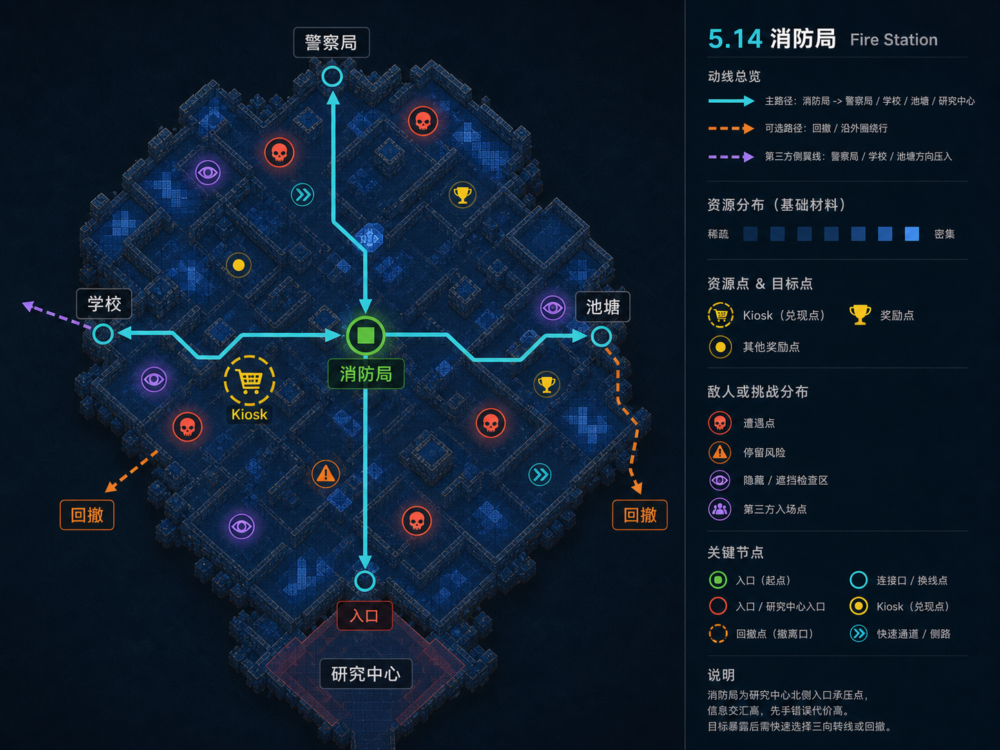

**Level Objective**
The fire station is a transportation hub in the north-central part, and the goal is to allow information from four directions: the school, police station, pond, and research center to collide here. It is the mid-term right-of-way judgment point.

**Player movements**
The fire station is connected to the school to the west, the police station to the north, the pond to the southeast, and the research center to the south. When players pass through a fire station, they are often no longer just looting, but deciding on the next battle.

**Space Layout**
The fire station is on the north side of the center and is not currently listed as a Kiosk area; its value is more towards the right-of-way gate on the outer ring of the north side of the research center, between the police station/school. Its spatial layout encourages a division of labor: some look at the research center, others look at the police station/school wing.

**Interaction Mechanism**
Central target cues, intersection observations, and adjacent kiosk directions together form the interactive core of the fire station. It does not rely on a single high-value item to attract people, but relies on location to create choices that must be passed through.

**obstacles and concealment**
Public information does not provide actual fire station bunker data. The report only analyzes intersection pressure based on official map relationships and does not include internal obstacles.

**Difficulty pace**
It heats up significantly from Day 2 onwards, as the center objective, adjacent Kiosk redemption directions, and the northern line all stack up. Night 4 In the final goal stage, the fire station often becomes the outer ring position on the north side of the center.

**Bonus Feedback**
Reward feedback is information and positioning. Teams occupying the vicinity of the fire station can know earlier movements in the direction of the school/police station/pond.

**Adaptation role and mode differences**
Haze and Rio are suitable for setting up wires from the outside of the fire station; Magnus and Eleven are responsible for entrance control; the single-row Shoichi will look for the side windows between the fire station and the research center.

### 5.15 Police Station

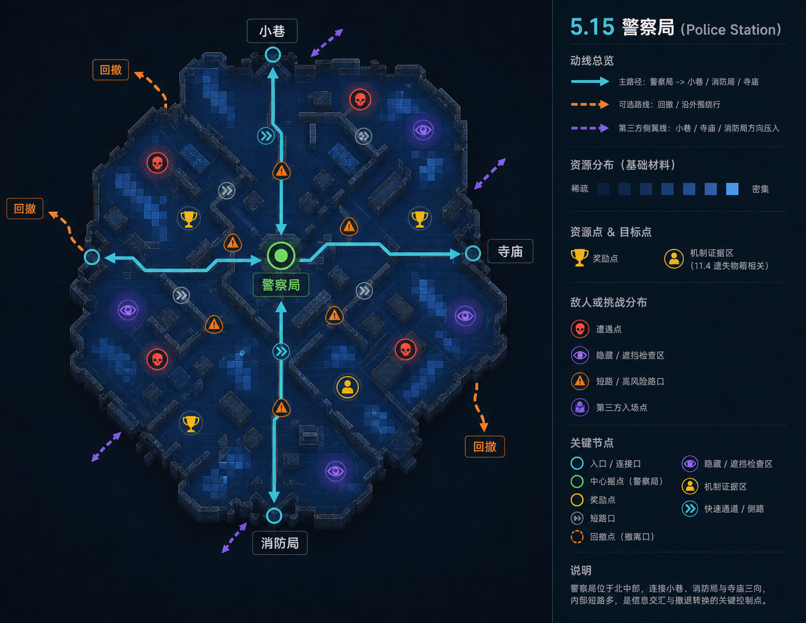

**Level Objective**
The police station has a high friction threshold in the north and central areas, and the current version of the information mentions changes related to the lost object box. Its goal is to pull teams together in the direction of alleys, fire stations, and temples through narrow roads and version objectives.

**Player movements**
The police station is connected to the fire station/alley to the west, the temple to the east, and the pond/research center perimeter to the south. It is the last information gate before the northern line approaches the central outer ring.

**Space Layout**
The police station is in the north-central area, closer to the central objective than the alley, so once the player stops there they will be under pressure from both the north and center lines.

**Interaction Mechanism**
The current version of the information mentions the Lost and Found Bin in the Police Department, which makes the purpose of the Police Department's value clearer. Events such as lost object boxes will turn players who were passing by into temporary stopovers, increasing the probability of encounters.

**obstacles and concealment**
Publicly available information lacks detailed maps of the police station and therefore does not describe specific rooms. What can be confirmed is that its road network position will amplify the value of short vision and control skills.

**Difficulty pace**
The Northern Front encounter can occur on Day 1, which gets heated after Day 2 with objective prompts, lost object boxes, and central contention. The difficulty curve here is steeper than at the gas station because it's closer to the center.

**Bonus Feedback**
Rewarding feedback is version events and central rights of way. Players get priority access to the fire station/pond direction, rather than long-term security benefits.

**Adaptation role and mode differences**
Isol's trap/area control, Hyejin's control, and Luke's short-term cuts can all be amplified in the police station; multi-player teams need to explore first in the front row, and are not suitable for naked entry in the back row.

### 5.16 Forest

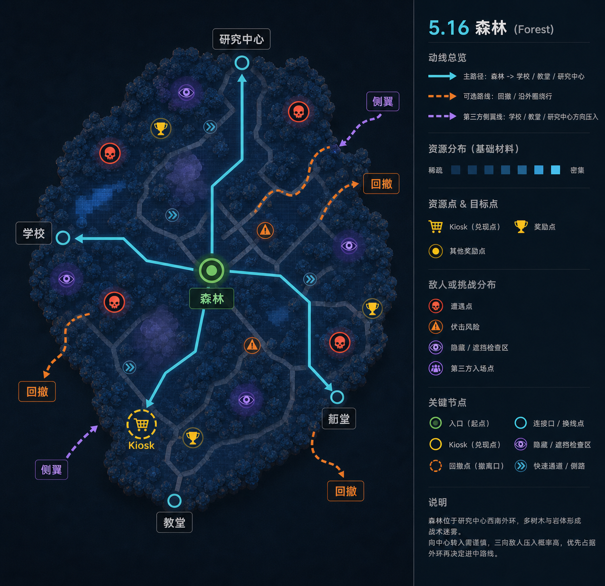

**Level Objective**
The forest is a hidden route-changing area in the outer ring of the center. The goal is to turn the routes between high-end residential areas, schools, churches, and research centers into multiple-choice questions with incomplete information.

**Player movements**
The forest borders the school to the north, the outer ring of the research center to the east, the church to the south, and the high-end residential area to the southwest. It is the main covert passage of the southwest outer circle close to the central event.

**Space Layout**
The forest is close to the research center but not at the core. It just serves as the outer ring position. Players can observe the center from the forest, or evacuate to the forest after engaging in firefights in the center.

**Interaction Mechanism**
The interaction of the forest is information control: fog of war, short-term vision, and route prediction. The official information does not give the coordinates of the grass, so we cannot write about a fixed ambush point, but we can discuss how the hidden area can serve third parties to dissuade fights.

**obstacles and concealment**
The terrain theme determines that it has an occlusion imagination, but the report only states that "the line of sight is segmented" based on the public map relationship. The real verifiable point is that the forest is located on multiple middle-circle routes: the north side is connected to the school, the east side is close to the outer ring of the research center, the south side is connected to the church, and the southwest is connected to the high-end residential area. As long as the player enters the forest, it is difficult to confirm four directions at the same time; this is why it serves third parties to mediate conflicts. Jackie or Shoichi don't need to know a fixed grass coordinate to take advantage of the short window of "you just looked at the center and can't look at the south side at the same time".

**Difficulty pace**
Day 1 can be used as a quiet transition, and Day 2 begins to become a contention surface for the center outer ring. Forests are a common outside route and retreat route when the Wickeline or Research Center objective is present.

**Bonus Feedback**
Bonus feedback is concealment and flanking angles. The forest rewards players with early positioning and information countdown, rather than pure material benefits.

**Adaptation role and mode differences**
Jackie and Shoichi are suitable for harvesting from the forest flank; Rio and Nadine need to use distance and teammates' vision to prevent being hit in the face by melee combat. Multiplayer teams are most afraid of "chasing into the fog together as a team" in the forest: if the front row does not confirm the direction of the church/school first, the value of the rays in the back row will suddenly disappear, and the battle will change from long-term suppression to close combat.

### 5.17 Archery Range

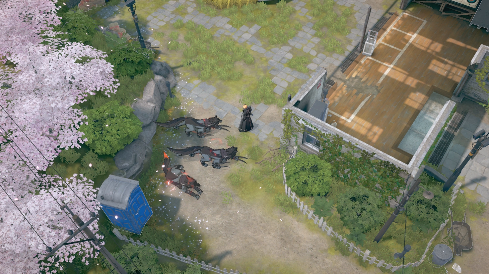

> This picture is used to illustrate the resource rewards and combat distance preferences of the starting area of ​​the northwest long-range characters.

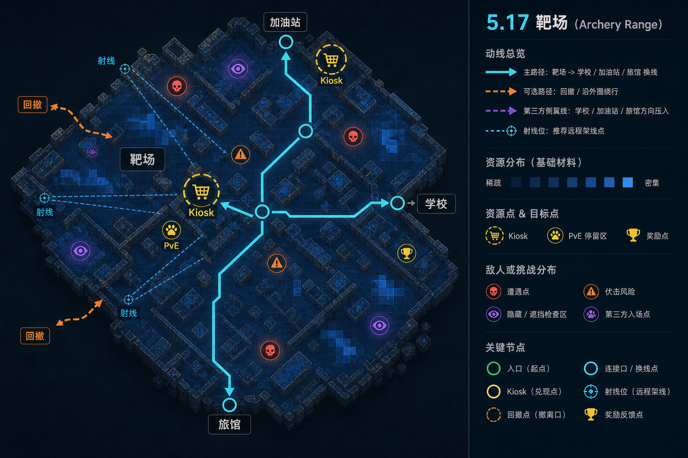

**Level Objective**
The shooting range is the northwest remote starting area and the official mutant beast group sample area. Its goal is to combine long-range sight, outer circle development, and mid-term PvE bonuses.

**Player movements**
The shooting range is connected to the gas station to the north/northeast, the school to the southeast, and the hotel to the southwest. Ranged characters often transition from here to the outer ring of the school to establish range.

**Space Layout**
The shooting range is on the northwest edge, very close to the school. It not only gives players a safe distance early on, but also quickly brings players to the west side of the center to fight.

**Interaction Mechanism**
The official mutant beast swarm map proves that the range can handle mid-game PvE contention. Ranged characters have a spatial advantage here, but staying to play PvE exposes the tempo.

**obstacles and concealment**
Real-life images can show the openness and occlusion levels of the shooting range, but there are no coordinates/dimensions. In terms of design, it can be regarded as a range test site, and do not write unverified bunker heights.

**Difficulty pace**
Day 1 is good for remote formation, and Day 2 heats up due to the mutant beast swarm and school lane changes. The closer you are to the school, the easier it is to be affected by the central goal.

**Bonus Feedback**
Rewarding feedback is ranged output space and PvE compensation. The shooting range allows players to experience professional advantages first, and then bring the advantages into more complex spaces through the school entrance.

**Adaptation role and mode differences**
Rio, Nadine, and Aya are suitable for medium and long distance routes from the shooting range to the school; Jackie and Luke will look for the flanking window between the shooting range and the school.

### 5.18 Temple

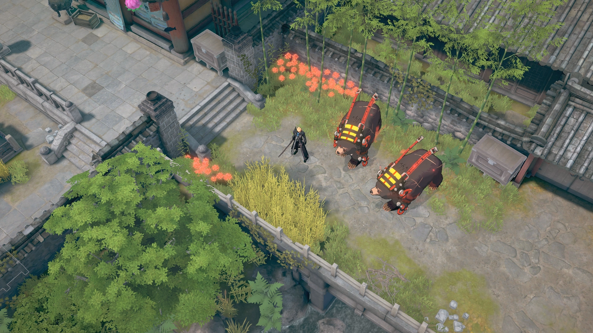

> This picture is used to illustrate that the resource suction of the northeast corner of the temple will pull the peripheral teams back to the main battle line.

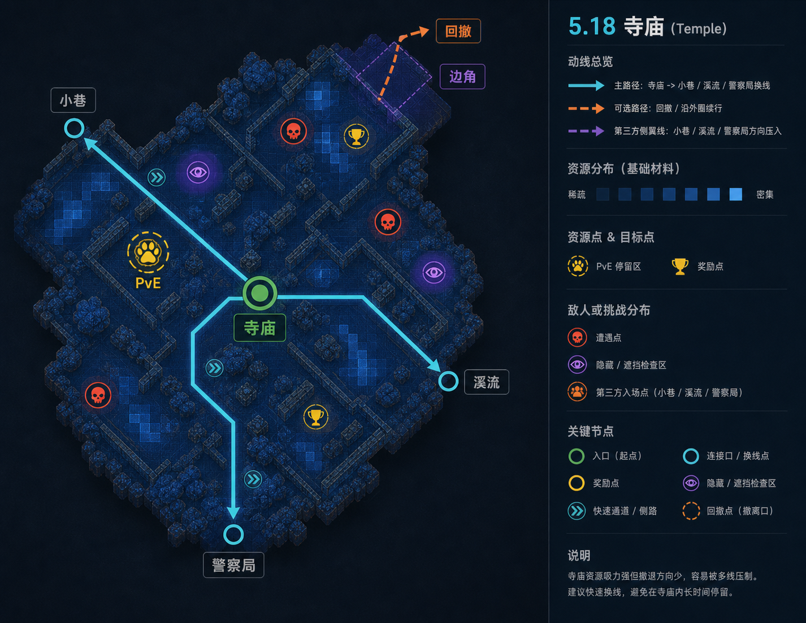

**Level Objective**
The temple is a high-value corner of the Northeast and an official sample area for mutant beasts. Its goal is to use high suction rewards to encourage corner teams to stay, and then make the shortcoming of few retreat routes a risk.

**Player movements**
The temple can be connected to the alley/police station to the west, the stream to the south, and the fire station/pond to the southwest. Northeastern players who want to participate in mid-term objectives usually have to go through streams or police stations.

**Space Layout**
The temple is in the northeast corner of the map. The border provides security on one side, but the available exits are limited. This layout naturally creates a space economy with "high rewards and difficult evacuation".

**Interaction Mechanism**
A horde of mutated beasts makes the temple a mid-game stop. Since the corner team has a safe back and a narrow road ahead when playing PvE, it is easier for third parties to press in from a fixed direction.

**obstacles and concealment**
Real pictures can prove that the temple has themed scenes and partial occlusion, but there is no quantifiable cover. The report only analyzes outlet numbers and corner pressure.

**Difficulty pace**
Day 1 is safe to grow, Day 2 gets hot with PvE and Kiosk/Stream routes. If the temple or stream side enters a restricted state in the middle and late stages, temple players will be forced to leave the corner earlier, or use a timer in exchange for a short distance crossing.

**Bonus Feedback**
Reward feedback is the exchange of corner high value and path cost. The temple does not allow players to get rewards for free, the real cost is being read by the alley/stream team when leaving.

**Adaptation role and mode differences**
Hyejin and Isol can use temple exit control; Magnus and Eleven can bear the pressure of narrow mouths; remote characters need to plan the retreat of the stream in advance.

### 5.19 School

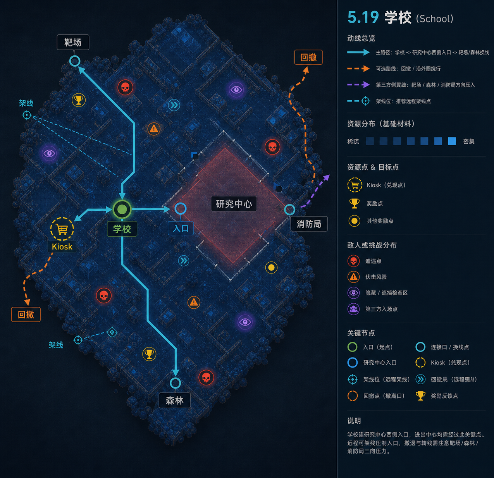

**Level Objective**
The school is the outer ring of the western central group battle, responsible for the transition from the shooting range, gas station, hotel, and forest to the outer ring/outward movement path of the research center. Its goal is to compress the outside long line, kiosk cash and center target into the same flanking space.

**Player movements**
The school is connected to the shooting range/gas station to the northwest, the hotel to the southwest, the forest to the south, and the outer ring of the research center to the east. It's the quintessential "station on the outer ring first, then decide whether to commit to Wickeline outward path-side target" area.

**Space Layout**
The school is adjacent to the west side of the research center and is labeled Kiosk next to it. In terms of layout, it can not only protect the retreat, but also provide flanking cuts on the outer ring/outward movement path of the research center. Therefore, it is the outer ring position rather than the end point of the mid-to-late battle.

**Interaction Mechanism**
Kiosk, center target prompts and intersection controls are overlaid on schools. Multiplayer teams often use the school as a re-entry point after resurrection/supplementary parts, while solo teams use the school to observe the remaining health situation in the center.

**obstacles and concealment**
Public information does not provide the complete school indoor route. The design analysis is based solely on official maps: the school is connected in multiple directions and is close to the center, so it has a high information load. Players not only "look at the center" at school, but also at the same time look at the long-range line from the shooting range/gas station, the replacement team from the hotel, and the flanking team from the forest. The school's hidden pressure comes from the existence of multiple entrances at the same time, rather than an unidentified fixed bush; if the team only focuses on the outer ring of the research center, they will often be attacked first by a third party in the direction of the forest or hotel.

**Difficulty pace**
It starts to get hot in the latter part of Day 1. After Day 2, it is bound to the goal of the research center. In the final stage of Night 4, the school often becomes the outer ring position and retreat redemption area.

**Bonus Feedback**
Reward feedback is access to the central objective event and Kiosk cash-out. School lets players gain observation, item completion, and re-entry opportunities without treating the Research Center as an ordinary scavenging POI.

**Adaptation role and mode differences**
Estelle/Eleven is suitable for the pressure line of the external path from the guard school to the outer ring of the research center, Haze/Rio is responsible for the output of the outer ring, and Shoichi/Jackie is looking for flankers to cut into the back row. Squad will use the school as a "re-entry platform": after resurrecting or repairing parts, they will press from the school to the center; in solo queue, it will be more like waiting for others to attack first on the edge of the school, and then enter after the skills and health line are exposed.

### 5.20 Research Center

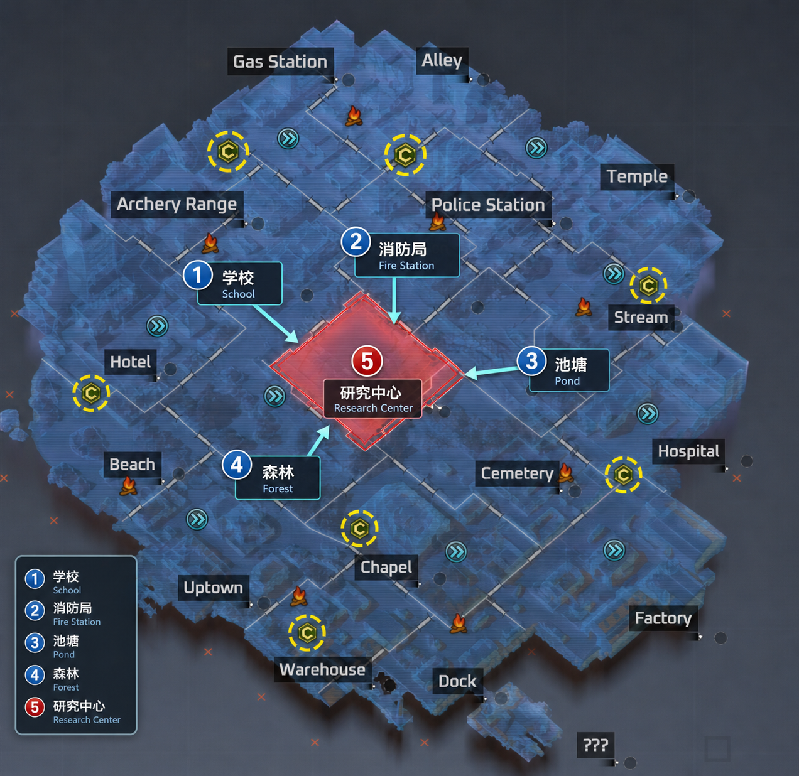

**Level Objective**
The research center is the core of the endgame high-voltage target, but it should not be written as a general material search POI. Its level goal is not to allow players to "enter the room and fight the boss comfortably", but to compress the appearance of Wickeline, the commitment of the outward movement path, the public target prompt, the outer ring wiring, and the third-party resolution into the same time window.

**Player movements**
The research center is surrounded by outer areas such as schools, forests, ponds, and fire stations. The current available information is more suitable to write the player's movement line as "approaching the outer ring of the research center, observing Wickeline's direction after leaving the research center, committing to or abandoning the goal", rather than writing it as a door-to-door search like in ordinary areas. Once the team leaves the target side, they will almost certainly enter one of the fallback lines at a school, forest, pond, or fire station.

**Space Layout**
The official map highlights the research center with a red area, indicating that it is a core suction point in the macrotopology. The current public rules show that the research center will become a restricted area after Night 4, and Wickeline will leave the research center and move to the unrestricted area; therefore, this report understands the red area as the "target pressure boundary" rather than an ordinary area space that can be stably operated.

**Interaction Mechanism**
The boss/target prompt mechanism and the Wickeline outward movement rules together constitute the central pressure of the study. Public prompts will reduce information asymmetry and let the whole picture know that the target window is open; but the real decision-making locations are the adjacent outer ring of the research center, the Wickeline outward path, the short-term horizon and the retracement direction.

**obstacles and concealment**
The public information does not provide a complete study of the height difference/bunker coordinates inside the center, nor does it provide the reviewable conditions for "entering the interior through ordinary methods and stably searching". The report only analyzes the outer ring, Wickeline's outward migration path, and public targets, and does not falsify architectural details or internal access rules.

This does not diminish its level value, but rather illustrates that the design focus of the research center is on the border rather than the room: what players are really fighting for is "the position closest to Wickeline but still able to retreat." The four outer ring directions of School, Forest, Pond, and Fire Station make it difficult for the target team to see all entry lines at the same time. If the first team focuses all their attention on the boss's health, the second team will read the skill openings from the outer ring; if the second team enters the field too late, they may find that the outer ring has been blocked by the front row and short-term vision.

**Difficulty pace**
After Day 2, the center outer ring gradually heats up, and the Wickeline window reaches its peak on Night 4. The difficulty for the team is not to "capture the center and win", but to manage the entry time of the outer ring team when the Wickeline moves out to the side of the path or commits the target on the roaming path.

**Bonus Feedback**
Reward feedback is high-value goals, tempo initiative, and end-game positioning. But the higher the reward, the stronger the space attraction, and the higher the probability of a third party intervening in a fight.

**Adaptation role and mode differences**
In Squad play, Eleven and Estelle handle outer-ring control on Wickeline's outward path, Haze and Rio damage Wickeline or outer-ring enemies, and Hyejin and Isol block entry routes. Solo play leans more toward waiting around School, Forest, Pond, or another outer-ring area for the endgame. Jackie wants other players to spend mobility and healing on the boss first; Magnus needs to turn narrow outer-ring entrances into initiations teammates can follow; Xiukai does not have to enter first, but his supplies and retreat lines can carry the team into a second engagement.

### 5.21 Special inspection of entrances, blind spots and ambush points

This section specifically responds to a question that is easy to write down in level disassembly: how to describe grass, walls, blind spots, and ambush points. The current public information does not provide verifiable grass coordinates, indoor wall coordinates, footsteps radius or bunker dimensions, so this report does not include false and accurate conclusions such as "a certain grass must be squatting" or "a certain wall is 1.2 meters high". What can be confirmed is the map area relationship, Kiosk/teleport point location, official target prompts, short-term vision mechanism, and the entrance inspection direction expressed by F-06/F-07.

| critical area | What it is: Confirmable spatial relationships | Why: Design Intent | How it affects players: Actual game decisions |
|---|---|---|---|
| Hospital | The Kiosk area confirmed by the current data station connects the streams, cemeteries, and factories in three directions. | The hospital places "repair, repair parts, and resurrection" in a multi-entrance pressure area, so that players cannot restore their status safely and cost-effectively. | The most important thing before entering the hospital is not to check the supplies first, but to ask: Are there any remote wires in the direction of the stream, are there controlled road closures in the direction of the cemetery, and are there any close combat pursuits in the direction of the factory. Aya/Rio need to be in the front row to see the entrance first; Luke/Shoichi is more suitable to wait for others to buy Kiosk or revive the barrage to enter. |
| Dock | In the starting area of ​​the southern outer circle, the current data station does not list the Kiosk of this area. Leaving the area mainly depends on the direction of warehouses, hotels, and factories. | It gives players a safe start, but trades "safety" for higher switching costs: the slower you leave, the harder it is to catch up with Day 2 resources and center-outer positioning. | Operation roles like Xiukai can start slowly at the dock, but they must decide in advance whether to go to the warehouse to replace parts, cash in the hotel, or go around the outer circle of the factory. If Jackie delays at the dock for too long, he will have to wait for the endgame window after others have completed their goals. |
| School | The west side of the research center outer ring, adjacent to the Kiosk, connects the shooting range, hotel, forest and the research center outer ring/outward path side pressure line. | The school allows teams to influence Wickeline goals without using the research center as a common entry point, which is a typical outer-ring commitment point. | Squad often uses the school as a re-entry point after resurrection/supplementary parts; Eleven/Estelle moves the pressure line outside the station, Rio/Haze sets up the line on the outside, and Jackie/Luke and other target teams enter the field when they retreat or buy a Kiosk. Most solo players do not commit to the goal first, but wait in the outer ring of the school for others to hand over their skills first. |
| Forest | The central outer ring and the flanking line exchange area on the south side connect the outside of the school, church, pond/research center. Public information does not give the coordinates of the grass. | The forest serves an "incomplete information" function: it makes it difficult for the target team to watch the south side, the school side, and the church side at the same time. | Before entering the forest, players must use Bat, Camera, CCTV or teammates to eliminate short-term threats; otherwise, the seemingly safe retreat line will become a third-party entry line. Jackie/Shoichi like the forest endgame, Rio/Nadine are afraid of being personal here. |
| Research center periphery | School, Forest, Pond, and Fire Station surround the central red area in four directions; F-07 only retains the close relationship between these four outer rings and does not depict unconfirmed internal rooms. Current rule caliber indicates that Wickeline will enter the unrestricted area on Night 4 from the research center outer ring/outward movement path side. | By disclosing the target, the Night 4 restricted area, and the outer ring of the migration path, the research center turns "who arrives first" into a team division of labor problem of "who commits first, who sees the migration path, and who is responsible for retreating." | If the first team fights Wickeline, it will lose skills, lose status, and expose its position; the second team cannot rush in casually, because the outward movement path may be covered by the front row and short-term vision. The real psychological game is: should you clear the enemy first or fight the boss first? Should you retreat in the middle of the fight? After receiving the profits, go to the school, hospital or church to cash out the Kiosk. |

This checklist is not a substitute for actual screenshots, but tells what should be captured in subsequent supplementary images: the hospital should focus on the three-way entrance and the Kiosk stop; the dock should focus on the exit route; the school should focus on the west outer ring of the research center and the periphery of the Kiosk; the forest should focus on the fog of war boundary and flanking paths; the research center periphery should focus on the positioning relationship when the Wickeline outward movement path side and the four-way outer ring of School/Forest/Pond/Fire Station coexist. As long as you get ER Masters or high-level practical video screenshots, the first priority is to add these pictures, rather than adding abstract concept pictures.

## 6. Changes in the heat of conflict in the early, middle and late stages

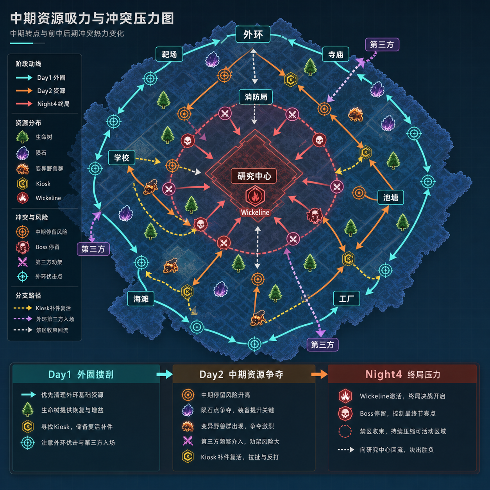

### 6.1 What is it: This is not a measured death heat map, but a mechanism pressure map

No reliable death heat map or engagement statistics heat map has been found in public information, so Figure F-05 only expresses "where the mechanism will suck players to" and does not express "where players actually die." The red center represents late-game suction at Research Center/Wickeline, the orange outer ring represents inlet pressure at School/Forest/Pond/Fire Station, yellow represents Kiosk cashing pauses, and cyan represents mid-term PvE suction like Mutant Herd. [Document number: S-01/S-03/S-IMG2]

### 6.2 Why: Conflict intensity changes from dispersed to concentrated over time

The conflicts in the early stage cannot be too dense, otherwise route learning and equipment formation will be swallowed up by randomness; the conflicts in the later stage cannot be too scattered, otherwise the PvPvE goal will have no decisive value. Lumia Island gradually turns conflict from "accidental encounter" to "predictable but difficult commitment" through Day 1 outer ring freedom, mid-term resource and Kiosk stay, Night 4 Wickeline, normal area restrictions/reopening, and endgame safe zone rules.

### 6.3 How it affects players: Players will shift from "avoiding people" to "choosing when to be seen"

On Day 1, players mostly want to avoid meaningless battles; after Day 2, players begin to actively calculate target refresh and Kiosk positions; after Night 4, players often cannot completely avoid battles and can only choose which direction to press toward the outer ring of the research center from School, Forest, Pond, or Fire Station. The real high-pressure point is not the moment you see the enemy, but the few seconds when you decide "whether to commit now, whether to fight the person or the boss first, and whether you can resurrect the replacement parts after retreating."

## 7. Research Center special analysis: Research Center/School/Peripheral Kiosk Final Team Battle Sample

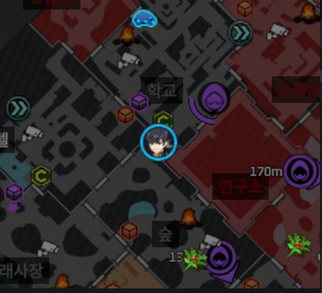

Figure F-10 illustrates that the pressure on the research center is not "players discover a hidden point by themselves", but that after the target information is disclosed, all teams in the map know that the same time window is opening. Disclosure of information reduces the cost of finding targets, but amplifies the game of entry timing. [Document number: S-01]

Figure F-07 only retains four map reading directions in the outer ring of the research center: School is the outer ring on the west side, Fire Station is the right of way on the north side, Pond is observation on the east side, and Forest is on the south side for concealment and retreat. The arrows in the picture indicate the direction of approach/observation/suppression. They do not indicate the entrance to a normal area, nor do they indicate that players can search the research center as a normal POI. [Document number: S-01/S-03/S-06]

First, let’s make the bottom line of the rules clear: the currently available information describes Lumia Island as 21 areas, 20 of which are usually accessible and will enter restricted areas day and night and reopen in some stages; the Research Center is the exception to the center that cannot be treated as an ordinary area. It becomes a restricted area after Night 4 and will not reopen. Dr. Wickeline will exit the research center and move to the unrestricted area. Players can theoretically approach the red zone by consuming the personal restricted area timer for pursuit, grabbing targets, or short-term detours, but this is not an entry rule for "normal entry into the area for search and long-term operations like hospitals, schools, and factories." Therefore, all "entry" in this chapter refers to the team moving from the outer ring such as School/Forest/Pond/Fire Station to the side of Wickeline's outward movement, rather than writing the inside of the research center as an ordinary boss room that can be stably used. [Document number: S-06]

### 7.1 Level Goal: Turn "Fight the Boss" into "Manage Being Seen"

The centerpiece of the Research Center isn't the boss itself, but rather the public objective prompt that turns Wickeline stops into full-map information events. After Night 4, the Research Center itself will become a restricted area and will not be reopened; Wickeline will come out of the Research Center and move to an unrestricted area. What the teams compete for is not "searching into the red zone according to the ordinary POI method", but the Wickeline's outward movement path side, movement path and outer ring road rights. Schools, forests, ponds, and fire stations bear four pressures: outer ring on the west, concealment on the south, buffer on the east, and right of way on the north.

### 7.2 Six-stage combat process

The textbook meaning of this process is: the final team battle is not a static boss room, but a combined system of "restricted area rules + Wickeline's outward path commitment + outer ring road rights + public information + economic redemption".

The first stage is the outer ring position: the team first selects a sideline among School, Forest, Pond, and Fire Station that can see the target side and retreat. The second section is observation of the outward movement path: after Wickeline comes out of the research center, the vanguard team decides whether to deal with the target immediately or clear the enemies in the outer ring first. The third paragraph is the goal commitment: playing Wickeline will cause dwell, skill consumption and status loss, and the restricted zone timer will also affect whether the player is willing to get close to the red zone boundary. The fourth stage is the entry of the third party: the back-up team cuts in from the outer ring and gives priority to attacking the team that is currently attacking the target or has just handed over skills. The fifth stage is retreat and cash-in: after getting profits or winning a wave, the team must retreat to a kiosk or safe route such as a school, hospital, church/forest, etc. The sixth stage is the second firefight: resurrection, replacement parts, re-opening of the restricted area and the next round of targets jointly decide whether to fight again.

### 7.3 How role responsibilities interact with space

- **Entrance Pressure**: Eleven (Eleven)/Estelle (Estelle) is responsible for the first wave of vision and control in the outer ring of the school or fire station, protecting the back row from being directly hit by Shoichi or Luke.
- **Output Wiring**: Haze/Rio/Aya need to establish a range in the outer ring of the school, the edge of the pond or the side of the fire station, instead of blindly approaching the red zone of the research center.
- **Road closures and information**: The entrances to Hyejin/Isol at the forest, pond, and police station sides are of high value, because these entrances are not simply wide roads, but short windows where the outer ring teams are most likely to squeeze in.
- **Operation and Fault Tolerance**: Johann (John)/Xiukai (Xiukai) did not "play less output" in the end game, but converted supplies, treatment, cooking and Kiosk redemption into the continuity of the second round of battle.

### 7.4 Restricted areas, enclosed spaces and data boundaries

The current public rule caliber gives the difference between the ordinary restricted area and the Research Center: usually accessible areas will become restricted areas over time and may be reopened; players entering the restricted area will consume their personal restricted area timer, and will die when it reaches zero; the Research Center will become a restricted area after Night 4 and will not be reopened. What can be confirmed and used for design analysis is: the research center is located in the center of the map, and the closing of the restricted area in the later period will reduce the available space; Night 4's Wickeline and public target prompts will push players to the outward movement path and outer ring; the four-way outer ring of School, Forest, Pond, and Fire Station will expose the target team when dealing with Wickeline.

This means that the focus of the design of the research center is not "how many walls are there in the inner room", but "once the player commits to Wickeline's outward movement path, he must answer five questions at the same time": whether the timer in the restricted area is enough, which outer ring direction to press from, who sees the outward movement path, whether to fight the person or the boss first, and which Kiosk to cash in after the fight. Jackie/Luke prefer to wait for the endgame in the outer ring, Aya/Rio/Haze need to find rays outside the Pond or School, Magnus/Eleven/Estelle are responsible for bearing pressure in the outer ring, and Xiukai/Johann turn supply and resurrection into the second round of entry capabilities.

### 7.5 The highest value resource in the later stage: Wickeline is not "a monster", but a signal of commitment to the whole map

**What it is**: Official Game Flow Materials Placing Wickeline in the high-value objective phase of Night 4, the boss/target tooltip also states that the target information will be publicly displayed. For players, this is not a hidden resource point, but a time window when everyone knows "something is going to happen here."

**Why**: If the highest value target is completely hidden, victory or defeat will be more dependent on information gaps and route contingency; if the target is just a quiet PvE monster, the first-to-reach team will collect the benefits at a low cost. Public reminders turn "where is the goal" into a consensus and change the real question to "who commits first, who enters the market later, and who is responsible for retreating and delivering." This can push the late-stage battle from pure numerical collision to route, vision and team division of labor.

**How ​​it affects players**: The team that reaches the outer ring of the research center first is not inherently safe. When playing Wickeline, you need to stay, transfer skills, lose status, and be read by the outer ring team; when approaching the boundary of the red zone, you must also consider the restricted zone timer. It may not be comfortable if you arrive late in the queue, because there may be people already setting up wires in the four directions of School/Forest/Pond/Fire Station. In actual games, the common psychology of the team is not "Should I occupy the center?" but "Should I commit to moving Wickeline to the path side?" "Will the third team take the boss if I clear the player first?" "Can I withdraw to the school or hospital side Kiosk after I take it?"

Wickeline’s fight is about more than just “giving rewards.” She will force the first team to stay, hand over skills and suffer status losses; if the outer ring team enters from School, Pond or Forest at this time, the first team often has to make a very short choice between "continue to fight the boss, turn around and hit people, or withdraw from the skill range first".

### 7.6 Entrance and view obstruction: four outer ring directions create four types of pressure

**What it is**: The current public information is insufficient to check the internal walls, grass and height differences of the research center, so this report only discusses the outer ring relationships that can be supported by map structures and localized images. School is the west Kiosk/re-entry direction, Forest is the concealment and flank direction, Pond is the east observation and buffer direction, and Fire Station is the north traffic and front pressure bearing direction.

**Why**: A good end point cannot have just one entrance. Only one entrance will become a front blocked door, and only open flat land will become remote cost-free wiring. The four-way outer ring allows different characters to have "can do but at a cost" tasks: the front row can guard the mouth, but guarding one mouth will miss another; the long-range can set up lines, but must retreat when being meleeed around the forest or the school flank; the assassin can wait for the endgame, but if he enters the battlefield too early, he will be counterattacked by the front row and control.

**How ​​it affects players**: The meanings of risk inspection maps for entrances to hospitals, docks, schools, forests, etc. converge here. If three people in the Squad all target the Wickeline, no one is watching the outer ring, and it is most likely to be penetrated by a third party from the Forest or School; if all three people are watching the outer ring, the Boss processing speed will slow down. Duo queue is even more awkward. One person hits the target and the other sees the line. They can only cover one direction. The remaining directions can only be judged by short-term vision props and hearing. The solo queue usually does not commit to Wickeline first, but stands on the outside of Forest, Pond or School and waits for others to hand over skills first.

One misunderstanding should be avoided here: the research center is not about "whoever is first in the red zone wins." The team that arrives first gets the right to deal with the targets on the side of Wickeline's outward movement first, and also gets the risk of four-way exposure, boss skill consumption, restricted area timer consumption, and the risk of the retreat route being predicted. The team that arrives later is not free to break up the fight, because if the four directions of School, Pond, Forest, and Fire Station are covered by short-term vision or front-row positions, the team that arrives later will be forced to enter the field through a narrow window, and the TTK will be compressed by the opponent's first move. The real test of the research center is the order of commitment, not simply the order of arrival.

### 7.7 Character play: In the same research center, different experimental subjects see different maps

**Jackie** prefers studying the outer ring of the center rather than the inner center. What she is looking for is the pause window when others fight bosses, buy kiosks, and retreat to recover blood. The flank line from Forest to School is more valuable to her, because there is a window for remaining health and skills to wait; if she has no information to get close to the red zone or Wickeline moves out to the side of the path, she will be easily focused by the front row and long-range fire.

**Aya/Rio** will see the research center as a ray problem. They should not blindly approach the red zone of the research center, but should find a position outside the Pond, School or Fire Station that can cover the Wickeline's outward movement path and allow them to retreat. What they are afraid of is the alley-style short window and the forest side facing their faces, so they need to check the outer ring in the front row, or use short-term vision props to check the flanks.

**Magnus** needs to compress the outward movement path and the throat point of the outer ring to the opening angle. Fire Stations, Pond mouths, and School side thresholds are all more suitable for him than pure open areas, because choke points can turn collisions and front-row pressure into team signals. The problem is that if his teammates don't keep up, Magnus will only become a target if he gets too close to the target.

The value of **Xiukai** is not in committing to Wickeline first, but in giving the team a second round. The outer circle starting move and supply operation made him more concerned about "whether it can be withdrawn after the attack, whether it can be replenished after the withdrawal, and whether it can be replenished after the replenishment." Studying center perimeter kiosks, zone timers, and fallback lines is important to him, as a supply advantage only becomes a winning advantage if the team survives until the second round.

## 8. Character and terrain interaction

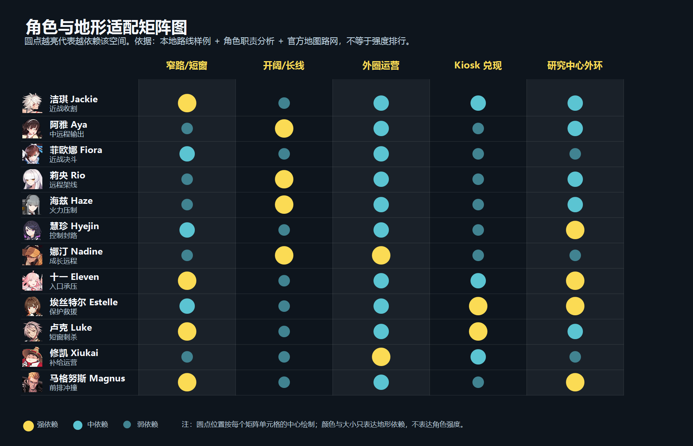

**Figure F-09 Reading**: The brighter the dot, the more dependent the character is on the corresponding space, which does not equal the strength ranking. It answers the question "Why does the map have narrow roads, long lines, outer ring operations, Kiosk cashing and research center outer rings at the same time": because different experimental subjects read the same space as different tasks. Solo Jackie will see Forest/School as the entrance to the endgame; Squad Estelle will see School/Hospital/Kiosk as a chain of protection and resurrection; Rio/Nadine will see Archery Range/Forest/Pond as rays and kite lines. [Document number: S-CHAR/S-05]

Putting the characters back into the level, it will be easier to understand why Lumia Island requires so many spaces of different scales:

| Level scene | What it is: Specific map behavior | Why: Characters change the meaning of the space | How it affects players: Actual decisions |
|---|---|---|---|
| Kiosk Pause | Hospitals, hotels, schools, police stations, churches, warehouses, shooting ranges, temples, etc. are currently reviewable Kiosk areas where players stop for parts, resurrection, or purchases. | For protection/fault-tolerance roles like Estelle and Johann, this is a safety valve for the team to reorganize; for Jackie, Luke, and Shoichi, this is the window where the enemy is most likely to turn around and slow down. | The Squad will be divided into people: one person interacts, one person watches the entrance, and one person stays in control; single-queue players usually only stop for a short time and leave immediately after buying, and do not use the Kiosk as a safe house. |
| Mutated beast swarms and mid-term PvE | Official examples include the Mutant Herd in the Beach, Temple, Factory, Archery Range and other areas. | PvE rewards will make the originally safe outer circle teams stay, long-range characters want to fight monsters safely, and melee/assassins will wait for the blood line and skill window after the fight is over. | Rio and Nadine will want to use distance to deal with the target; Magnus and Eleven will guard the entrance; Jackie and Luke are more willing to wait for others to hand over their skills and then cut in instead of attacking the monster first. |
| Research center outer ring | School, Forest, Pond, and Fire Station form the final pressure around Research Center and Wickeline's outward migration path. | The same outer ring does not mean the same thing to different roles: the long-range sees the ray, the front row sees the pressure port, the assassin sees the flanks, and the operational role sees retreat and secondary entry. | Before the team enters the field, responsibilities will be assigned: who will watch the forest, who will stand in the school, who will deal with the boss, and who will reserve skills to fight the third party; a team that cannot distinguish between responsibilities will easily lose the boss and the retreat line at the same time. |
| Restricted area and finals | Ordinary areas will be restricted/may be reopened; the Research Center will become a restricted area that will no longer be reopened after Night 4; there will also be a Temporary/Final Safe Zone later. | The restricted area makes "whether you can chase" become a matter of time and resources. The supply/support value of Xiukai and Johann will be magnified in the second round of battle, and the front-row pressure of Magnus and Eleven will determine whether the team can pass through the narrow mouth. | Players will not just ask "whether to fight or not", but also "how to move after the fight, whether the timer is enough, whether the Kiosk is still open, and whether teammates can keep up." This is why the later route is more like an operational problem than the early route. |

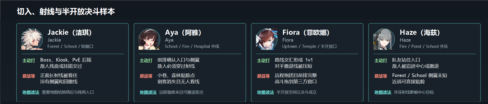

**Figure F-17.1 How to read**: First look at the four samples of Jackie, Aya, Fiora, and Haze, and you can see why the map cannot be made into only one type of space. Jackie needs flanks and residual health windows, Aya/Haze needs entrance outside beams, and Fiora needs a semi-open duel surface; the same School/Forest/Fire Station outer ring actually has different tasks for different characters. [Document number: S-CHAR/S-05]

The character avatar sub-images in the table below uniformly use locally traceable avatar assets; the route samples come from the current/near-current version samples after verifying and parsing the DAK.GG character route page SSR payload and DAK regional dictionary on 2026-06-13. They prove that "there are traceable Saved Plan route samples for this character", but they are not equal to the strength ranking, nor are they equal to the only optimal route.

| Experimental subject | Terrain dependence and core movement lines | Skills/Responsibilities and Space Interactions | The difference between solo queue and multiplayer | Level design inspiration |
|---|---|---|---|---|
|  Jackie | DAK 11.4 sample: Hospital -> Dock; favors Kiosk pauses, short windows, and endgame pursuit. | Melee harvesting requires the enemy to be paused due to a Kiosk, Boss, PvE, or lane change; the hospital starting sample shows that she can read pauses in high-interaction zones as opportunities to cut in. | Solo is more like an opportunistic hunter; in Squad, teammates need to create frontal pressure in order to cut in from the flank. | The map must retain flanks and endgame routes, otherwise harvesting characters can only charge head-on. |
|  Aya (Aya) | DAK 11.4 sample: Stream -> Factory; prefer medium and long-range output lines, industrial growth lines and retreatable rack points. | Medium and long-range firepower relies on the readable ray in front of the entrance, which is not suitable for close combat in deep alleys. The stream to the factory indicates that the remote growth line will cross the line change channel instead of just guarding a safe corner. | Single rows should avoid crossing narrow spaces; multi-person teams need to be in the front row to block the entrance. | The ranged character requires the map to provide open lanes, but must use side lanes to put her at risk of being cut. |
|  Fiora (Fiona) | DAK 11.4 sample: Hotel -> Dock; prefers semi-open duel surfaces, corner pursuits and retreatable routes. | Melee dueling characters require close enough timing and retracement judgment. The hotel to dock sample ties together the Kiosk/Relay Stall and the Outer Circle Retreat Line. | In solo queue, you can find 1v1 at the intersection of routes; in squad, you rely more on teammates to seize the entrance first. | The level requires a semi-open duel space, allowing both melee and long-range countermeasures. |
|  Haze | DAK 11.4 sample: Factory -> Temple; prefers industrial growth and then moves to corner targets and center outer rays. | The suppressive fire role requires steady line of sight and teammates to protect the entrance. Factory to Temple indicates that her route will be from the material/fire forming area to the high value corner scramble. | The risk of being attacked in a single row is high; in the Squad, the School/Fire Station/Pond entrance can be suppressed. | The outer ring is the main stage for remote characters to influence the central objective. |
|  Luke (Luke) | DAK 11.4 sample: Uptown -> Factory; favors short intersections, line pursuit and enemy pause windows. | Assassinate/harvest characters require the enemy to stay or make a mistake in turning. The transition from high-end residential areas to factories embodies the cutting pressure from the outer circle to the industrial high-friction zone. | Solo row relies on opportunism to grab the remaining health; squad is more like a flanking threat. | The map needs to retain short windows and bypass lines, otherwise the assassin will only have to rush through. |
|  Xiukai (Xiukai) | DAK 11.4 sample: Fire Station single-zone route; favors stable starts, supply operations, and outer-ring reentry. | Cooking/sustainability characters transform map resources into long-term combat effectiveness. The single-zone route sample shows that the current route design allows the operational role to reduce the complexity of the starting move first, and then focus on mid-term line changes and supplies. | Solo play can focus on growth and avoiding fights; in multiplayer, supplies improve the team's ability to re-enter. | The outer and middle rings both need learning beats that let operational characters build late-game value. |
|  Magnus (Magnus) | DAK 11.4 Sample: Fire Station -> Cemetery; turning from north central right-of-way to southeast choke area. | Front row/colliding characters have high value at the choke point, and will be kited remotely in too wide a space. The fire department went to the cemetery to combine the entrance pressure and the center circle line change. | The single row can capture isolated targets; the squad is responsible for entrance pressure and breaking up the formation. | The map needs narrow mouths and outer rings to coexist. |
|  Eleven (Eleven) | DAK 11.4 sample: Beach -> Hotel -> Forest; after the outer ring starts, it enters the flanking outer ring via Kiosk relay. | It has high value for entrance control and group protection, and is suitable for the entrance of School / Fire Station / Forest. This sample shows that she not only only knows how to stand from the front, but also needs to change from the outer circle to the mid-to-late stage pressure point. | The single row is more cautious; in the squad, the core is to bear pressure and protect. | High value targets must have entrance width and retreat lines. |
|  Estelle (Estelle) | DAK 11.4 sample: Factory -> Forest; connect the outer ring to the south flank of the center. | The protection/rescue duty relies on the team's positioning, and the forest route allows her to shift from material shaping to protecting the team into the mid-term outer ring. | Duo/triple rows are worth more than single rows. | Kiosk and outer ring retracement line are level devices that support the second round of operation of the role. |
|  Rio (Leo) | DAK 11.4 Sample: Barge -> Chapel; safe ray from outer ring/special start to south central outer ring. | Long range output requires line of sight and safe setback. The Barge sample indicates that the current route may operate from an unconventional outer ring start into the Kiosk/Church side. | Avoid committing too much in a single row; in a squad, the front row needs to provide a stable shooting line. | Open areas must prevent long-range costless output via flanking routes. |
|  Nadine (Nadine) | DAK 11.4 Sample: Chapel -> Dock; growing long range retracement from south central to outer circle. | Highly dependent on safe brushing, outer ring observation and distance control. The journey from the church to the pier reflects the growth rhythm of "get relay resources first, and then reserve space outside the area". | Single queues focus on growth and counterattack; multiplayer teams need others to protect the entrance. | PvE growth paths should lead to mid-conflict, not stay in the outer ring forever. |
|  Hyejin (Hyejin) | DAK 11.4 sample: Barge -> Cemetery; prefer the outer circle/special starting point to enter the cemetery with high control value. | Control skills are stronger at narrow entrances, forests, ponds, and police station side entrances. Graveyard Sample allows her to turn entry blockade into mid-game lane change pressure. | The single row can control the counterattack; the squad is responsible for blocking roads and restricting the entry of third parties. | The control character needs to be able to compete for the entrance, not just wide and flat land. |

### 8.1 Character route card: when to take the initiative to fight and when to avoid fighting

**What it is**: The route card below is not a strength list and not a real-time optimal-route claim. It translates the real character samples used in this report into four level-design questions: what terrain does the character like, what terrain punishes them, when can they initiate, and when should they avoid committing. The DAK route sample parses character, weapon, Plan ID, version, and region sequence from page payloads; F-04, F-04a, and F-04b have already been redrawn from that real network-guide sample set. Browser screenshots would improve auditability, but the current route evidence is not treated as official pathing or a tier ranking.

**Why**: Level design discussions can easily become empty talk if they only talk about "assassin, ranged, front row, support". What really affects map design is where the characters make decisions: Jackie waits for the Kiosk endgame, whether Rio can establish a ray in the outer ring of School, whether Magnus can turn the Fire Station entrance into a team-opening angle, and whether Xiukai can cash in on the outer ring operation into a second round.

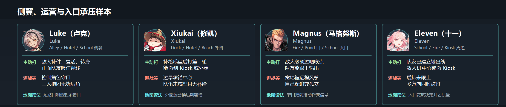

**Figure F-17.2 Reading**: Luke, Xiukai, Magnus, and Eleven split "fight or not" into four types of map problems: Luke needs short junctions and pauses, Xiukai cares about supply and the second round, Magnus wants to narrow the opening to turn the group opening into a signal that teammates can follow, and Eleven connects entrance control and Kiosk protection. [Document number: S-CHAR/S-05]

**How ​​it affects players**: Players don’t just fight enemies when they see them. Solo row will first ask "Do I have a way out?"; Duo row will ask "Who sees the line and who handles the target"; Squad will ask "After the front row is opened, can the output and support keep up?" These judgments will in turn determine what the map needs: short intersections, long rays, Kiosk pauses, outer circle retracement lines, and center outer circle pressure lines are all indispensable.

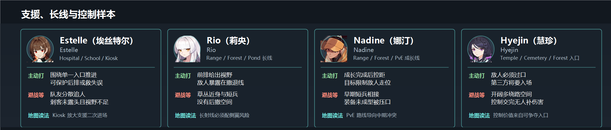

**Figure F-17.3 Reading**: Estelle, Rio, Nadine, Hyejin illustrate that "positioning" in multiplayer mode is more important than pure resources. Support relies on kiosks and retreat lines to delay mistakes into the second round, long-range requires the front row to provide vision, and the control character must wait for the enemy to pass; these all require the map to have a clear entrance, outer ring, and retreatable sidelines. [Document number: S-CHAR/S-05]

| Experimental subject | favorite terrain | Terrible terrain | Actively open the window | Avoid battle/waiting window |
|---|---|---|---|---|
| Jackie | Forest/School short-window and endgame routes such as outer rings, alleys, and police stations. | Unobstructed long rays, front entrance watched in advance by the front row. | When the enemy fights a boss, fights a Mutant Herd, buys a Kiosk, or retreats to recover blood, the action stops, the blood line is not full, and skills are handed over. | When the enemy's front row is complete, the long-range positions are wide open, and you have no flanks or retreat lines, do not rush into the outer ring of the research center from the front. |
| Aya | The outer ring of the School, the lateral line of the Fire Station, and the outside of the Hospital are positions that can cover the Wickeline's outward movement path or the target stopping point and can retreat. | Alley, deep in the alley, close to the forest. | When the front row or short-term vision has confirmed the flank, the enemy needs to pass through the short opening of the outer ring to approach. | When no one is watching the outer ring, the flanks are unknown, and the enemy Jackie/Luke may circle back, you should first retreat to the ray protected by your teammates. |
| Fiora (Fiona) | Semi-open dueling spaces on the outside of Uptown, Temple, and Alley. | The outer ring of the boss in an overly wide open space or where multiple teams can stand completely. | When the opponent is alone, 1v1 can occur at the intersection of routes, or when the opponent's retreat line is compressed by a wall or corner. | When the opponent has front-row protection from a distance, or the battle is delayed until a third party can enter, the line should be changed first. |
| Haze | Suppression rays from the Fire Station, the outside of the Pond, and the outer ring of the School. | Forest close, hospital/alley short window. | The front line holds the outer ring when the enemy must approach the target through a narrow opening or withdraw from the Kiosk. | When the enemy assassin disappears and no one is watching the Forest/School flank, don't be greedy for center output. |
| Luke | Alley, Hotel Kiosk, School flank, short intersection where it is difficult for the enemy to turn around. | It is a purely open area and the entrance where the controlled character is armed in advance. | When the enemy is distracted after patching up, resurrecting, playing in the jungle or fighting a boss, and the front of the team has attracted attention. | When the three enemies are in a group, Eleven/Estelle is under pressure in the outer ring, and you have no back angle, you should wait for the next wave to pause. |
| Xiukai (Xiukai) | Dock, Hotel, Beach, Hospital / Chapel retracement lines. | Continuous encounters with premature center commitment and no replenishment time. | When the team is well-supplied, the opponent has consumed one round, and can retreat to the Kiosk or outer circle after the battle. | When the team is not formed, the goal is too far, and there is no second round of supplies after committing to Wickeline, it is better to operate slowly. |
| Magnus | Fire Station, Pond entrance, School outer ring and other places where enemies can be squeezed into narrow openings. | The wide area that is stretched out by the distance, the deep pursuit route that teammates cannot keep up with. | When the enemy must pass through, the back row can keep up, and the enemy formation can be broken up after the group starts. | When teammates are too far away, the enemy has a complete kite line in the long range, and you are too deep and will be isolated, you should seize the opportunity first and not pursue deeply. |
| Eleven（Eleven） | School/Fire Station outer ring, Kiosk perimeter, research center outer ring pressure point. | Being hit in multiple directions at the same time, with no back row to follow, a deep position. | Teammates are ready for output and the enemy is about to press toward the outer ring of the research center or retreat toward the Kiosk. | When you are under pressure but your teammates are still repairing parts and the long-range ray has not been established, you should wait for time instead of forcing it. |
| Estelle | Near Hospital, School, Fire Station, Kiosk. | Teammates are too far apart to be rescued. | Teammates can advance around an entrance, and you can protect the backline or recover when a mistake occurs. | When your teammates are chasing each other, the outside view of the Kiosk is unclear, and the enemy assassin is not showing his head, shrink your position first. |
| Rio | Archery Range, Forest outside, Pond/School long line. | Alleys, deep forests, and locations where you are attacked in the face by melee combat at short distances. | The front row provides vision when the enemy is withdrawn from the center or Kiosk and must be exposed to the ray. | When the flanks are unknown, the enemy melee has disappeared, and you have no retreat line, don't stand still just to get a few more hits. |
| Nadine | Archery Range, Forest, Pond Outer Ring and growable PvE routes. | In the early stage, we were forced to fight in close combat and on a narrow road with no vision. | When growth has been completed and the enemy is restricted by targets or entrances. | In the early stage, when the equipment is not yet formed, the enemy is actively pressing the narrow opening, and you have no distance, give priority to changing lanes and clearing the jungle. |
| Hyejin | Temple, Cemetery, Forest, Pond entrances and other places where roads can be closed. | A completely open space that enemies can bypass from multiple directions. | The enemy must pass through, a third party is about to enter, and teammates need to block the road to gain time to hit the target. | When the control is handed over but the team does not take damage, or the opponent does not need to pass through your control area, you should wait for the next entrance window. |

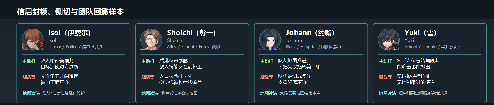

**Figure F-17.4 Reading**: Isol, Shoichi, Johann, Yuki This group is more like a "route quality checker". If there is no predictable path on the map, Isol's information blockade is meaningless; if there is no flank line, Shoichi can only charge head-on; if there is no concentration point and retracement line, Johann's support value will be weakened; if the space is all wide and stretched, it will be difficult for a stable advance and retreat character like Yuki to realize the advantage of short and medium distances. [Document number: S-CHAR/S-05]

### 8.2 Glossary: ​​Official English and Chinese textbook translations

| Official English | Chinese textbook translations | Mechanism explanation | Level design significance |
|---|---|---|---|
| Lumia Island | Lumia Island / Lumia Island | "Eternal Return" main game map | All zones, restrictions, objectives, kiosks and routes revolve around it |
| Restricted Area | restricted area | The red area on the map; after entering, the personal restricted area timer will be consumed and you will die when it reaches zero; ordinary areas may be reopened. | It turns route selection into time resource management, allowing short traversals but punishing greedy routes and unplanned pursuits. |
| Kiosk | Kiosk Store/Terminal | Official Help Center terminology, players use Credits to purchase, repair parts, and revive related content | Separate "earning benefits" and "cashing out benefits" to create stay risks |
| Acceleration Influx Perimeter | Acceleration Influx Perimeter | The short-term acceleration mechanism at the regional boundary; the data station records that the first time you cross the boundary, you can gain 50% movement speed, and it will be closed on Day 2. | Make the starting route on Day 1 smoother to avoid too slow search in the early stage; after closing, the cost of mid-term line change commitment will be increased. |
| Hyperloop | Hyperloop/Transport Terminal | The target area can be selected and teleported to a random location in the area; it ignores control when used on Day 1, and can be interrupted by subsequent control hits. | This allows teams to cross-region to fill positions, chase targets or rescue, but random placement in the destination area will create information risks. |
| VLS | VLS/Vertical Launch System | Starting from Day 3, it will replace the safe zone Hyperloop. You can glide synchronously with your teammates. The maximum movement range is about 130m. The mark will be exposed before landing and a short processing window will be generated. | Changing the mid-to-late line change from "point-to-point teleportation" to "public landing commitment" is more suitable for creating readable third-party entries and anti-crouching. |
| Credits | Honor value / Credits | Official Help Center terminology for Kiosk purchases | Turn combat, PvE and retreat into economic decisions |
| Rootkit | Rootkit / escape tool | Official Kiosk / Game Flow related items, available for purchase starting from Day 3 | Making "retreat cash out" in the later period is not just about running far, but also includes the judgment of whether to invest in the economy for Escape. |
| Escape | Escape / escape | Rules for entering possible states after Day 3 in the official Game Flow | It is not a traditional permanent map with multiple evacuation points, but it will affect whether the team continues to commit to fighting in the later stage. |
| Tree of Life | tree of life | Special materials/objectives in official Game Flow and Kiosk materials | Time points such as Day 2 and Day 3 pull players from the outer circle route to the mid-term resource competition. |
| Meteorite | meteorite | Special materials/objectives in official Game Flow and Kiosk materials | Use predictable refresh to create mid-term turning points and outer ring grabbing points |
| Alpha | Alpha / Alpha | Mid-term boss objectives in the official Game Flow | Move mid-term teams from scraping to target commitment |
| Omega | Omega / Omega | Late boss objectives in official Game Flow | Night 3 nearby pushes players into higher-stakes objective fights |
| Battle Zone | combat area | Official 1.0 Gameplay mechanics; the Eternal Return Wiki (Fandom information site) page describes them in a historical tone, and this article does not serve as a reference to the current stable map mechanics. | As a reminder of the old mechanics: any system that temporarily changes the risk of an area will interrupt the established route. |
| Mutant Herd | herd of mutated beasts | High-value PvE events in official 1.0 Gameplay | Create mid-term stay and third-party risk with PvE rewards |
| Wickeline | Wickeline / Wickeline | Official target/Boss related information | The public goal attracts teams from all over the map and forms the center of pressure in the final game. |
| Fog of War | fog of war | Players cannot continuously grasp the entire map information | Make short-term vision, route anticipation and flank cuts valuable |
| Choke Point | throat point | Locations where routes are compressed and entry and exit directions are limited | Amplify the value of frontline, control, trap and burst roles |
| Friction | Friction | Information/terrain/entities that allow players to stay, consume blood, transfer skills or be exposed | Transform PvE and interaction from “rewards” to “risk-reward options” |
| Third-party | Third party to break up the fight | Non-belligerent parties take advantage of targets or battle losses to enter | It is the core gameplay jointly created by the Research Center, Kiosk and Outer Ring Road Network |

## 9. Summary of level design

The level goal of Lumia Island can be summed up in one sentence: let players gain route freedom first, and then compress the freedom into high-pressure choices using public goals, fulfillment pauses, and restricted area closures. In the early stage, the outer ring area is responsible for reducing the randomness of death. In the middle stage, kiosks, mutated beast groups, target prompts, and ordinary area restrictions/reopening are responsible for creating turning point pressure. In the later stage, the Research Center and the surrounding School/Forest/Pond/Fire Station are responsible for involving the entire map team in the same outer ring commitment game.

From the player's perspective, the map is not a linear process of "walking from the birth point to the boss point", but a cycle of "scavenging -> changing lines -> observing -> committing -> retreating -> cashing out -> entering again". The meaning of each area should be understood in this cycle: piers, beaches, and factories start with low pressure; warehouses, hotels, hospitals, and churches turn profits into Kiosk pauses; schools, forests, ponds, and fire stations turn central goals into outer-ring right-of-way issues; and research centers stack restricted area rules, Wickeline outward movement paths, public information, third-party persuasion, and final closure into the highest pressure field.

## 10. Evidence, Figure List, and Evidence Boundaries

### 10.0 Release Checklist

This table separates the release deliverables from the evidence boundaries. The report is a complete release version: claims are supported by local files, source IDs, and parsed DAK route payloads; data that is not public or not verified by live screenshots is kept as a boundary note or optional future enhancement, not as an unfinished factual claim.

| Requirement | Release status | Evidence location | Evidence boundary / optional enhancement |
|---|---|---|---|
| Three-level argument: what / why / how it affects players | Complete | Chapters 1-9; Chapter 5 region-by-region analysis; Chapter 7 Research Center focus | Additional match screenshots could make the effects more visual, but they are not required for the current conclusions. |
| Based on real information, not fabricated | Complete, with evidence boundaries | Chapter 0 data baseline; Sections 10.1-10.5; Chapter 11 references | DAK payloads decode 3 routes for each of 16 sample characters. Non-public grass coordinates, wall details, and combat positions are not written as facts. |
| Illustrated text and local images | Complete | 55 local images in the main text; Section 10.6 figure list | image2 assets are marked as explanatory diagrams; official images, avatars, route figures, and regional redraws are all local files. |
| Real character scavenging route figures | Complete, redrawn from samples | Section 10.2; F-04 / F-04a / F-04b; S-DAK-ROUTE | Routes come from DAK Saved Plan payloads. They do not represent official routes, strength rankings, or single optimal paths; browser screenshots are optional audit reinforcement. |
| Hospital / Dock / School / Forest / Research Center perimeter risk diagrams | Complete within the map-and-mechanic evidence boundary | F-06 entrance-risk framework; F-15 regional redraws; Section 5.21 | The report discusses entrances, adjacency, Kiosk pauses, and objective pressure, not unverified grass points, wall coordinates, or footstep radius. |
| Early / mid / late conflict heat | Complete as mechanism pressure, not a statistical heatmap | F-05 mechanism pressure; F-04b route-sample heat; Chapter 6 | No public death or engagement statistical heatmap was found, so the report only uses mechanism pressure and route-sample heat. |
| Research Center focused analysis | Complete, with evidence boundaries | Chapter 7; F-07 / F-10 / F-15.20; S-06 | The conclusion is based on public objective, restricted-area, and Wickeline rules. Match screenshots can improve visualization but do not replace rule evidence. |
| Character analysis and avatars | Complete | Chapters 2 and 8; F-08 / F-09 / F-17; S-CHAR | Avatar sources are localized; official character page screenshots can optionally strengthen source traceability. |
| Centralized references | Complete | Chapters 10-11 | The body keeps source IDs instead of inline external links for GitHub readability. |

### 10.1 Official mechanism and timeline evidence

The old 1.0 Game Flow gave the original public skeleton of the objectives, materials, Boss, Kiosk, and Escape mechanics (Stuff No. S-01); but the current time/region rules need to be reviewed with the Lumia Island page accessible on 2026-06-12 (Stuff No. S-06). The current schedule of the data station shows: Day 1 / Night 1 / Day 2 still retains more safe areas; Night 2 begins to restrict 5 ordinary areas at one time; then Day 3, Day 4, and Day 5 will have an alternation of "restrictions + reopening"; Night 6 will have Temporary Safe Zones (temporary safe zones), and Day 7 / Night 7 will enter the Final Safe Zone (final safe zone) decisive battle. In other words, mid-late game conflicts don't "heat up" by feel, but instead zone openings/restrictions, kiosk availability, resurrection rules, objective prompts, and personal restricted zone timers all come together to narrow route options.

Translating the values ​​into level language, we can see that "mid-term pressure" mainly comes from three types of stops. The first category is where Kiosk stays: The official Help Center and 1.0 Gameplay data show that Kiosk can purchase Tree of Life, Meteorite, Mythril, Force Core, VF Blood Sample, Rootkit and other items; the current page of the data station also states that Kiosk is activated 260 seconds after the start of the game. The current Kiosk is located in Archery Range, School, Police Station, Temple, Hospital, Chapel, Warehouse, Hotel these 8 Each area can be used to resurrect teammates at a specific stage, and purchases will produce announcements/delivery actions that are perceptible throughout the map. This makes the Kiosk not just a restocking point, but a predictable point of interaction where "the enemy knows you're likely to stop." The second category is PvE stay: official Mutant Herd information shows that the Wolf Herd in Factory/Archery Range appears on Day 2, and the Bear Herd in Beach/Temple appears on Night 2, with respawn times of 310 seconds each. The third category is target stops: Wickeline, special materials and airdrops allow players to expose their positions for high-value gains; the restricted zone timer adds a time cost to these stops.

The current Eternal Return Wiki (Fandom data station) gives rules for restricted areas and research centers that are more suitable for the revision of this manuscript (data number S-06): Lumia Island has a total of 21 areas, 20 of which are generally accessible; these areas will enter restricted area status as the day and night progress, and may be reopened in subsequent stages. Players entering the restricted area will consume their personal Restricted Area Counter, which starts at 20 seconds and reaches a maximum of 30 seconds. Killing other experimental subjects can add 5 seconds; when the timer reaches zero, the experimental subject will die immediately. The Research Center is an exception target area: it will become a restricted area after Night 4 and will not reopen; Dr. Wickeline will exit the Research Center and move to the unrestricted area. Therefore, the main text rewrites the research center as "outward path target and outer ring pressure" instead of the ordinary POI entrance battle.

The same information also affects the writing of end-game interactions: starting from Day 6, players will restore part of the restricted zone timer; when the temporary safe zone appears on Night 6, interactions such as the security console, Hyperloop, VLS, Kiosk, Launch Pad, White Lily, etc. will stop working, and wild animals will no longer exist as map friction; when multiple teams exist, the temporary safe zone will be separated from other areas on the island, and will reopen only when there is only one team left inside. The Final Safe Zone of Day 7 / Night 7 completely transforms "route operation" into a problem of "remaining timer + final team battle". Therefore, the way to write a later report must focus on: whether this area can still be walked, whether it can be bought, whether it can fly, whether it can be revived with a Kiosk, and how many personal timers there are after entering the red zone, instead of just writing "the center is more dangerous".

| Mechanism Evidence (S-01/S-03/S-06) | Officially verifiable parameters | What it means for level design |
|---|---|---|
| Kiosk special materials | Tree of Life / Meteorite can be purchased, Mythril, Force Core, and VF Blood Sample are more expensive; Rootkit can be purchased starting from Day 3. | Turn "Route Scraping" into "Economic Cash Out" and players will generate readable pauses in the Kiosk. |
| Acceleration Influx / Hyperloop / VLS | The first crossing of the regional boundary provides 50% movement speed for a short time and is closed on Day 2; Hyperloop is distributed in Gas Station, Forest, School, Temple, Stream, Hospital, Factory, Chapel, Uptown, and Hotel; starting from Day 3, the safe zone Hyperloop is replaced by VLS. The maximum movement range of VLS is about 130m, and the landing point will be exposed and create a short landing processing window. | The traffic system makes the Day 1 route smoother, mid-term route changes more committed, and late-stage route changes more readable; instead of just following the road, players can choose between "quick rearrangement" and "exposed landing points." |
| Credit Revival | Available from Day 3 to Night 4, requires a short cast after purchase. | Multiplayer mode can delay a failure into a second round, but the rescue action itself will reveal the position. |
| Wolf / Bear Mutant Herd | Wolf Herd: Factory, Archery Range, appears on Day 2; Bear Herd: Beach, Temple, appears on Night 2; respawn time 310 seconds. | Areas that were originally safer or in corners will heat up again in the mid-term, with PvE stops becoming third-party entry windows. |
| Battle Zone | The old 1.0 Gameplay information includes Night 2 random battlefield, cannibalization, explosion countdown, kill recovery and other rules; the Battle Zone page of the Eternal Return Wiki (Fandom information site) describes the system in a historical tone. | This article does not include Battle Zone as the current stabilization mechanism in the regional conclusion; it is only retained as a reference for "how temporary regional rules change the flow of movement in history." |
| Bat / Camera / CCTV | Official data gives short-term field of view parameters such as Bat field of view 30 seconds / 8 meters, Camera 60 seconds, and CCTV 90 seconds. | The field of view is not permanent occupation, but short-window management; players have to decide when to explore, when to advance, and when to retreat. |
| Weather / Eco Objectives | Lumia Island data station records: Clear makes the base field of view 8.5m -> 10m and less grass; Rainy has more grass, SP recovery +100%, and hearing range is reduced by 15%; Sandstorm reduces the field of view; Glowing Flower can increase the field of view for a short time, Lantern Bloom provides 24m circular field of view, and Sandy Mushroom will generate a grass-like cloud for 12 seconds. | The hidden area is not a matter of fixed coordinates, but changes with weather, ecological objects and short-term vision tools. Areas such as hospitals, forests, schools, and the outer ring of research centers place more emphasis on detection points and flank protection on rainy days, while sunny days are more conducive to remote early wiring. |
| Dr. Wickeline | The Night 4 time window appears; Toxic Explosion-type skills will affect players within 8 meters and cause damage and poison pressure calculated based on current health points. | The team that fights the boss first will be forced to stay and lose status. It is easier for the third party to create high-pressure options when entering from the outer ring such as School/Pond/Forest. |
| Restricted Area / Research Center | Usually the accessible area will enter the restricted area and may be reopened; the restricted area timer initially starts at 20 seconds and reaches a maximum of 30 seconds. Killing adds 5 seconds. If it reaches zero, you will die. The Research Center becomes a restricted area after Night 4 and will not reopen; Wickeline leaves the Research Center and moves to the unrestricted area. | The restricted area is not a simple hard wall, but a time resource; the research center cannot be written as an ordinary search area, but should analyze the outward movement path commitment, outer ring position and retracement fulfillment. |
| Temporary / Final Safe Zone | On Night 6, a temporary safe zone appears, multiple map interactions stop working, and wild animals are cleared; on Day 7 / Night 7, the final safe zone enters a decisive battle, and the outcome can be decided by the remaining amount of the personal timer. | The final level has changed from "searching/repairing/changing lines" to the pressure of "closing small spaces, remaining timers, team battle handling and resurrection results". |

### 10.2 Route evidence verification status

**Route Evidence Verification Status**
The SSR payload of the DAK.GG character page confirms the Character Analysis / Saved Plans entry, character weapon branch, Plan ID, version, route code, and stat fields; the route code can be decoded by the DAK `/api/v1/data/areas` zone dictionary. The review results on 2026-06-13 showed that many manual routes in the old draft were mismatched or out-of-date: for example, #36002 is actually Luke, not Rio; #6471 is actually Ly Anh, not Xiukai; #4572 is actually Vanya, not Estelle. Therefore, in this round, the route evidence was changed to "resolved DAK samples", and F-04 / F-04a / F-04b have been redrawn from the same real network-guide sample set; the report still does not claim that these routes are strength rankings or the only optimal routes.

| Experimental subject/weapon | DAK parsed sample (verified 2026-06-13) | Processing of text route samples | Use in level analysis |
|---|---|---|---|
| Jackie Two-handed Sword / Two-handed Sword | Plan #828, v11.4.0, path Hospital -> Dock, v2 Win 13.89, v2 Like 3476. | Use Hospital -> Dock; the old manual route has been deprecated. | Support the level explanation of "Melee harvesting looks for Kiosk/target pause from high interaction area, and then uses outer circle retreat line to cash in". |
| Aya (Aya) Assault Rifle / assault rifle | Plan #8745, v11.4.0, path Stream -> Factory, v2 Win 15.91, v2 Like 2291. | Use Stream -> Factory instead of following the old draft factory route. | Support the explanation of "long-range firepower is connected to the industrial growth area through the line change channel, and then looks for the outer ring rays". |
| Fiora (Fiona) Rapier / Western sword | Plan #1686, v11.4.0, path Hotel -> Dock, v2 Win 12.09, v2 Like 671. | Use Hotel -> Dock. | Support the explanation of "semi-open duel roles require relay pauses and outer circle retracement". |
| Yuki Two-handed Sword / Two-handed sword | Plan #2426, v11.4.0, path Hospital -> Fire Station, v2 Win 14.61, v2 Like 5570. | Use Hospital -> Fire Station. | Supports the explanation that “the stable short-medium range role will shift from the Kiosk/Reply Zone to the North Central Right of Way”. |
| Magnus (Magnus) Hammer / hammer | Plan #3262, v11.4.0, path Fire Station -> Cemetery, v2 Win 13.78, v2 Like 2910. | Used Fire Station -> Cemetery; the old draft manual route has been deprecated. | Support the explanation that "the front row/collision role depends on the choke point, entrance pressure and teammate follow-up distance". |
| Eleven (Eleven) Hammer / hammer | Plan #7, v11.4.0, path Beach -> Hotel -> Forest, v2 Win 16.32, v2 Like 4116. | Use Beach -> Hotel -> Forest. | Support the explanation of "the entrance pressure-bearing role starts from the outer ring and enters the flanking outer ring through the Kiosk relay". |
| Estelle Ax / ax | Plan #2185, v11.4.0, path Factory -> Forest, v2 Win 13.86, v2 Like 3605. | Use Factory -> Forest; the old manual route has been deprecated. | Support the explanation of "the protection/rescue role shifts from the growth zone to the outer ring of the flanks and the team's retreat line". |
| Luke Bat / bat | Plan #4975, v11.4.0, path Uptown -> Factory, v2 Win 13.82, v2 Like 778. | Use Uptown -> Factory; the old manual route has been deprecated. | Support the explanation of "Assassination/Reaping characters use the lane-changing window from the outer circle to the high-friction zone." |
| Haze Assault Rifle / assault rifle | Plan #3107, v11.4.0, path Factory -> Temple, v2 Win 13.30, v2 Like 1717. | Use Factory -> Temple. | Supports the explanation that a firepower character can move from an industrial growth route into a high-value corner contest. |
| Rio Bow/bow | Plan #513, v11.4.0, path Barge -> Chapel, v2 Win 14.02, v2 Like 4826. | Use Barge -> Chapel, and mark that Barge is an unconventional area in the DAK's current area dictionary and is not included in the 20 ordinary area-by-area matrix. | Supports the explanation for "Ranged characters can enter the South Central Kiosk and Outer Rim from the Special/Outer Rim starting point." |
| Nadine (Nadine) CrossBow / crossbow | Plan #276, v11.4.0, path Chapel -> Dock, v2 Win 15.07, v2 Like 2658. | Use Chapel -> Dock. | Support the explanation of "Growth-type long-distance uses the south central relay to connect to the outer circle retracement". |
| Hyejin Shuriken / Shuriken | Plan #9147, v11.4.0, path Barge -> Cemetery, v2 Win 14.59, v2 Like 338. | Take Barge -> Cemetery and mark the unconventional area boundaries. | Support the explanation of "controlling the character to turn the starting point of the outer circle into the cemetery entrance blockade". |
| Isol Pistol / Pistol | Plan #683, v11.4.0, path Police Station -> Temple, v2 Win 14.60, v2 Like 1707. | Take Police Station -> Temple. | Supports the explanation that "information/trap characters operate around city kiosks, short junctions, and temple corner pressures." |
| Shoichi Dagger / dagger | Plan #13573, v11.4.0, path Hospital -> Cemetery, v2 Win 11.11, v2 Like 5345. | Use Hospital -> Cemetery. | Support the explanation of "short-window assassination characters finding pause around the hospital kiosk and cemetery entrance." |
| Johann Arcana/Arcane Cards | Plan #2917, v11.4.0, path Barge -> Alley, v2 Win 16.78, v2 Like 886. | Use Barge -> Alley and mark irregular area boundaries. | Support the explanation of "support characters gather from the outer circle/special starting point to the city's short intersection". |
| Xiukai Spear / Spear | Plan #3024, v11.4.0, Path Fire Station, v2 Win 15.35, v2 Like 278. | Fire Station single zone route adopted; old draft handmade route deprecated. | Support the explanation that "the operation/supply role can first reduce the complexity of the starting hand, and then transfer the value to the mid-term outer ring and the second round of supply." |

### 10.3 Twenty regional mechanism quick check matrix

The first 20 regions were written according to "region-by-region explanation"; this section has been changed to a horizontal quick review. Its function is to allow readers to quickly judge whether a certain area is a starting point, a transfer gate, a Kiosk redemption point, a PvE stop point, or the outer ring of the research center. The monsters/targets in the table are only those that can be confirmed by public information; the restricted area is handled according to the current rules of "possible restrictions/possible reopening" in ordinary areas, and no area is written as a fixed combat zone.

The reading of concealed evidence also needs to be updated: the public information still does not give the coordinates of grass, wall collision or footsteps radius, but S-06 has confirmed that weather and ecological objects will change the amount of grass, visual range, hearing range and temporary occlusion. Therefore, the "grass gap" in the table below does not mean that there is no grass in the game, but that this report cannot write locations that have not been reviewed with screenshots as fixed ambush points; the design conclusion only discusses verifiable dynamic information pressure.

| area | Level function in one sentence | Confirmed PvE / Enemies / Targets | Kiosk/Redeem Relationship | Restricted areas and concealed evidence boundaries | Player reading |
|---|---|---|---|---|---|
| Dock | The low-pressure starting point at the southern end is safe but slow. | No official fixed mutant beast group or leader information found. | There is no Kiosk in this area; it is transferred to warehouses, hotels, and factories for cash. | General areas may be restricted/reopened over time; there is no public information on grass, footsteps, and bunker dimensions. | Xiukai can start operations slowly, but must leave the zone in advance; if Jackie delays for too long, she can only wait for the mid-term endgame window. |
| Warehouse | The outer ring on the south side is supplemented with an economic cash door. | No official fixed mutant beast group map found. | The current information station confirms that there is a Kiosk in the warehouse, which is the stopping point for players on the south side to supplement their supplies. | Hidden risks come from multi-directional intersections, and the height of the box is not included. | The multi-player team needs someone to look in the direction of the church/high-end residential area; single-row Luke can look for Kiosk to pause. |
| Pond | Observation and buffer zone in the east central outer ring. | No official fixed Herd; forms indirect suction with Alpha, Research Center, Beach/Temple Herd. | No kiosks in this area; cash in direction of fire station/stream/hospital. | There is a gap in the coordinates of the water system grass; only explained according to the fog of war and multiple exits. | Hyejin/Isol can be sealed; Rio/Haze can use the pond to see the center but cannot promise too much depth. |
| Stream | The northeast line-changing channel connects hospitals, temples, and shooting ranges. | No official fixed Herd; close to the Temple Bear Herd pressure zone. | The stream Kiosk is not currently listed on the site; it is more like the pathway before the Temple/Hospital/School redemption. | Grass/auditory data gap; fixed ambush grass spots are not written. | Remote and controlled characters use it to enter temples/shooting ranges to scout for information, and retreat quickly when being attacked by melee combatants. |
| Beach | Starting from the southwest outer circle, Night 2 is popular for PvE. | Officially confirmed Bear Mutant Herd: 2 bears, Night 2 appearance, 310 seconds respawn. | There is no Kiosk in this area; the direction of the hotel/school/warehouse is the postwar cash line. | The official Herd real-life map is available, but the current grass/bunker coordinates are missing. | Suitable for low-pressure molding in the early stage; Night 2 bear hunting will be read by the hotel/school direction. |
| Uptown | Transition area from southwest outer circle to alley/hotel/warehouse. | No official pinned Herd found. | The upscale residential area Kiosk is not currently listed on the data site; the nearest redemption points are mainly Warehouse/Hotel. | There is a lack of real-life information on the surrounding spots and grass in the building. | Characters with short windows like Luke can use residential areas to enter alleys; long-range characters should not stay in unknown wings. |
| Alley | At the short intersection on the north side, zoom in and read the trap line. | No official pinned Herd found. | The current information site does not list alley kiosks; it prefers access roads around the Police Station / Hotel / School. | Do not write about the precise grass; only analyze based on short field of view, building edges and fog of war. | Shoichi/Luke likes to wait for others to turn around or add parts; long-range characters should avoid deep pursuit. |
| Gas Station | The starting diversion point in the northwest is where the oil, battery, gun lines and trap lines meet. | No official pinned Herd found. | The current data station does not list a gas station Kiosk; redemption pressure is from the direction of Archery Range / Police Station / School. | The oil and electricity repair parts can be ambushed when stopped, but the specific shielding coordinates are missing. | Haze/Isol can complete the gun/trap operation around here; look to the alley flanks before entering the school. |
| Hotel | West Side Relay and Kiosk Stop. | No official pinned Herd found. | The current data station confirms that the hotel has a Kiosk, which is the west side patch/resurrection staging point. | Gaps in construction details; confirmed by relay short stops and high intersection pressure. | Players' patch here is most likely to be read in three directions: schools, alleys, and high-end residential areas. |
| Factory | The southeastern outer ring industrial growth area becomes hot again on Day 2. | Officially confirmed Wolf Mutant Herd: 3 wolves, appearing on Day 2, respawn in 310 seconds. | There is no Kiosk in this area; the hospital/cemetery side and the teleport point are post-war transfer routes. | There are official real-life pictures of Herd, but there are no real-life corner screenshots in the direction of the hospital/cemetery. | Aya/Haze/Estelle can be molded from the factory; beware of hospital/cemetery third parties when hunting wolves. |
| Cemetery | The pressure valve in the southeast middle circle connects hospitals, churches, and temples. | No official pinned Herd found. | There is currently no cemetery kiosk listed on the data site; the closest redemption point is Hospital / Chapel / Temple. | Tombstone/wall detail gaps, bunker height not written. | Hyejin can use the entrance to block the road; teams will exchange information here before pressing from the factory to the outer ring of the center. |
| Hospital | The east side is the pressure area for battery life, replacement parts and resurrection. | No official pinned Herd found. | The current data station confirms that the hospital has a Kiosk; the three-way entrance exposes the purchase/resurrection action. | Three-way entrances need to be reviewed with actual screenshots; fixed grass and indoor routes are not included. | Before entering the hospital, you should look at streams, cemeteries, and factories; when buying a Kiosk, you are most likely to be struck by the side. |
| Chapel | The south central transfer gate connects the warehouse, forest and cemetery. | No official fixed Herd found; 11.4 official confirmed terrain adjustment. | The current data station confirms that the church has a Kiosk; it is also a secondary patch point for the south-central team. | 11.4 Description There are general changes, but the complete details need to be reviewed with the current actual machine. | Defeated teams often exchange fire here for the second time; support/control characters can use the entrance to stall for time. |
| Fire Station | The north-central right-of-way hub, the outer ring on the north side of the research center. | No official pinned Herd found. | The Fire Station Kiosk is not currently listed on the data site; the redemption point is at Police Station / School / Hospital. | Internal bunker gap; only analyzed based on the north entrance and outer ring positions. | Magnus/Eleven can keep their mouth shut; Haze/Rio can set up lines on the outside; the team needs to be separated into people to watch the school/police station. |
| Police Station | The northern line approaches the high friction threshold in front of the center outer ring. | No official fixed Herd found; 11.4 official confirmation of changes related to lost object boxes. | The current information station confirms that the police station has a Kiosk; the 11.4 lost and found box increases the local stay value. | There are official pictures of the current location of the lost object box, but combat occlusion still requires actual screenshots. | Jackie can be harvested through short intersections; the control/trap role can turn intersections into short combat windows. |
| Forest | The central outer ring, flanks and third-party conflict prevention channels on the south side. | No official fixed Herd found; creates lead pressure with Range Herd, Church/Cemetery route. | The Forest Kiosk is not currently listed on the site; it serves the front and rear flanks of the Chapel/School/Archery Range. | Grass coordinate gap; only fog of war borders and flanking paths discussed. | Jackie/Shoichi like forest endgame; Rio/Nadine need front row or short-term vision protection. |
| Archery Range | The northwest long-range growth line was pulled back to the combat radius by the wolves in the mid-term. | Officially confirmed Wolf Mutant Herd: 3 wolves, appearing on Day 2, respawn in 310 seconds. | The current data station confirms that the range has a Kiosk; the long-range growth line will form a stop point in the medium term. | The official has real-life pictures of the Herd, but lacks screenshots of the rays from the shooting range to the school. | Rio/Nadine can grow and set up lines; when fighting wolves, guard against double-teaming from the school/forest direction. |
| Temple | The high-yield area in the northeast corner has fewer retreat directions. | Officially confirmed Bear Mutant Herd: 2 bears, Night 2 appearance, 310 seconds respawn. | The current data site confirms that temples have kiosks; high-yield corner areas are therefore more susceptible to read pauses. | Official pictures of the Herd are available; the actual exit of the stream/alley is still missing. | Fiora/Hyejin can fight a short battle at the entrance; if the retreat is blocked after fighting the bear, the gain will turn into a burden. |
| School | West research center outer ring and kiosk reentry point. | No official fixed Herd found; adjacent to Research Center Wickeline Pressure. | The current data station confirms that the school has a kiosk, which is one of the most critical re-entry points in the outer ring of the research center. | Indoor routes, grass, and walls need to be reviewed with a real machine. | Squad can use the school to repair and then press towards Wickeline and move out to the side of the path; Jackie/Luke and other enemies will retreat, and Rio/Haze will set up lines on the outside. |
| Research Center | The core of the final goal, public information, restricted area rules and four-way outer ring superposition. | Official information confirms Night 4 Wickeline; the Eternal Return Wiki (Fandom information site) records that the Research Center becomes a restricted area after Night 4 and will not be reopened, and Wickeline will come out of the Research Center. | There is no Kiosk in this area; the surrounding School/Police Station/Hospital/Chapel, etc. will be the fulfillment direction after the Kiosk forms the target. | The internal room/wall/normal entry conditions still lack actual screenshots; the text does not treat it as a normal search POI. | If you fight the boss first, you will be exposed and lose your status, and you have to consider the restricted area timer; if you enter the boss later, you will also face the risk of being watched in the four-way outer ring. |

### 10.4 Regional Evidence Index

The following 20 pieces of evidence were originally scattered at the end of each regional section, but are now concentrated at the end of the article. The main text only retains the level design analysis. The specific materials, kiosks, route evidence and boundaries to be verified are reviewed here.

| area | summary of evidence |
|---|---|
| Dock | The official supply list can be used to check the existence of basic materials such as kitchen knife 7, rust sword 9, double knives 7, short stick 11, labor gloves 7 in this area; this report only uses it to explain the feasibility of the route, and does not use the resource list as the main body of the text. Cross-evidence: Dock Kiosk is not listed on the current data site; the most recently reviewed redemption direction is mainly Warehouse/Hotel. Dock appears 6 times in 48 DAK Saved Plan samples (starting point 0 / ending point 6 / relay 0). |
| Warehouse | The official supply list can be used to check the existence of basic materials such as pens 11, glass bottles 15, razors 7, playing cards 11, cloth armor 11 in this area; this report only uses it to explain the validity of the route, and does not use the resource list as the main body of the text. Interactive evidence: The current Lumia Island data station confirms that the Warehouse is a Kiosk area and can be used as an economic redemption point in the southern outer circle. Warehouse does not appear in the 48 DAK Saved Plan samples, so the bank only analyzes based on Kiosk redemption points. |
| Pond | The official resource list can be used to check the existence of basic materials such as 10 hammers, 14 pickaxes, 6 hatchets, 6 spears, and 9 sticks in this area. This report only uses it to explain the validity of the route and does not use the resource list as the main body of the text. Interactive Evidence: The Pond Kiosk is not currently listed in the data site; it is located near the Hospital/Temple/School redemption area and the outer ring of the Research Center. Pond does not appear in the 48 DAK Saved Plan samples, and the text only uses it as the outer ring observation area on the east side of the research center. |
| Stream | The official resource list can be used to check the existence of basic materials such as Hammer 12, Pickaxe 15, Bow 7, Needle 7, Windproof Jacket 12 in this area; this report only uses it to explain the feasibility of the route, and does not use the resource list as the main body of the text. Interactive Evidence: The stream Kiosk is not currently listed on the site; it was a rerouting channel before the Temple/Hospital/School redemption. Stream appears 4 times in 48 DAK Saved Plan samples (starting point 3 / ending point 1 / relay 0). |
| Beach | The official resource list can be used to check the existence of basic materials such as double knives 9, hammer 13, pickaxe 17, hatchet 9, short spear 9 and other basic materials in this area; this report only uses it to explain the validity of the route, and does not use the resource list as the main body of the text. Interactive evidence: Beach Kiosk is not listed in the current data site; after the war, the redemption direction is mainly Hotel / School / Warehouse. Beach appears 2 times in the 48 DAK Saved Plan samples (starting point 1 / ending point 1 / relay 0). |
| Uptown | The official resource list can be used to check the existence of basic materials such as pen 13, baseball 8, Fedorov automatic rifle 8, lens 8, hairband 13; this report only uses it to explain the validity of the route, and does not use the resource list as the main body of the text. Interactive evidence: The current information site does not list the high-end residential area Kiosk; the most recently re-verified Kiosk is Warehouse/Hotel. Uptown appears 4 times in 48 DAK Saved Plan samples (starting point 3 / ending point 1 / relay 0). |
| Alley | The official resource list can be used to check the existence of basic materials such as scissors 10, kitchen knives 7, steel chains 11, needles 7, and peaked caps 11 in this area; this report only uses it to explain the feasibility of the route, and does not use the resource list as the main body of the text. Cross-Evidence: The alley Kiosk is not listed in the current data site; it is more commonly used as an entry passage to the Police Station/Hotel/School. Alley appears 7 times in 48 DAK Saved Plan samples (starting point 0 / ending point 7 / relay 0). |
| Gas Station | The official resource list can be used to check the existence of basic materials such as 12 scissors, 11 pens, 12 hammers, 11 short sticks, and 6 whips in this area; this report only uses it to explain the feasibility of the route, and does not use the resource list as the main body of the text. Interactive evidence: The current data station does not list a gas station Kiosk; the redemption pressure comes from the direction of Archery Range / Police Station / School. Gas Station appears 2 times in the 48 DAK Saved Plan samples (starting point 1 / ending point 1 / relay 0), so it is only analyzed as a low-frequency route node. |
| Hotel | The official resource list can be used to check the existence of basic materials such as kitchen knife 9, Walter PPK 9, Fedorov automatic rifle 9, needle 9, guitar 9 in this area; this report only uses it to explain the validity of the route, and does not use the resource list as the main body of the text. Interaction evidence: The current data station confirms that the Hotel is a Kiosk area; nearby routes will bring beach, school, and pier players to the same stopping point. Hotel appears 6 times in the 48 DAK Saved Plan samples (starting point 5 / ending point 0 / relay 1). |
| Factory | The official material list can be used to check the existence of basic materials such as Hatchet 7, Whip 7, Walther PPK 7, Fedorov Automatic Rifle 7, and Bicycle Helmet 13 in this area; this report only uses it to explain the validity of the route, and does not use the resource list as the main body of the text. Cross evidence: The current information site does not list factory kiosks; after the war, the lines were mainly transferred to kiosk areas such as Hospital/Hotel. Factory appears 13 times in 48 DAK Saved Plan samples (starting point 6 / ending point 6 / relay 1). |
| Cemetery | The official resource list can be used to check the existence of basic materials such as pickaxe 15, bamboo 11, baseball 7, steel chain 12, lens 7, etc. in this area; this report only uses it to explain the feasibility of the route, and does not use the resource list as the main body of the text. Interactive evidence: The current data station does not list a cemetery kiosk; the most recently rechecked kiosk is Hospital/Chapel/Temple. Cemetery appears 10 times in 48 DAK Saved Plan samples (starting point 1 / ending point 9 / relay 0). |
| Hospital | The official supply list can be used to check the existence of basic materials such as scissors 13, double knives 9, labor gloves 9, razors 9, and needle 9 in this area; this report only uses it to explain the feasibility of the route, and does not use the resource list as the main body of the text. Interaction evidence: The current data station confirms that Hospital is a Kiosk area; the three-way entrance allows purchase and resurrection actions to be read by third parties. Hospital appears 9 times in 48 DAK Saved Plan samples (starting point 7 / ending point 0 / relay 2). |
| Chapel | The official resource list can be used to check the existence of basic materials such as 12 scissors, 9 rust swords, 12 hammers, 12 short sticks, and 7 whips in this area; this report only uses it to explain the feasibility of the route, and does not use the resource list as the main body of the text. Interactive evidence: The current data station confirms that Chapel is a Kiosk area; it is the node where the South Central area was replenished after the retreat. Chapel appears 6 times in 48 DAK Saved Plan samples (starting point 5 / ending point 1 / relay 0). |
| Fire Station | The official supply list can be used to check the existence of basic materials such as pens 12, glass bottles 15, playing cards 12, long rifles 7, and hearts 7 in this area; this report only uses it to explain the validity of the route, and does not use the resource list as the main body of the text. Interactive evidence: The current site does not list the Fire Station Kiosk; it is more like the right-of-way gate between the outer ring on the north side of the research center and the Police Station/School/Hospital redemption point. Fire Station appears 7 times in 48 DAK Saved Plan samples (starting point 3 / ending point 4 / relay 0). |
| Police Station | The official resource list can be used to check the existence of basic materials such as 10 rust swords, 12 hammers, 11 short sticks, 12 steel balls, and 9 bows in this area. This report only uses it to explain the feasibility of the route and does not use the resource list as the main body of the text. Interaction evidence: The current data station confirms that the Police Station is a Kiosk area; 11.4 officially added/adjustd the police station lost object box, forming a local resource hotspot in the current version. Police Station appears once in 48 DAK Saved Plan samples (starting point 1 / ending point 0 / relay 0). |
| Forest | The official material list can be used to check the existence of basic materials such as pickaxe 15, short spear 7, bamboo 12, labor gloves 7, steel ball 11 in this area; this report only uses it to explain the feasibility of the route, and does not use the resource list as the main body of the text. Interactive Evidence: Forest Kiosk is not listed in the current site; it served the flanks of the Chapel/School/Archery Range before and after the redemption. Forest appears 3 times in 48 DAK Saved Plan samples (starting point 0/end point 3/relay 0). |
| Archery Range | The official resource list can be used to check the existence of basic materials such as 10 rust swords, 13 bamboos, 13 steel balls, 8 baseballs, and 8 bows in this area; this report only uses it to explain the feasibility of the route, and does not use the resource list as the main body of the text. Interaction evidence: The current data station confirms that the Archery Range is a Kiosk area; the long-range growth line will produce a readable pause in the mid-term. Archery Range appears 3 times in the 48 DAK Saved Plan samples (starting point 1 / ending point 2 / relay 0), which is a low-frequency but reviewable route node. |
| Temple | The official resource list can be used to check the existence of basic materials such as kitchen knife 7, rust sword 10, double sword 7, short spear 7, bamboo 13 in this area; this report only uses it to explain the feasibility of the route, and does not use the resource list as the main body of the text. Interaction evidence: The current data station confirms that Temple is a Kiosk area; the corner high-yield area is therefore more prone to patch pauses. Temple appears 3 times in 48 DAK Saved Plan samples (starting point 1 / ending point 2 / relay 0). |
| School | The official resource list can be used to check the existence of basic materials such as scissors 14, hatchet 9, razor 9, chalk 12, guitar 9 in this area; this report only uses it to explain the feasibility of the route, and does not use the resource list as the main body of the text. Interactive evidence: The current data station confirms that School is a Kiosk area; it is one of the most critical re-entry and resurrection patch points in the outer ring of the research center. School appears twice in the 48 DAK Saved Plan samples (starting point 0/end point 1/relay 1), and the relationship between the outer ring of the research center and the Kiosk is still supported by S-06. |
| Research Center | The official 1.0 Item Spawn table does not list the Research Center as a normal materials area; the Eternal Return Wiki (Fandom data station) records that it became a restricted area after Night 4 and will not be reopened, and Wickeline will come out of the Research Center. Therefore, this report does not describe the research center as a material collection point, but as a central high-pressure target, final rotation hub, outward migration path commitment, and outer ring pressure source analysis. Interactive evidence: Research Center Kiosk is not listed on the current data site; 48 DAK Saved Plan samples do not use Research Center as a common search path, which is consistent with the writing of "the center is not an ordinary POI". |

### 10.5 Evidence Boundaries and Optional Live-Screenshot Expansion

**Optional expansion image list**

- High-definition real machine screenshots or video screenshots of the periphery of hospitals, docks, schools, forests, and research centers: used to confirm walls, grass, door blind spots, ambush points, and retreat lines. Prioritize taking pictures according to the checklist in Section 5.21: the three-way entrance of the hospital, the route out of the pier, the west outer ring/kiosk of the school, the forest flank path, the four-way outer ring of the research center and the side station of the Wickeline outward movement path.
- Screenshots of the internal/border space of the research center: used to check the performance of Night 4 restricted areas, closed/high barrier spaces, internal walls and specific boundary occlusion; before obtaining real machine evidence, ordinary entry conditions will not be written.
- Current-version DAK.GG Saved Plan screenshots: this report already parses 3 routes for each of 16 sample characters from the DAK SSR payload and `/api/v1/data/areas` dictionary, for a total of 48 Plan IDs, versions, weapons, and region sequences. F-04, F-04a, and F-04b have been redrawn from that real network-guide sample set. Per-route browser screenshots would improve auditability; without them, the figures prove structured page samples and decoded route sequences, not route strength ranking or a single optimal route.
- High-level actual combat video screenshots or ER Masters clips: used to supplement the timing of the Research Center's entry, whether to hit people first or the boss first, and real game cases of third-party entry.
- Real death/engagement heat map: No public information was found. This report currently only retains the mechanism pressure map and cannot be regarded as a statistical heat map.
- "Entrance reading lines" for hospitals, schools, forests, and docks are based on map adjacency and Kiosk/objective mechanics. They are not verified grass points, wall coordinates, or footstep-radius claims. Future live screenshots should sit beside the relevant paragraphs as evidence reinforcement rather than adding more abstract diagrams.

**Release visual status**

| Target figure | Release status | Optional upgrade |
|---|---|---|
| Overall structure diagram of Lumia Island | There are official map reconstructions, official Kiosk maps, and local redraw pressure layers. | If you can obtain the full high-definition image of the current version, you can replace the old 1.0 background image and retain the 1.0 image as evidence of historical structure. |
| Character avatar and positioning overview map | There is an overview of local avatars and role positioning, and the sources of avatars are listed in the icon list and S-CHAR. | Continue to add screenshots of the current version's character page or official avatar sources to make the source of avatar assets more solid. |
| Real character search road map | 3 DAK Plan IDs, versions, weapons and path codes/place names for each of the 16 sample characters have been parsed, a total of 48 records; F-04, F-04a, and F-04b have been redrawn according to the real path samples. | Continue to add screenshots of the DAK page; if the sample of subsequent routes is expanded, the sample distribution map and heat map can be regenerated. |
| Cross-regional flow chart in the early, middle and late stages | There are already mechanical pressure diagrams and macro gameplay closed-loop diagrams. | High-level game videos can be used to make up a timeline screenshot of the real team from the outer circle to the outer circle of the research center. |
| Hospital / Dock / School / Forest / Research Center perimeter blind-zone diagrams | The entrance-risk framework and regional redraws are present; the text treats them as mechanism and adjacency evidence. | Current-version screenshots or video frames could mark walls, grass, door vision, and ambush windows one by one. |
| Heat map of conflicts in the early, middle and late stages | There is a mechanical pressure map; there is no published death/engagement statistics heat map. | If an official or credible statistical heat map is found, replace it; otherwise, it will continue to be clearly marked as mechanical pressure and will not be regarded as a death heat map. |
| Research Center special structure figure | The user-approved conformal master and local annotation map are present. | A Night 4 Wickeline outward-path screenshot could improve visualization of boundaries and team positions. |
| Character and terrain adaptation matrix diagram | There is already a local avatar matrix and the dots have been re-centered. | After the route screenshots are completed, the "terrain dependence" and the actual route frequency can be presented separately. |
| Key-location live-scene matching board | Official Mutant Herd scene images are included, and regional redraws cover the structural analysis. | Research Center, School, Hospital, Forest, Dock, and Kiosk revive/purchase scenes could be added later. |

**Processing rules for actual machine pictures and raw pictures**

| Material type | how to use | Can't be used |
|---|---|---|
| Official screenshots / actual screenshots of the current version | As the first evidence picture in the text, it is allowed to be cropped, improve clarity, add arrows and Chinese annotations. | The map structure will not be changed, and non-existent grass, doors, walls or hidden entrances will not be added. |
| High level video screenshots | Used to prove true game positions, third-party entry, Kiosk pauses, and Wickeline's outward path-side commitment. | Do not cut images that only have skill special effects or close-up shots of characters, with no spatial relationship visible. |
| image2 redraw based on real screenshot | The blurred picture can be redrawn into a formal plan presentation, retaining the true composition and only enhancing paths, lines of sight, regional hierarchies and interaction points. | Do not draw maps out of thin air, and do not generate pseudo UI, pseudo minimaps, pseudo heat maps, or pseudo grass coordinates. |
| Mechanism Pressure Diagram | Used to explain how bonuses, restricted areas, kiosks, and bosses draw players toward certain areas. | Not intended to be considered a real death heat map or statistical heat map. |

**Real machine scene matching status in key locations**

| Place | Currently available real images | Proven design points | Optional additions |
|---|---|---|---|
| Hospital / hospital | F-06 entrance-risk figure + F-15.12 regional redraw | The hospital is a Kiosk/sustainability themed area on the east side. The three-way entrance turns repair and resurrection actions into readable pauses. | Live screenshots of the three-way entrance to Stream / Cemetery / Factory, plus walls or grass around the Kiosk. |
| Dock / dock | F-06 Entrance Risk Check Map + F-15.01 Area Remapping | The dock is a safe but slow starting point for the outer circle, and the exit route determines the mid-term response speed. | Actual screenshots of the dock departure route, corners, and ambush points. |
| School / school | F-06 Entrance Risk Check Map + F-15.19 Area Remapping | The school is able to influence the outer ring positions and kiosk redemption points on the side of the Wickeline relocation path without setting foot inside the Research Center. | Screenshots of the outer ring on the west side of the school to the research center, around the school kiosk, and the entrance to the forest/range side. |
| Forest / forest | F-15.16 area redraw + F-07 research center outer ring map | The forest assumes the functions of the southern central outer ring, concealed line change and third-party conflict resolution. | Actual screenshots of forest war fog borders, grass/walls, church/school/research center wings. |
| Beach / beach | F-11 Official Mutant Herd Pictures | Low-pressure starters in the outer circle will be brought back into the conflict radius by PvE rewards in the mid-term. | Screenshots of the actual entrance and grass of the current version. |
| Factory / Factory | F-13 Official Mutant Herd Pictures | The factory is both a low-pressure growth area and a mid-term stay risk point. | Screenshot of the route transfer in the direction of hospital/cemetery. |
| Temple / temple | F-12 Official Mutant Herd Pictures | High-value PvE in corners creates the problem of having few retreat directions. | Actual screenshots of the stream/alley exit. |
| Archery Range / shooting range | F-14 Official Mutant Herd Pictures | Long-range growth routes will be sucked back into the engagement radius by mid-term PvE rewards. | Screenshot of the outer ring ray from the shooting range to the school. |
| Research Center / Research Center | F-07 conformal high-definition structure diagram + F-10 official target prompt diagram + F-15.20 area redrawing | Open goals, restricted area rules, Wickeline out to the side, four-way outside rings and Kiosk cashes all combine to create endgame pressure. | Night 4 restricted area performance, Wickeline's outward movement path side, boundary occlusion, and School/Forest/Pond/Fire Station four-way outer ring same-screen station screenshots. |

**Live-screenshot collection and expansion strategy**

When making subsequent supplementary images, don’t just pursue “good-looking screenshots”, but give priority to proving the level design issues. Before each actual screenshot enters the text, it must be able to answer: This screen proves which entrance, which retreat line, which Kiosk pause, which third-party entry, or which Boss commitment window. If the screenshot can only show character skin, kill effects or UI information, but cannot explain the spatial relationship, it will not be included in the text.

| priority | Screen to be filled in | best from | Screenshot moment | Replacement/supplementary position | Proven design perspective | Qualification standards |
|---|---|---|---|---|---|---|
| P0 | Research Center Wickeline Engagement | ER Masters / High Level Squad Practical Video | Halfway through Wickeline, a third party appears in either direction of School/Forest/Pond/Fire Station. | Add actual machine diagrams after Chapter 7 F-07, or replace the insufficiently clear schematic diagram of the research center. | The research center is a committed space of "Wickeline's external commitment to the outside path + being seen by the outer ring", not just a boss room. | The screen must be able to see the central target, at least one outer ring direction, the team's position or the third party's approach direction. |
| P0 | From the school to the outer ring on the west side of the research center | ER Masters / High Level Squad Practical Video | The team re-presses to the Wickeline outbound path side after the School Kiosk or School Outer Ring patch. | Chapter 5.19 and Chapter 7.6. | The school is an outer ring position that can affect the center's battle without stepping inside the research center. | The screenshot must also show the school side position, the center direction or the kiosk pause; it cannot only have a close-up view of the character. |
| P1 | Hospital three-way entrance with Kiosk stop | High-level practical video/self-recorded version of the current version | One team buys items or revives at the hospital kiosk, and the other team approaches from the direction of the stream, cemetery, or factory. | Chapter 5.12 and Chapter 5.21. | The hospital puts recovery, replacement, and resurrection into multi-entrance pressure zones. | The screen must be able to identify at least two entrance directions, or the direction in which the Kiosk pauses and the enemy approaches. |
| P1 | Forest flanks and fog of war border | ER Masters / High level practical video | One team moves from the forest to the outer ring of the school or research center, while the other team handles the target at the center/school. | Sections 5.16, 5.21, 7.6. | The forest is responsible for third-party dissuasion and retreat, rather than just resource points. | The screenshot must show the relative position of the flanking route and the target team; grass coordinates are not required. |
| P1 | Route from the pier to the area | Current version self-recorded / high-level solo or squad video | Players leave from the dock and choose the direction of warehouse, hotel or factory. | Sections 5.1 and 5.21. | The dock is safe but slow, and the choice of departure area determines the mid-term response speed. | The screenshot must be able to identify the dock boundary and exit direction, and no battle screen is required. |
| P1 | Kiosk Resurrection / Credit Revival | High Level Squad Videos | The team is revived or patched at the Kiosk, and the enemy approaches. | Chapter 1.4, Chapter 4.1, Chapter 8 Support Character Segment. | Kiosk turns economy and resurrection into readable pauses. | The screen should be able to see the Kiosk interaction and entry pressure, and avoid just taking a screenshot of the UI store interface. |
| P2 | Mutant Herd scramble | Actual combat video of the current version other than official pictures | Factory / Archery Range wolves, or Beach / Temple bears are being beaten when a third party approaches. | Chapter 4 and Section 10.3. | Mid-term PvE is not a safe way to spawn monsters, but staying there causes third-party risks. | The screenshot should be able to see the Herd, the player's position and the inferred entry direction at the same time. |

The replacement principle is very simple: if you get a clear actual machine picture, put it first after the first picture in the corresponding region section, and use it to prove "how the real scene carries this design logic"; keep the image2 picture as a structural guide. If the actual machine picture is clear enough, you can reduce the old cropped picture at the same position to the icon list or source index, so that it no longer occupies the main position of the text.

### 10.6 Illustration list
| Drawing number | Picture title | local file | Annotation instructions | Proven design perspective | Data number |
|---|---|---|---|---|---|
| F-01 | Official 1.0 Lumia Island map reconstruction | `assets/lumia-island-map-reconstruction.png` | The yellow area marks the new expanded map, demolished areas, new paths and open buildings. | After 1.0, the map reduces early random collisions through expansion and zone splitting, giving more space for route planning. | S-02 |
| F-02 | Official Kiosk location map | `assets/kiosk-locations.png` | As a regional cropping and early labeling base map; the current Kiosk area is subject to review by the S-06 data station. | Kiosk turns repairs, resurrections, and economic cash-ins into stopping points that can be read by the enemy. | S-03 / S-06 |
| F-03 | image2 Redraw the official mechanism evidence pressure layer | `assets/image2-batch-redraws/level_diagram_01_pressure_layers.png` | Redraw pressure layers based on evidence from official maps, kiosks, boss/target hints and reporting mechanisms. | Rewards and goals will pull players from the outer circle of safety to the risk zone. | S-01 / S-03 / S-IMG2 |
| F-04 | DAK Saved Plan route sample overlay map | `assets/image2-batch-redraws/level_diagram_02_player_route.png` | Redrawn based on the official Kiosk map and 48 real network strategy routes in `assets/data/dak-route-guides-20260613.json`; transparent lines represent route sequences, thick yellow lines represent repeated route edges, and dot numbers represent the number of occurrences of an area. | The early route is not a list of materials, but the role risk budget and mid-term assembly time; real route samples can help determine which areas are more often the starting point, end point, or route change node. | S-03 / S-05 / S-DAK-ROUTE / S-IMG2 |
| F-04a | DAK Saved Plan sample area distribution map | `assets/summary-figures/dak-route-start-end-distribution.png` | The 48 routes are divided into starting points, ending points and relay counts; single-region routes only count starting points and do not count ending points. | Sample statistics must first solve the problem of sample size and overlap before returning to map popularity annotation. | S-DAK-ROUTE |
| F-04b | DAK Saved Plan sample heat map annotation | `assets/summary-figures/dak-route-area-heatmap.png` | Write the number of regional occurrences of 48 routes back to the official Kiosk base map; the larger the circle, the more occurrences of the route sequence. | Map heat can illustrate where route samples are concentrated, but it cannot replace death heat maps or intensity rankings. | S-03 / S-DAK-ROUTE |
| F-05 | image2 Redraw the mechanism conflict pressure map in the early, middle and late stages | `assets/image2-batch-redraws/level_diagram_04_midgame_pressure.png` | Mark out the center target, the kiosk cash-in, the outer ring approach sideline and the Mutant Herd mechanism suction. | Conflict will shift over time from scattered scavenging to central goals and outer ring pressure sidelines. | S-01 / S-03 / S-IMG2 |
| F-06 | image2 Redraw risk inspection maps for hospitals, docks, and school entrances | `assets/image2-batch-redraws/level_diagram_03_entry_vision.png` | Unify entrance, short field of view, ambush check direction and risk of outer ring pressure towards the research center into a readable representation; coordinate with section 5.21 to verify hospitals, docks, schools, forests and research center perimeters. | The real risk in critical areas comes from incomplete information before entering the door, not simply the amount of resources. | S-01 / S-03 / S-IMG2 |
| F-07 | Research Center outer ring is close to image2 local annotation map | `assets/research-center-image2-local-label-polish.png` | Image2 partial mark redrawing based on the user-approved master version only optimizes the numbers, Chinese location signs, legends and approach arrows, without changing the map structure. | The outcome of the research center is often determined by Wickeline's outward movement to the path side, outer ring positioning, restricted area timer and retreat cashing. | S-01 / S-03 / S-06 |
| F-08 | Overview of real avatar assets and character positioning | `assets/summary-figures/character-role-overview.png` | Use local traceable avatar layout to mark the role's terrain responsibilities. | Roles are not abstract professions, but users of different spatial tasks. | S-CHAR / S-05 |
| F-08.01 | Jackie character avatar | `assets/character-jackie.png` | Character route card avatar, used to identify melee harvest samples. | Jackie reads the Forest/School outer ring and Kiosk pause as a flanking harvest window. | S-CHAR / S-05 |
| F-08.02 | Aya character avatar | `assets/character-aya.png` | Character route card avatar, used to identify medium and long-range output samples. | Aya needs a retreatable ray and a front row to protect the entrance. | S-CHAR / S-05 |
| F-08.03 | Fiora character avatar | `assets/character-fiora.png` | Character route card avatar, used to identify semi-open duel samples. | Fiora needs a dueling space that is chaseable but not completely open. | S-CHAR / S-05 |
| F-08.04 | Haze character avatar | `assets/character-haze.png` | Character route card avatar, used to identify fire suppression samples. | Haze relies on Fire Station / Pond / School outer ring rays. | S-CHAR / S-05 |
| F-08.05 | Luke character avatar | `assets/character-luke.png` | Character route card avatar, used to identify short-window assassination samples. | Luke will read alleys, hotels, and kiosk pauses as cut-in windows. | S-CHAR / S-05 |
| F-08.06 | Xiukai character avatar | `assets/character-xiukai.png` | Character route card avatar, used to identify outer circle operations/supply samples. | Xiukai relies on low-pressure starts, feed operations, and second-round entries. | S-CHAR / S-05 |
| F-08.07 | Magnus character avatar | `assets/character-magnus.png` | Character route card avatar, used to identify front row collision samples. | Magnus needs choke points to turn the start of a fight into a signal that his teammates can follow up on. | S-CHAR / S-05 |
| F-08.08 | Eleven character avatar | `assets/character-eleven.png` | Character route card avatar, used to identify entrance pressure samples. | Eleven reads the outer ring of the research center and the periphery of the Kiosk as protection/attack space. | S-CHAR / S-05 |
| F-08.09 | Estelle character avatar | `assets/character-estelle.png` | Character route card avatar, used to identify protection and rescue samples. | Estelle makes resurrecting/repairing the Kiosk, Hospital and School Outer Rings more forgiving. | S-CHAR / S-05 |
| F-08.10 | Rio character avatar | `assets/character-rio.png` | Character route card avatar, used to identify long-term output samples. | Rio needs perimeter shooting, distance control, and a safe back-up line. | S-CHAR / S-05 |
| F-08.11 | Nadine character avatar | `assets/character-nadine.png` | Character route card avatar, used to identify growth-oriented long-range samples. | Nadine needs the PvE growth path to finally access mid-conflict. | S-CHAR / S-05 |
| F-08.12 | Hyejin character avatar | `assets/character-hyejin.png` | Character route card avatar, used to identify control road closure samples. | Hyejin relies on readable entrances such as temples, ponds, and forests to block roads and fight back. | S-CHAR / S-05 |
| F-09 | Character and terrain adaptation matrix | `assets/summary-figures/character-terrain-matrix-centered.png` | Use dots to mark the character's dependence on the narrow road, long line, outer ring, kiosk, and center outer ring. | The same map must serve assassin, ranged, frontline, support and operations roles at the same time. | S-CHAR / S-05 |
| F-10 | Official Boss/Target Tips Picture | `assets/boss-minimap-notification.png` | Display boss/target information disclosure prompt. | Disclosing the goal turns "where the goal is" into a consensus and shifts the pressure to when to enter and how to exit. | S-01 |
| F-11 | Official Mutant Herd: Beach | `assets/mutant-herd-beach.png` | Official Beach Mutant Beast Pack example. | The low-pressure outer ring will reheat in the mid-term due to PvE rewards. | S-01 |
| F-12 | Official Mutant Herd: Temple | `assets/mutant-herd-temple.png` | Example of the official temple mutant beast horde. | High-value PvE in corners creates a space economy of "high yield but few retreat directions." | S-01 |
| F-13 | Official Mutant Herd: Factory | `assets/mutant-herd-factory.png` | Official factory mutant beast swarm example. | The factory is both a growth area and a mid-term stay risk point. | S-01 |
| F-14 | Official Mutant Herd: Archery Range | `assets/mutant-herd-archery-range.png` | Example of an official range mutant beast swarm. | Long-range growth routes will be pulled back into the engagement radius by mid-term PvE rewards. | S-01 |
| F-15 | 20 region image2 redraw group | `assets/image2-batch-redraws/level_diagram_07-26_area_*.png` | Each region is image2 redrawn based on reported real map evidence and old crops, enhancing path, node, risk and reward feedback. | Each region has different starting points, transfer points, concealment, cash-out or central outer ring functions. | S-03 / S-IMG2 |
| F-15-M | Twenty regional mechanism quick check matrix | Section 10.3 Tables | Side-by-side cross-section of 20 regions for level functionality, confirmed PvE/enemies/objectives, kiosk/redeem relationships, restricted zones/reopening, and hidden evidence boundaries. | Regional design cannot just look at the resource list, but must also look at movement routes, stays, third-party risks and data credibility. | S-01 / S-03 / S-04 / S-05 / S-06 |
| F-16 | Real machine scene matching map of key locations | `assets/summary-figures/key-scene-matching-board.png` | The four official Mutant Herd real-life pictures of Beach, Temple, Factory, and Archery Range are placed side by side to supplement the design perspective and the boundaries of authenticity. | The real scenes of key locations can support the level design conclusion of “mid-term PvE stops to create conflicts”. | S-01 |
| F-17 | Character Active/Combat Avoidance Decision Chart Set | `assets/summary-figures/role-decision-row-*.png` | The 16 experimental subjects were cut into four groups according to terrain tasks, and character analysis paragraphs were inserted dispersedly. | The interaction between the character and the map must fall into the game decision of "when to fight, when to wait, and from which outer ring direction to commit." | S-CHAR / S-05 |
| F-17.1 | Cut, ray and semi-open duel samples | `assets/summary-figures/role-decision-row-1.png` | Active/avoidance windows for Jackie, Aya, Fiora, and Haze. | Maps need to serve flank harvesting, long-range rays, and semi-open duels at the same time. | S-CHAR / S-05 |
| F-17.2 | Wing, operational and inlet pressure samples | `assets/summary-figures/role-decision-row-2.png` | Active/avoidance windows for Luke, Xiukai, Magnus, and Eleven. | Short-circuit intersections, outer ring operations, narrow openings and entrance protection are different space tasks. | S-CHAR / S-05 |
| F-17.3 | Support, long-term and control samples | `assets/summary-figures/role-decision-row-3.png` | Active/avoidance window for Estelle, Rio, Nadine, Hyejin. | Support, long-term output and control roles rely on clear entrances, outer peripheral vision and fallback lines. | S-CHAR / S-05 |
| F-17.4 | Information blocking, side cutting and team withdrawal samples | `assets/summary-figures/role-decision-row-4.png` | Active/avoidance window for Isol, Shoichi, Johann, Yuki. | Information blocking, side cuts and team retracement require predictable routes and concentration points. | S-CHAR / S-05 |
| F-18 | image2 Macro gameplay closed-loop flow chart | `assets/image2-batch-redraws/level_diagram_05_macro_loop_flow.png` | Use a visual process to express search, reline, observe, commit, withdraw, cash out and re-enter. | The level rhythm of "Eternal Return" is a closed loop, rather than a one-way advancement. | S-01 / S-03 / S-IMG2 |

**F-15 Subplot Index**

| Drawing number | area | local file | Annotation instructions | Proven design perspective | Data number |
|---|---|---|---|---|---|
| F-15.01 | Dock / dock | `assets/image2-batch-redraws/level_diagram_07_area_dock.png` | Cutting marks for the starting area of ​​the outer circle on the south side. | The dock is a safe but slow starting point, and the exit route determines the mid-term response speed. | S-03 |
| F-15.02 | Warehouse / warehouse | `assets/image2-batch-redraws/level_diagram_08_area_warehouse.png` | The south side Kiosk is adjacent to and marked with the outer circle transition line. | The warehouse converts outer ring returns into Kiosk pauses that can be read. | S-03 |
| F-15.03 | Pond / pond | `assets/image2-batch-redraws/level_diagram_09_area_pond.png` | The observation position of the outer ring in the center of the east side is marked. | The pond allows the player to observe the research center with low commitment, but will be exposed to the hospital/cemetery direction. | S-03 |
| F-15.04 | Stream / stream | `assets/image2-batch-redraws/level_diagram_10_area_stream.png` | Line change mark in the middle circle on the northeast side. | The stream connects the temple, hospital and pond into a triangle. | S-03 |
| F-15.05 | Beach / beach | `assets/image2-batch-redraws/level_diagram_11_area_beach.png` | Southwest outer rim and mid-game PvE suction callouts. | The beach changes from a low-pressure starting area to a mid-stop risk point. | S-03 / S-01 |
| F-15.06 | Uptown / high-end residential area | `assets/image2-batch-redraws/level_diagram_12_area_uptown.png` | Southwest outer circle transition label. | The high-end residential area connects beaches, warehouses, and forests to form a transition from the outer ring to the central outer ring. | S-03 |
| F-15.07 | Alley / alley | `assets/image2-batch-redraws/level_diagram_13_area_alley.png` | Line change marking on the narrow road on the north side. | Alleys use short vision and linear paths to amplify assassin/melee cuts. | S-03 |
| F-15.08 | Gas Station/gas station | `assets/image2-batch-redraws/level_diagram_14_area_gas_station.png` | The northwest starts with diversion marking. | The Gas Station lets players choose between a long-range line on the range and a melee line in the alley. | S-03 |
| F-15.09 | Hotel / hotel | `assets/image2-batch-redraws/level_diagram_15_area_hotel.png` | West side Kiosk cash callout. | The hotel places the patch/resurrection pause near the school's outer ring pressure. | S-03 |
| F-15.10 | Factory / Factory | `assets/image2-batch-redraws/level_diagram_16_area_factory.png` | The southeast outer ring industrial zone is marked. | The factory is a stable growth area and will also become hot due to the hospital/cemetery switch and mid-term PvE. | S-03 / S-01 |
| F-15.11 | Cemetery / cemetery | `assets/image2-batch-redraws/level_diagram_17_area_cemetery.png` | The southeast center circle pressure valve is marked. | The cemetery must process the hospital/church direction information before pressing the factory route towards the center outer ring. | S-03 |
| F-15.12 | Hospital / hospital | `assets/image2-batch-redraws/level_diagram_18_area_hospital.png` | The east side Kiosk / battery life theme area label. | The hospital places recovery and replacement parts into multi-entry pressure areas. | S-03 |
| F-15.13 | Chapel / church | `assets/image2-batch-redraws/level_diagram_19_area_chapel.png` | South Central Kiosk/Switch Gate Callout. | The church presses the southern outer ring, the outer ring of the forest and the direction of the cemetery into a secondary crossfire point. | S-03 |
| F-15.14 | Fire Station / fire station | `assets/image2-batch-redraws/level_diagram_20_area_fire_station.png` | North Central Research Center Outer Ring Label. | The Fire Department decided to study the center's north right-of-way and front row for pressure. | S-03 |
| F-15.15 | Police Station / Police Station | `assets/image2-batch-redraws/level_diagram_21_area_police_station.png` | Threshold markings for the narrow road in the north central part. | The Police Department makes Northern Line crossings into thresholds exploitable by control/trap characters. | S-03 / S-04 |
| F-15.16 | Forest / forest | `assets/image2-batch-redraws/level_diagram_22_area_forest.png` | Concealed line change markings on the center outer ring. | The forest reserves space for the third party to dissuade the fight and retreat to counterattack. | S-03 |
| F-15.17 | Archery Range / shooting range | `assets/image2-batch-redraws/level_diagram_23_area_archery_range.png` | Northwest ranged starting and mid-game PvE callouts. | Shooting Range allows long-range growth lines to be sucked back into the conflict radius by PvE rewards in the mid-term. | S-03 / S-01 |
| F-15.18 | Temple / temple | `assets/image2-batch-redraws/level_diagram_24_area_temple.png` | The high value area in the northeast corner is marked. | Temple creates corner risk with high yield and less retreat direction. | S-03 / S-01 |
| F-15.19 | School / school | `assets/image2-batch-redraws/level_diagram_25_area_school.png` | The west center outer ring is labeled adjacent to the Kiosk. | The school is able to influence the outer ring position on the side of the Wickeline relocation path without having to step inside the research center. | S-03 |
| F-15.20 | Research Center / Research Center | `assets/image2-batch-redraws/level_diagram_26_area_research-center.png` | Mark the relationship between the central red zone, the Wickeline outward path side and the four-way outer ring. | The Research Center compresses public objectives, restricted zone rules, boss stops, and third-party risks into the same space. | S-03 / S-01 / S-06 |

## 11. References

| serial number | Data type | title/name | Publisher/Author | Date/Version | Link | Report usage |
|---|---|---|---|---|---|---|
| S-01 | Official mechanism information | 1.0.0 Gameplay: Item Spawn, Game Flow, Vision, Old Battlefield Mechanics, Mutated Beast Swarm, Wakelane | Nimble Neuron | 1.0.0 / Fetched 2026-06-11, reviewed 2026-06-12 | https://playeternalreturn.com/posts/news/1281 | Old 1.0 Timeline, Tree of Life / Meteorite, Alpha / Omega, Wickeline, Mutant Herd, Battle Zone History, Rootkit / Escape, Vision Mechanics, Research Center Pressure |
| S-02 | Official version announcement | 1.0.0 Patch Notes: Map expansion, zone removal, new paths and open buildings | Nimble Neuron | 1.0.0 / crawl 2026-06-11 | https://playeternalreturn.com/posts/news/1286 | 1.0 Map structure background and macro topological explanation |
| S-03 | Official help information | What are Credits and Kiosks | Nimble Neuron Help Center | Grab 2026-06-11 | https://support.playeternalreturn.com/hc/en-us/articles/20584542119321-What-are-Credits-and-Kiosks | Kiosk mechanism and old location map base map; current kiosk area list reviewed with S-06 |
| S-04 | Official version announcement | 11.4 Patch Notes: Police station lost object box, church terrain changes | Nimble Neuron | 11.4 / Grab 2026-06-11 | https://playeternalreturn.com/posts/news/3629 | Supplementary information on local terrain and resource hot spots in the current version |
| S-05 | Trusted community/statistical station entrance | DAK.GG Character Analysis / Saved Plans entrance and sampling character route page | DAK.GG | Crawl 2026-06-11, review 2026-06-13 | https://dak.gg/er/characters；https://dak.gg/er/characters/Jackie/routes；https://dak.gg/er/characters/Magnus/routes；https://dak.gg/er/characters/Aya/routes；https://dak.gg/er/characters/Rio/routes；https://dak.gg/er/characters/Luke/routes；https://dak.gg/er/characters/Xiukai/routes；https://dak.gg/er/characters/Estelle/routes | Entrance to real characters, weapon branches, and Saved Plans; see S-DAK-ROUTE for specific path evidence |
| S-DAK-ROUTE | Trusted community/statistical station structured data | DAK.GG Saved Plans SSR payload and `https://er.dakgg.io/api/v1/data/areas?hl=en` zone dictionary | DAK.GG | Verified 2026-06-13 | 16 character route pages including https://dak.gg/er/characters/Jackie/routes; https://er.dakgg.io/api/v1/data/areas?hl=en | Each of the 16 sample characters has 3 Saved Plans, a total of 48 Plan IDs, weapons, versions, path codes and decoded location names; used for F-04 / F-04a / F-04b. It does not represent the official route or strength ranking; browser screenshots are optional audit reinforcement. |
| S-06 | Wiki/Information Station | Lumia Island / Research Center: Number of zones, restricted zone timers, normal zone reopening, Kiosk current zone, traffic mechanics, weather/ecology objects, Research Center and Wickeline behavior | Eternal Return Wiki（Fandom） | Grab 2026-06-12 | https://eternalreturn.fandom.com/wiki/Lumia_Island；https://eternalreturn.fandom.com/wiki/Research_Center | Currently available restricted area rules: 20 areas are generally accessible, with a restricted area timer of 20 seconds initially/maximum of 30 seconds, plus 5 seconds for kills, and death at zero; usually accessible areas may be restricted and reopened; Kiosk is located at Archery Range / School / Police Station / Temple / Hospital / Chapel / Warehouse / Hotel, and will be activated after 260 seconds; Acceleration Influx, Hyperloop, VLS, Launch Pads and other transportation mechanisms; Clear / Rainy / Sandstorm / Dynamic information rules for Foggy, Glowing Flower, Lantern Bloom, Sandy Mushroom, etc.; Research Center becomes a restricted area after Night 4 and will not reopen, Wickeline moves out of the Research Center to a non-restricted area; Night 6 temporary safe zone and Day 7 final safe zone rules |
| S-07 | Wiki/Historical Mechanics Information | Battle Zone: The old battle zone system described in a historical tone on the current page | Eternal Return Wiki（Fandom） | Grab 2026-06-12 | https://eternalreturn.fandom.com/wiki/Battle_Zone | Used to mark the current boundary of Battle Zone: This article does not regard it as the current stable map mechanism, only as old mechanism information and items to be reviewed. |
| S-CHAR | Local avatar evidence assets | `assets/character-*.png` | localized assets | Grab 2026-06-11 | local path | Character avatar overview and character-terrain matrix |
| S-IMG2 | image2 batch redraw assets | `assets/image2-batch-redraws/level_diagram_*.png` | OpenAI image2 / localized output | Generate 2026-06-12 | local path | Interpretive schematic generated based on reported actual map evidence, old croppings, and conformal maps from accredited research centers; not an official screenshot and does not serve as evidence of grass coordinates, footstep radius, bunker dimensions, or death heat maps |
| S-VID-OPTIONAL | Optional live-video evidence expansion | ER Masters / high-level match screenshot directions | Optional expansion | Not part of current factual evidence | No local citation | Research Center Wickeline fights, School west entrance, Hospital three-way entrance, Forest flank, Dock exit route, Kiosk revival, and Mutant Herd contests; currently only future expansion directions, not factual evidence |
